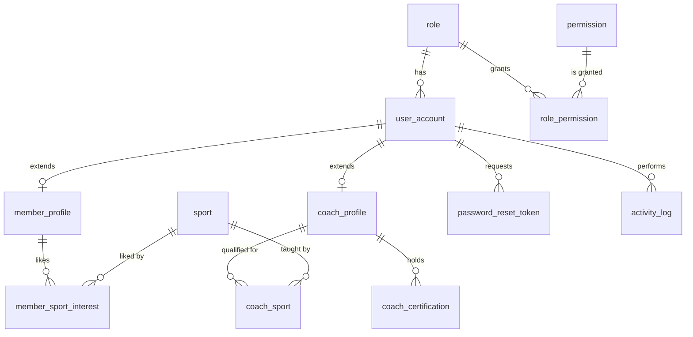

# 01 - Identity and Access

Screens covered: Home (Log in / Join now), F1-02 User Management, F1-03 Roles and Permissions, F1-04 Activity Log,
F1-05 Sign Up and Log In, F1-06 My Profile, F1-10 Member Search and Profile, Home "Meet your coaches".

## ERD

## Design Decisions

- **One account, one role.** `user_account.role_id` is a single FK. A person who is both a coach and a member uses
  two accounts. If multi-role is needed later, replace `role_id` with a `user_role` join table.
- **Configurable permissions (F1-03).** `role_permission` stores the matrix. Spring Security authorities are
  `ROLE_<role.code>` plus every `permission.code` of that role.
- **Account status is separate from membership status** (note on F1-02). `user_account.status` only controls login.
- **Profiles use a shared primary key.** `member_profile.user_id` and `coach_profile.user_id` are both PK and FK to
  `user_account.id` (JPA `@MapsId`). Receptionist and Manager need no extra profile.
- **Member age group is computed, not stored.** Age at the session date is derived from `user_account.date_of_birth`
  and compared with `age_group.min_age / max_age`. Therefore `date_of_birth` is mandatory for members (service validation).
- **Coach qualification** is explicit (`coach_sport`, `coach_certification`) so that F2-03 can enforce
  "assign a qualified Coach" and F2-06 can show certificate badges.
- **Activity log is append-only** (F1-04: "Activity records are read-only"). It stores actor, time, action, target
  record code and a JSON diff.

## Tables

### `role`

Fixed system roles: `MEMBER`, `COACH`, `RECEPTIONIST`, `MANAGER`.

| Column | Type | Null | Key / Default | Description |
|---|---|---|---|---|
| id | BIGINT | No | PK, IDENTITY | |
| code | NVARCHAR(30) | No | UQ | `MEMBER`, `COACH`, `RECEPTIONIST`, `MANAGER` |
| name | NVARCHAR(50) | No | | Display name |
| description | NVARCHAR(255) | Yes | | |
| is_system | BIT | No | 1 | System roles cannot be deleted |
| created_at | DATETIME2(0) | No | SYSDATETIME() | |
| updated_at | DATETIME2(0) | Yes | | |

### `permission`

Rows of the F1-03 matrix plus permissions needed by Flow 2 to Flow 6.

| Column | Type | Null | Key / Default | Description |
|---|---|---|---|---|
| id | BIGINT | No | PK, IDENTITY | |
| code | NVARCHAR(60) | No | UQ | e.g. `RECORD_CLASS_ATTENDANCE` |
| name | NVARCHAR(100) | No | | e.g. "Record class attendance" |
| description | NVARCHAR(255) | Yes | | |
| module | NVARCHAR(30) | No | | Grouping: `PROFILE`, `USER`, `MEMBERSHIP`, `CLASS`, `TRAINING`, `PAYMENT`, `AI`, `SUPPORT` |
| display_order | INT | No | 0 | Row order in the matrix |

### `role_permission`

Pure join table (composite PK). Changes are recorded in `activity_log` with action `ROLE_PERMISSIONS_UPDATED`.

| Column | Type | Null | Key / Default | Description |
|---|---|---|---|---|
| role_id | BIGINT | No | PK, FK -> role.id (cascade) | |
| permission_id | BIGINT | No | PK, FK -> permission.id (cascade) | |

### `user_account`

Login identity for every person (members and staff).

| Column | Type | Null | Key / Default | Description |
|---|---|---|---|---|
| id | BIGINT | No | PK, IDENTITY | |
| email | NVARCHAR(255) | No | UQ | Login name (case-insensitive collation) |
| password_hash | NVARCHAR(100) | No | | BCrypt hash |
| full_name | NVARCHAR(100) | No | | |
| phone | NVARCHAR(20) | Yes | UX filtered (not null) | Used by reception search |
| date_of_birth | DATE | Yes | | Required for members (age eligibility) |
| address | NVARCHAR(255) | Yes | | |
| avatar_url | NVARCHAR(500) | Yes | | Initials are shown when null |
| role_id | BIGINT | No | FK -> role.id | |
| status | NVARCHAR(20) | No | `ACTIVE` | `ACTIVE`, `INACTIVE`, `LOCKED` |
| last_login_at | DATETIME2(0) | Yes | | |
| created_at, updated_at | DATETIME2(0) | | | Audit |
| created_by, updated_by | BIGINT | Yes | | Audit (user id, no FK) |
| version | INT | No | 0 | Optimistic lock |

Indexes: `ux_user_account_phone` (filtered), `ix_user_account_role_status (role_id, status)`.

### `member_profile`

Member-only data (1:1 with `user_account`).

| Column | Type | Null | Key / Default | Description |
|---|---|---|---|---|
| user_id | BIGINT | No | PK, FK -> user_account.id | Shared primary key |
| member_code | NVARCHAR(20) | No | UQ | `MEM-0128` from `seq_member_code` |
| main_goal | NVARCHAR(30) | Yes | | `IMPROVE_FITNESS`, `BUILD_SKILLS`, `COMPETITION` |
| current_level | NVARCHAR(20) | No | `BEGINNER` | `BEGINNER`, `INTERMEDIATE`, `ADVANCED` |
| joined_on | DATE | No | today | "Joined 27 Sep 2026" |
| staff_note | NVARCHAR(500) | Yes | | Internal note by reception |
| created_at, updated_at | DATETIME2(0) | | | Audit |

### `member_sport_interest`

"Sports of interest" checkboxes on F1-06. Used by the recommendation weight `MEMBER_PREFERENCE`.

| Column | Type | Null | Key / Default | Description |
|---|---|---|---|---|
| member_id | BIGINT | No | PK, FK -> member_profile.user_id (cascade) | |
| sport_id | BIGINT | No | PK, FK -> sport.id | |

### `coach_profile`

Coach-only data (1:1 with `user_account`). Public fields are shown on Home "Meet your coaches".

| Column | Type | Null | Key / Default | Description |
|---|---|---|---|---|
| user_id | BIGINT | No | PK, FK -> user_account.id | Shared primary key |
| primary_sport_id | BIGINT | Yes | FK -> sport.id | Badge shown on cards ("BASKETBALL") |
| headline | NVARCHAR(150) | Yes | | "Youth coaching certificate - Fundamentals and team play" |
| bio | NVARCHAR(1000) | Yes | | |
| years_experience | INT | Yes | CHECK >= 0 | "8 years of group coaching" |
| specialties | NVARCHAR(255) | Yes | | "Ball skills and teamwork" |
| is_public | BIT | No | 1 | Show on Home page |
| display_order | INT | No | 0 | |
| created_at, updated_at | DATETIME2(0) | | | Audit |

### `coach_sport`

Sports a coach is qualified to teach. Has an attribute, so it uses a surrogate key.

| Column | Type | Null | Key / Default | Description |
|---|---|---|---|---|
| id | BIGINT | No | PK, IDENTITY | |
| coach_id | BIGINT | No | FK -> coach_profile.user_id (cascade) | |
| sport_id | BIGINT | No | FK -> sport.id | |
| max_level | NVARCHAR(20) | Yes | | Highest level the coach may teach; null = any |

Unique: `(coach_id, sport_id)`.

### `coach_certification`

| Column | Type | Null | Key / Default | Description |
|---|---|---|---|---|
| id | BIGINT | No | PK, IDENTITY | |
| coach_id | BIGINT | No | FK -> coach_profile.user_id (cascade) | |
| sport_id | BIGINT | Yes | FK -> sport.id | Null = general certificate (e.g. first aid) |
| name | NVARCHAR(150) | No | | "Basketball Coaching Certificate" |
| issuer | NVARCHAR(150) | Yes | | |
| issued_on | DATE | Yes | | |
| expires_on | DATE | Yes | CHECK >= issued_on | |
| document_url | NVARCHAR(500) | Yes | | |
| is_verified | BIT | No | 0 | Verified by Manager |
| created_at | DATETIME2(0) | No | SYSDATETIME() | |

### `password_reset_token`

Supports "Forgot password?" on F1-05. Only the hash of the token is stored.

| Column | Type | Null | Key / Default | Description |
|---|---|---|---|---|
| id | BIGINT | No | PK, IDENTITY | |
| user_id | BIGINT | No | FK -> user_account.id (cascade) | |
| token_hash | NVARCHAR(100) | No | UQ | SHA-256 of the emailed token |
| expires_at | DATETIME2(0) | No | | |
| used_at | DATETIME2(0) | Yes | | Single use |
| created_at | DATETIME2(0) | No | SYSDATETIME() | |

### `activity_log`

Read-only audit trail shown on F1-04.

| Column | Type | Null | Key / Default | Description |
|---|---|---|---|---|
| id | BIGINT | No | PK, IDENTITY | |
| actor_user_id | BIGINT | Yes | FK -> user_account.id | Null = system job |
| action | NVARCHAR(60) | No | | `PAYMENT_CONFIRMED`, `MEMBERSHIP_REGISTERED`, `PACKAGE_UPDATED`, `ROLE_UPDATED`, ... |
| entity_type | NVARCHAR(40) | No | | `PAYMENT`, `MEMBERSHIP`, `MEMBERSHIP_PLAN`, `USER_ACCOUNT`, ... |
| entity_id | BIGINT | Yes | | Target row id |
| entity_code | NVARCHAR(40) | Yes | | Displayed record (`PAY-1042`, `MEM-0128`, "Multi-Sport") |
| summary | NVARCHAR(255) | Yes | | Human readable sentence |
| details | NVARCHAR(MAX) | Yes | CHECK ISJSON | `{"before": {...}, "after": {...}}` for "View details" |
| ip_address | NVARCHAR(45) | Yes | | IPv4 or IPv6 |
| created_at | DATETIME2(0) | No | SYSDATETIME() | |

Indexes: `ix_activity_log_created (created_at DESC)`, `ix_activity_log_entity (entity_type, entity_id)`,
`ix_activity_log_actor (actor_user_id, created_at)`.

## Recommended Actions to Log

| Action | Triggered by |
|---|---|
| `USER_CREATED`, `USER_UPDATED`, `USER_STATUS_CHANGED`, `ROLE_UPDATED` | F1-02 |
| `ROLE_PERMISSIONS_UPDATED` | F1-03 |
| `MEMBERSHIP_REGISTERED`, `MEMBERSHIP_RENEWED`, `MEMBERSHIP_CANCELLED` | F1-08, F1-11 |
| `PACKAGE_CREATED`, `PACKAGE_UPDATED` | Membership packages |
| `PAYMENT_RECORDED`, `PAYMENT_CONFIRMED`, `PAYMENT_FAILED`, `INVOICE_ISSUED`, `INVOICE_VOIDED` | F1-12, F3-03 to F3-06 |
| `CLASS_PUBLISHED`, `SESSION_PUBLISHED`, `SESSION_CANCELLED` | F2-02, F2-03 |
| `ATTENDANCE_SUBMITTED`, `ATTENDANCE_CORRECTED` | F4-06 |
| `RECOMMENDATION_RULES_UPDATED`, `ASSISTANT_CONTENT_UPDATED` | F5-12, F6-12 |
