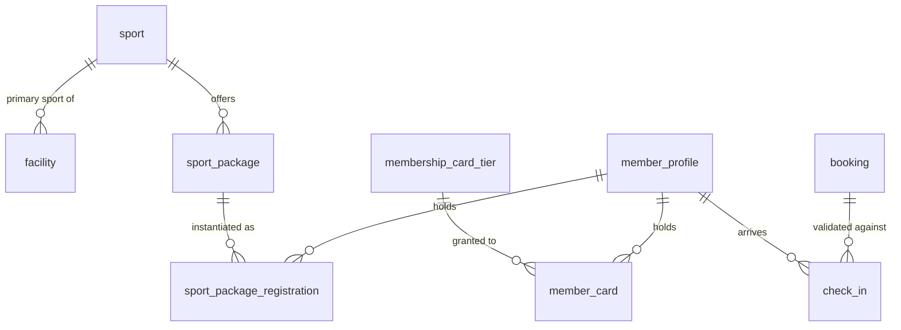

# 02 - Catalog and Membership

Screens covered: Home (sports, packages, cards), F1-03 Sport Packages, F1-04 Create or Edit Sport Package,
F1-05 Membership Cards, F1-08 Available Packages & Cards, F1-09 Package Detail & Registration,
F1-10 Membership Card Detail & Purchase, F1-11 My Packages & Cards, F1-12 Member Search & Profile,
F1-13 Register Package for Member, F1-14 Issue Membership Card for Member, F1-15 Front Desk Check-in.

## ERD (Active Architecture)

## Design Decisions

- **Sport Packages Model.** Each package is strictly tied to:
  - Exactly 1 sport (`sport_id`).
  - Exactly 1 training format (`format`: `SELF_TRAINING` or `COACH_LED`).
  - Duration in days and fixed session counts:
    - Single visit: 1 day, 1 session.
    - 30 days: 30 days, 8 sessions.
    - 90 days: 90 days, 24 sessions.
- **Multiple Active Packages.** Members can hold multiple active sport packages simultaneously (e.g., Badminton Self-training 30-day package and Swimming Coach-led 90-day package concurrently).
- **Membership Cards (Discounts Only).** Membership cards provide fixed percentage discounts on 30-day and 90-day sport package purchases:
  - Standard: Free, permanent validity, 0% discount.
  - Gold: 300,000 VND / 12 months, 5% discount on package purchases.
  - VIP: 600,000 VND / 12 months, 10% discount on package purchases.
  - Card rules: Single visits are excluded from discounts; discounts do not stack; cards do not grant direct facility admission without an active sport package session booking.
- **Explicit Start Date Selection.** When registering for a package (online or at reception), the member/staff explicitly chooses the `start_date`. Validity end date is computed as `end_date = start_date + duration_days`.
- **Front Desk Check-in (F1-15).** Front desk check-in strictly requires:
  1. An existing confirmed session booking for the member on the current day (`session_date = CAST(SYSDATETIME() AS DATE)`).
  2. The member holds an active paid sport package covering the session sport.
  3. No duplicate check-in recorded for the same session.
  4. Front desk check-in verifies arrival and does not double-deduct from attendance (which is separately logged by coaches or receptionists).
- **Legacy Compatibility.** Legacy tables (`membership_plan`, `plan_eligible_sport`, `plan_feature`, `membership`, `membership_sport`) are retained in the schema for data continuity, with their corresponding Java domain entities marked `@Deprecated`.

## Tables

### `sport`

| Column | Type | Null | Key / Default | Description |
|---|---|---|---|---|
| id | BIGINT | No | PK, IDENTITY | |
| code | NVARCHAR(30) | No | UQ | `FOOTBALL`, `BADMINTON`, `BASKETBALL`, `VOLLEYBALL`, `SWIMMING`, `TENNIS` |
| name | NVARCHAR(50) | No | UQ | Display name |
| venue_type | NVARCHAR(20) | No | | `INDOOR`, `OUTDOOR`, `POOL` |
| description | NVARCHAR(500) | Yes | | |
| image_url | NVARCHAR(500) | Yes | | |
| display_order | INT | No | 0 | |
| is_active | BIT | No | 1 | |
| created_at, updated_at | DATETIME2(0) | | | Audit |

### `facility`

| Column | Type | Null | Key / Default | Description |
|---|---|---|---|---|
| id | BIGINT | No | PK, IDENTITY | |
| code | NVARCHAR(30) | No | UQ | `BB_COURT_A`, `BB_COURT_B`, `INDOOR_POOL` |
| name | NVARCHAR(100) | No | | "Basketball Court B" |
| facility_type | NVARCHAR(20) | No | | `COURT`, `POOL`, `FIELD`, `HALL`, `STUDIO` |
| sport_id | BIGINT | Yes | FK -> sport.id | Primary sport; null = multi-purpose |
| capacity | INT | Yes | CHECK > 0 | Physical capacity |
| is_active | BIT | No | 1 | |
| created_at, updated_at | DATETIME2(0) | | | Audit |

### `membership_card_tier`

Defines the membership card discount tiers (Standard, Gold, VIP).

| Column | Type | Null | Key / Default | Description |
|---|---|---|---|---|
| id | BIGINT | No | PK, IDENTITY | |
| code | NVARCHAR(30) | No | UQ | `STANDARD`, `GOLD`, `VIP` |
| name | NVARCHAR(50) | No | | "Standard", "Gold Member", "VIP Member" |
| price | DECIMAL(14,2) | No | CHECK >= 0 | 0 for Standard, 300,000 for Gold, 600,000 for VIP |
| duration_months | INT | No | CHECK >= 0 | 0 (permanent) for Standard, 12 for Gold and VIP |
| discount_percentage | INT | No | CHECK >= 0 | 0% for Standard, 5% for Gold, 10% for VIP |
| description | NVARCHAR(500) | Yes | | Tier benefits description |
| is_active | BIT | No | 1 | |
| created_at, updated_at | DATETIME2(0) | | | Audit |

### `member_card`

Member's card holding record.

| Column | Type | Null | Key / Default | Description |
|---|---|---|---|---|
| id | BIGINT | No | PK, IDENTITY | |
| card_code | NVARCHAR(30) | No | UQ | `CARD-1001` from sequence |
| member_id | BIGINT | No | FK -> member_profile.user_id | Member holding card |
| tier_id | BIGINT | No | FK -> membership_card_tier.id | Current card tier |
| start_date | DATE | No | | Card activation date |
| end_date | DATE | Yes | | Null for permanent Standard, date for Gold/VIP |
| status | NVARCHAR(20) | No | `ACTIVE` | `ACTIVE`, `EXPIRED`, `CANCELLED` |
| price_paid | DECIMAL(14,2) | No | CHECK >= 0 | Snapshot of fee paid |
| payment_id | BIGINT | Yes | FK -> payment.id | Associated payment attempt |
| created_at, updated_at | DATETIME2(0) | | | Audit |

### `sport_package`

Specific packages offered by the center.

| Column | Type | Null | Key / Default | Description |
|---|---|---|---|---|
| id | BIGINT | No | PK, IDENTITY | |
| code | NVARCHAR(30) | No | UQ | `PKG-BADMINTON-30D`, `PKG-SWIM-90D-COACH` |
| name | NVARCHAR(100) | No | | Display name |
| sport_id | BIGINT | No | FK -> sport.id | Single sport covered |
| training_format | NVARCHAR(20) | No | | `SELF_TRAINING`, `COACH_LED` |
| duration_days | INT | No | CHECK > 0 | 1, 30, or 90 days |
| session_count | INT | No | CHECK > 0 | 1, 8, or 24 sessions |
| price_amount | DECIMAL(14,2) | No | CHECK >= 0 | Base package price in VND |
| description | NVARCHAR(500) | Yes | | Package overview |
| is_active | BIT | No | 1 | Package visibility toggle |
| created_at, updated_at | DATETIME2(0) | | | Audit |

### `sport_package_registration`

An instance of a member purchasing a sport package.

| Column | Type | Null | Key / Default | Description |
|---|---|---|---|---|
| id | BIGINT | No | PK, IDENTITY | |
| registration_code | NVARCHAR(30) | No | UQ | `REG-PKG-1001` |
| member_id | BIGINT | No | FK -> member_profile.user_id | Purchasing member |
| package_id | BIGINT | No | FK -> sport_package.id | Package purchased |
| channel | NVARCHAR(20) | No | | `ONLINE` or `RECEPTION` |
| original_price | DECIMAL(14,2) | No | CHECK >= 0 | Package base price |
| discount_percentage | INT | No | CHECK >= 0 | 0, 5, or 10 from active card tier |
| paid_amount | DECIMAL(14,2) | No | CHECK >= 0 | Amount after card discount |
| total_sessions | INT | No | CHECK > 0 | Snapshot of initial sessions |
| remaining_sessions | INT | No | CHECK >= 0 | Sessions left to book |
| start_date | DATE | No | | Explicitly chosen start date |
| end_date | DATE | No | CHECK >= start_date | `start_date + duration_days` |
| status | NVARCHAR(20) | No | `PENDING_PAYMENT` | `PENDING_PAYMENT`, `ACTIVE`, `EXPIRED`, `CANCELLED`, `REFUNDED` (V11) |
| activated_at | DATETIME2(0) | Yes | | Date activated. Activation allowed only from PENDING_PAYMENT -> ACTIVE. Recomputes start_date to TODAY and end_date = start_date + duration_days if start_date < TODAY. |
| payment_id | BIGINT | Yes | FK -> payment.id | Payment record |
| created_by_user_id | BIGINT | No | FK -> user_account.id | Member or receptionist |
| created_at, updated_at | DATETIME2(0) | | | Audit |

### `check_in`

Front desk arrival record (F1-15).

| Column | Type | Null | Key / Default | Description |
|---|---|---|---|---|
| id | BIGINT | No | PK, IDENTITY | |
| member_id | BIGINT | No | FK -> member_profile.user_id | Arriving member |
| membership_id | BIGINT | Yes | FK -> membership.id | Legacy membership reference (nullable) |
| booking_id | BIGINT | Yes | FK -> booking.id | Today's confirmed session booking |
| package_registration_id | BIGINT | Yes | FK -> sport_package_registration.id | Active package backing admission |
| checked_in_at | DATETIME2(0) | No | SYSDATETIME() | Front desk timestamp |
| result | NVARCHAR(20) | No | | `ALLOWED`, `DENIED` |
| denial_reason | NVARCHAR(255) | Yes | | Reason if DENIED: "No confirmed booking for today", "Specified booking is not scheduled for today or is not confirmed", "All confirmed bookings for today have already been checked in", "Already checked in for this session", "Booking is not linked to a sport package registration", "No active sport package", "Sport package registration is expired or not yet valid" |
| recorded_by | BIGINT | No | FK -> user_account.id | Receptionist user |
| note | NVARCHAR(255) | Yes | | Staff note |

### Deprecated Tables (Retained for Backward Compatibility)

- `membership_plan`: Monolithic membership plan definition.
- `plan_eligible_sport`: Sports allowed under monolithic plan.
- `plan_feature`: Monolithic plan feature bullet points.
- `membership`: Monolithic membership registration periods.
- `membership_sport`: Sports chosen under monolithic membership.
