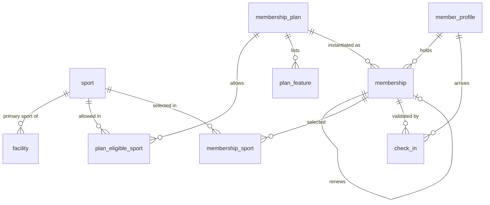

# 02 - Catalog and Membership

Screens covered: Home (sports, plans), F1-07 Membership Plans, F1-08 Plan Detail and Registration, F1-09 My Membership,
F1-10 Member Search and Profile, F1-11 Register and Renew Membership, F1-13 Check-in, Manager "Membership packages".

## ERD



## Design Decisions

- **Unified plan model.** Every plan has `max_sports` and a pool of eligible sports (`plan_eligible_sport`):
  - Starter: pool = 6 sports, `max_sports = 1` (member chooses 1).
  - Multi-Sport: pool = 6 sports, `max_sports = 3` (member chooses up to 3).
  - All Access: pool = 6 sports, `max_sports = 6` (all included automatically).
  - Swim Starter / Basketball Pass: pool = 1 sport, `max_sports = 1` (fixed).
  When `pool size = max_sports` the UI preselects all sports and hides the checkboxes.
- **One row per membership period.** `membership` is created as `PENDING_PAYMENT` when a member (F1-08) or a
  receptionist (F1-11) registers. A renewal creates a **new** row with `registration_type = 'RENEWAL'` and
  `previous_membership_id`. This keeps history, invoices and revenue per period clean.
- **Snapshots.** `price_amount` and `duration_days` are copied from the plan at registration time, and the selected
  sports are copied into `membership_sport`. Later plan edits never change existing memberships or invoices.
- **Dates are set only on payment confirmation.**
  - No current active membership: `start_date = confirmation date`, status `ACTIVE`.
  - Renewal while still active: `start_date = previous.end_date + 1 day`, status `SCHEDULED` (a daily job switches it
    to `ACTIVE`).
  - `end_date = start_date + duration_days` (matches "27 Sept 2026 - 27 Oct 2026" in F1-09), inclusive.
- **At most one pending registration per member** (filtered unique index). This prevents duplicate charges (F3-02).
- **Facility = teaching area** ("Basketball Court B", "Indoor Pool"). Used for schedule conflict checks in F2-03.
- **Age groups are a lookup table** because they carry numeric ranges used in eligibility checks.
- **Check-in** records arrival at the front desk only; it never counts as class attendance.

## Tables

### `sport`

| Column | Type | Null | Key / Default | Description |
|---|---|---|---|---|
| id | BIGINT | No | PK, IDENTITY | |
| code | NVARCHAR(30) | No | UQ | `FOOTBALL`, `BADMINTON`, `BASKETBALL`, `VOLLEYBALL`, `SWIMMING`, `TENNIS` |
| name | NVARCHAR(50) | No | UQ | Display name |
| venue_type | NVARCHAR(20) | No | | `INDOOR`, `OUTDOOR`, `POOL` (Home tiles "01 / OUTDOOR") |
| description | NVARCHAR(500) | Yes | | |
| image_url | NVARCHAR(500) | Yes | | |
| display_order | INT | No | 0 | |
| is_active | BIT | No | 1 | |
| created_at, updated_at | DATETIME2(0) | | | Audit |

### `age_group`

| Column | Type | Null | Key / Default | Description |
|---|---|---|---|---|
| id | BIGINT | No | PK, IDENTITY | |
| code | NVARCHAR(30) | No | UQ | `KIDS_6_12`, `AGES_8_11`, `TEENS_13_17`, `AGES_16_PLUS`, `ADULTS_18_PLUS` |
| label | NVARCHAR(50) | No | | "Kids 6-12", "Ages 16+" |
| min_age | INT | No | CHECK >= 0 | Inclusive |
| max_age | INT | Yes | CHECK >= min_age | Inclusive, null = no upper bound |
| display_order | INT | No | 0 | |
| is_active | BIT | No | 1 | |

### `facility`

| Column | Type | Null | Key / Default | Description |
|---|---|---|---|---|
| id | BIGINT | No | PK, IDENTITY | |
| code | NVARCHAR(30) | No | UQ | `BB_COURT_A`, `BB_COURT_B`, `INDOOR_POOL` |
| name | NVARCHAR(100) | No | | "Basketball Court B" |
| facility_type | NVARCHAR(20) | No | | `COURT`, `POOL`, `FIELD`, `HALL`, `STUDIO` |
| sport_id | BIGINT | Yes | FK -> sport.id | Primary sport; null = multi-purpose |
| capacity | INT | Yes | CHECK > 0 | Physical capacity (informational) |
| is_active | BIT | No | 1 | |
| created_at, updated_at | DATETIME2(0) | | | Audit |

### `membership_plan`

Called "Membership packages" in the Manager workspace.

| Column | Type | Null | Key / Default | Description |
|---|---|---|---|---|
| id | BIGINT | No | PK, IDENTITY | |
| code | NVARCHAR(30) | No | UQ | `STARTER`, `MULTI_SPORT`, `ALL_ACCESS`, ... |
| name | NVARCHAR(100) | No | | "Multi-Sport" |
| tagline | NVARCHAR(100) | Yes | | "02 / EXPLORE" label |
| description | NVARCHAR(500) | Yes | | "Mix classes across up to three sports." |
| price | DECIMAL(14,2) | No | CHECK >= 0 | VND |
| duration_days | INT | No | CHECK > 0 | 30 |
| max_sports | INT | No | CHECK >= 1 | Number of sports the member may select |
| is_featured | BIT | No | 0 | "MOST POPULAR" badge |
| status | NVARCHAR(20) | No | `DRAFT` | `DRAFT`, `ACTIVE`, `ARCHIVED` |
| display_order | INT | No | 0 | |
| created_at, updated_at, created_by, updated_by | | | | Audit |
| version | INT | No | 0 | |

### `plan_eligible_sport`

Pool of sports a plan allows. Rule: `COUNT(*) >= max_sports` (service validation on publish).

| Column | Type | Null | Key / Default | Description |
|---|---|---|---|---|
| plan_id | BIGINT | No | PK, FK -> membership_plan.id (cascade) | |
| sport_id | BIGINT | No | PK, FK -> sport.id | |

### `plan_feature`

Bullet list on plan cards ("Coach-led class booking", "Personal schedule and progress").

| Column | Type | Null | Key / Default | Description |
|---|---|---|---|---|
| id | BIGINT | No | PK, IDENTITY | |
| plan_id | BIGINT | No | FK -> membership_plan.id (cascade) | |
| feature_text | NVARCHAR(150) | No | | |
| display_order | INT | No | 0 | |

### `membership`

One registration / membership period. Displayed as "Current membership" (F1-09) and "Registration summary" (F1-11).

| Column | Type | Null | Key / Default | Description |
|---|---|---|---|---|
| id | BIGINT | No | PK, IDENTITY | |
| registration_code | NVARCHAR(20) | No | UQ | `REG-1042` |
| member_id | BIGINT | No | FK -> member_profile.user_id | |
| plan_id | BIGINT | No | FK -> membership_plan.id | |
| registration_type | NVARCHAR(20) | No | | `NEW`, `RENEWAL` |
| previous_membership_id | BIGINT | Yes | FK -> membership.id | Set for renewals |
| channel | NVARCHAR(20) | No | | `ONLINE` (member) or `RECEPTION` (receptionist) |
| status | NVARCHAR(20) | No | `PENDING_PAYMENT` | `PENDING_PAYMENT`, `SCHEDULED`, `ACTIVE`, `EXPIRED`, `CANCELLED` |
| price_amount | DECIMAL(14,2) | No | CHECK >= 0 | Snapshot of plan price |
| duration_days | INT | No | CHECK > 0 | Snapshot of plan duration |
| start_date | DATE | Yes | | Set on payment confirmation |
| end_date | DATE | Yes | CHECK >= start_date | Inclusive validity end |
| activated_at | DATETIME2(0) | Yes | | When it became `ACTIVE` |
| cancelled_at | DATETIME2(0) | Yes | | |
| cancel_reason | NVARCHAR(255) | Yes | | |
| created_by_user_id | BIGINT | No | FK -> user_account.id | Member or receptionist who created it |
| created_at, updated_at | DATETIME2(0) | | | Audit |
| version | INT | No | 0 | |

Constraints and indexes:
- `ck_membership_active_dates`: statuses `SCHEDULED`, `ACTIVE`, `EXPIRED` require both dates.
- `ux_membership_one_pending (member_id) WHERE status = 'PENDING_PAYMENT'`.
- `ix_membership_member_status (member_id, status, end_date)` for "current membership" lookups.

### `membership_sport`

Sports selected for this membership period ("Your sports: Basketball, Swimming, Badminton").

| Column | Type | Null | Key / Default | Description |
|---|---|---|---|---|
| membership_id | BIGINT | No | PK, FK -> membership.id (cascade) | |
| sport_id | BIGINT | No | PK, FK -> sport.id | Must exist in `plan_eligible_sport` of the plan |

Rule: number of rows `<= membership_plan.max_sports` and `>= 1` (service validation).

### `check_in`

Front desk arrival record (F1-13).

| Column | Type | Null | Key / Default | Description |
|---|---|---|---|---|
| id | BIGINT | No | PK, IDENTITY | |
| member_id | BIGINT | No | FK -> member_profile.user_id | |
| membership_id | BIGINT | Yes | FK -> membership.id | Membership used to validate; null when denied |
| checked_in_at | DATETIME2(0) | No | SYSDATETIME() | |
| result | NVARCHAR(20) | No | | `ALLOWED`, `DENIED` |
| denial_reason | NVARCHAR(255) | Yes | | "No active membership", "Account inactive" |
| recorded_by | BIGINT | No | FK -> user_account.id | Receptionist |
| note | NVARCHAR(255) | Yes | | |

Indexes: `ix_check_in_member (member_id, checked_in_at)`, `ix_check_in_time (checked_in_at)`.

## Useful Queries

Current membership of a member (F1-09, F1-10, F2-07, F5-01, F6-04):

```sql
SELECT TOP (1) m.*
FROM membership m
WHERE m.member_id = @memberId
  AND m.status IN ('ACTIVE', 'SCHEDULED')
  AND m.end_date >= CAST(SYSDATETIME() AS DATE)
ORDER BY m.start_date;
```

Membership covering a session date and sport (booking eligibility):

```sql
SELECT m.id
FROM membership m
JOIN membership_sport ms ON ms.membership_id = m.id
WHERE m.member_id = @memberId
  AND m.status IN ('ACTIVE', 'SCHEDULED')
  AND @sessionDate BETWEEN m.start_date AND m.end_date
  AND ms.sport_id = @sportId;
```
