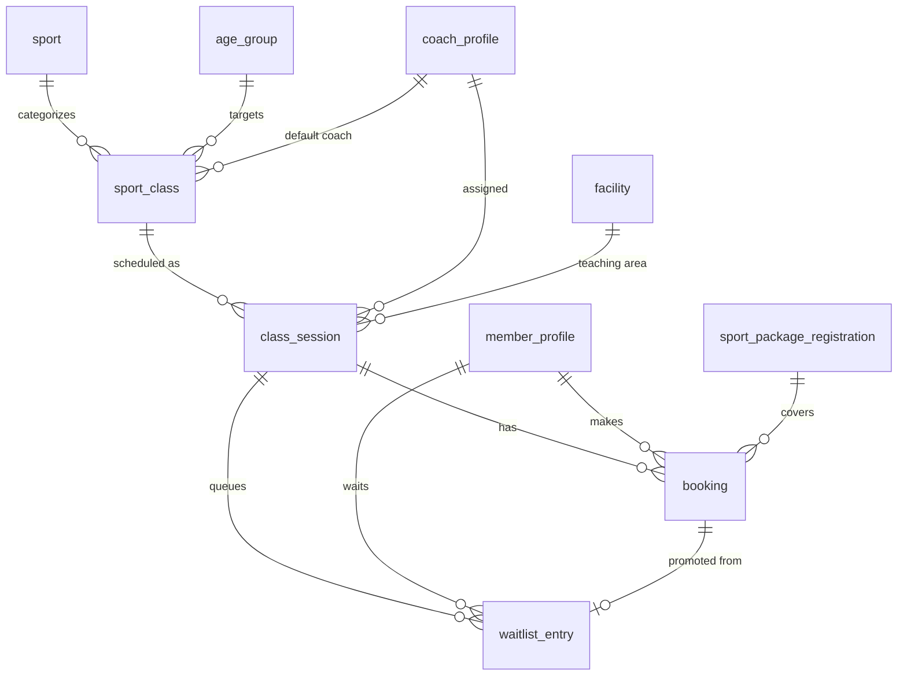

# 03 - Classes and Booking

Screens covered: Home (Quick class finder, Upcoming classes), F2-01 Sport Classes, F2-02 Create or Edit Sport Class,
F2-03 Class Sessions & Coach Assignment, F2-04 Schedule & Session Details, F2-05 View Schedule, F2-06 Find or Filter Sessions,
F2-07 Session Detail - Coach-led, F2-07-Self Booking Options - Self-training, F2-08 Booking Review,
F2-08-Self Booking Review - Self-training, F2-09 Booking Confirmed, F2-09-Self Booking Confirmed - Self-training,
F2-10 My Bookings, F2-10-Self My Bookings - Self-training, F2-11 Member Booking Search, F2-12 Book for Member,
F2-13 Coach Schedule, F2-14 Class Session Detail, F2-15 Class Roster, F2-16 Roster Detail & Attendance Notes.

## ERD



## Design Decisions

- **Class vs session.** `sport_class` is the learning group defined in F2-02 (name, sport, age group, level, goal,
  maximum members, code `CL-1000`). `class_session` is one dated occurrence created in F2-03 (date, start/end time,
  teaching area, coach). Members book **sessions**.
- **Coach-led vs Self-training sessions.** Sessions support two formats: `COACH_LED` and `SELF_TRAINING`.
  For `SELF_TRAINING`, `coach_id` is nullable (or assigned to facility supervisor). Booking self-training slots reserves
  a training area slot and consumes 1 session from the member's self-training package.
- **Draft until published.** A session can be saved as `DRAFT` without coach or facility; publishing requires both
  (or facility only for self-training).
- **Capacity and seat counter on the session.** `capacity` is copied from `sport_class.max_members` when the session
  is created. `booked_count` is updated atomically to avoid overbooking under concurrent requests.
- **Conflict checks (F2-03).** "Check that this Coach and teaching area have no other session at the selected time."
  Enforced in the service with indexed queries on `(coach_id, session_date)` and `(facility_id, session_date)`.
- **One active booking per member per session** via filtered unique index. A member may re-book after cancelling.
- **Booking covers sessions via sport package.** `package_registration_id` links the booking to the active package.
  Each confirmed booking reserves 1 session from `remaining_sessions`. The legacy `membership_id` is retained as nullable for backward compatibility.
- **Receptionist assisted booking (F2-11, F2-12).** Receptionists can search members and book confirmed sessions on their behalf (creates a standard `booking` row with `status = 'CONFIRMED'`; source channel is not stored in V10 schema).
- **Waitlist does not reserve a seat (Planned).** When a seat opens, the first `WAITING` entry gets an `OFFERED` status with an expiry; accepting creates a booking.
- **My Bookings tabs** (Upcoming / Past / Cancelled) are derived: `status` plus `session_date` compared to today.
- **Roster** (F2-15, F2-16) is `booking` rows with `status = 'CONFIRMED'` for a session.

## Tables

### `sport_class`

Learning group / class definition (migrated in V10).

| Column | Type | Null | Key / Default | Description |
|---|---|---|---|---|
| id | BIGINT | No | PK, IDENTITY | |
| code | NVARCHAR(30) | No | UQ | `CL-1000` from `seq_class_code` |
| name | NVARCHAR(100) | No | | Display class name (e.g. "Basketball Fundamentals") |
| sport_id | BIGINT | No | FK -> sport.id | Sport categorized |
| age_group_id | BIGINT | Yes | FK -> age_group.id | Target age group (e.g. "Ages 16+") |
| level | NVARCHAR(20) | No | `BEGINNER` | `BEGINNER`, `INTERMEDIATE`, `ADVANCED` |
| max_members | INT | No | 20, CHECK > 0 | Default capacity of new sessions |
| is_active | BIT | No | 1 | Active visibility toggle |
| created_at, updated_at | DATETIME2(0) | | | Audit timestamps |

*(Note: Columns `learning_goal`, `short_description`, `image_url`, `default_coach_id`, `default_facility_id` from early UI designs remain planned UI extensions not yet added in V10 schema).*

### `class_session`

Dated class occurrence or self-training slot (migrated in V10).

| Column | Type | Null | Key / Default | Description |
|---|---|---|---|---|
| id | BIGINT | No | PK, IDENTITY | |
| class_id | BIGINT | Yes | FK -> sport_class.id | Linked class (nullable for self-training slots) |
| sport_id | BIGINT | No | FK -> sport.id | Sport of the session |
| session_date | DATE | No | | Date of session |
| start_time | TIME(0) | No | | Start time |
| end_time | TIME(0) | No | CHECK > start_time | End time |
| facility_id | BIGINT | Yes | FK -> facility.id | Facility / court |
| coach_id | BIGINT | Yes | FK -> coach_profile.user_id | Assigned coach (nullable for self-training) |
| training_type | NVARCHAR(20) | No | `COACH_LED` | `COACH_LED` or `SELF_TRAINING` |
| capacity | INT | No | 20, CHECK > 0 | Maximum participants |
| booked_count | INT | No | 0, CHECK 0..capacity | Confirmed bookings |
| status | NVARCHAR(20) | No | `PUBLISHED` | `DRAFT`, `PUBLISHED`, `CANCELLED`, `COMPLETED` |
| created_at, updated_at | DATETIME2(0) | | | Audit timestamps |

*(Note: Columns `published_at`, `published_by`, `cancelled_at`, `cancel_reason`, `attendance_status`, `attendance_submitted_at`, `attendance_submitted_by`, `version` are planned extensions not in V10).*

Indexes: `ix_class_session_date_status (session_date, status)`.

### `booking`

Session reservation by a member (migrated in V10).

| Column | Type | Null | Key / Default | Description |
|---|---|---|---|---|
| id | BIGINT | No | PK, IDENTITY | |
| booking_code | NVARCHAR(30) | No | UQ | `BK-2048` from `seq_booking_code` |
| session_id | BIGINT | No | FK -> class_session.id | Reserved session |
| member_id | BIGINT | No | FK -> member_profile.user_id | Booking member |
| package_registration_id | BIGINT | Yes | FK -> sport_package_registration.id | Active package covering the booking |
| membership_id | BIGINT | Yes | FK -> membership.id | Legacy membership coverage fallback |
| status | NVARCHAR(20) | No | `CONFIRMED` | `CONFIRMED`, `CANCELLED` |
| booked_at | DATETIME2(0) | No | SYSDATETIME() | Booking creation timestamp |
| cancelled_at | DATETIME2(0) | Yes | | Cancellation timestamp |
| cancel_reason | NVARCHAR(255) | Yes | | Cancellation reason |
| created_at, updated_at | DATETIME2(0) | | | Audit timestamps |

*(Note: Columns `source`, `fee_amount`, `cancelled_by`, `cancel_type`, `version` from earlier drafts are not present in V10).*

Indexes: `ix_booking_member_session (member_id, session_id, status)`.

### `waitlist_entry` (Implemented - Migration V15)

Planned waitlist queue when class sessions reach maximum capacity.

| Column | Type | Null | Key / Default | Description |
|---|---|---|---|---|
| id | BIGINT | No | PK, IDENTITY | |
| session_id | BIGINT | No | FK -> class_session.id | |
| member_id | BIGINT | No | FK -> member_profile.user_id | |
| status | NVARCHAR(20) | No | `WAITING` | `WAITING`, `OFFERED`, `PROMOTED`, `EXPIRED`, `CANCELLED` |
| joined_at | DATETIME2(0) | No | SYSDATETIME() | Queue order (position is derived, not stored) |
| offered_at | DATETIME2(0) | Yes | | |
| offer_expires_at | DATETIME2(0) | Yes | | `offered_at + WAITLIST_OFFER_HOURS` |
| promoted_booking_id | BIGINT | Yes | FK -> booking.id | Booking created from the offer |
| cancelled_at | DATETIME2(0) | Yes | | |

Indexes: `ux_waitlist_active (session_id, member_id) WHERE status IN ('WAITING','OFFERED')`,
`ix_waitlist_queue (session_id, status, joined_at)`.

## Useful Queries

Find matching published sessions (F2-05, Home quick finder, F6-03):

```sql
SELECT cs.id, sc.name, s.name AS sport, ag.label AS age_group, sc.level,
       cs.session_date, cs.start_time, cs.end_time, u.full_name AS coach,
       cs.capacity - cs.booked_count AS seats_left
FROM class_session cs
JOIN sport_class sc ON sc.id = cs.class_id
JOIN sport s        ON s.id = sc.sport_id
JOIN age_group ag   ON ag.id = sc.age_group_id
JOIN user_account u ON u.id = cs.coach_id
WHERE cs.status = 'PUBLISHED'
  AND sc.status = 'PUBLISHED'
  AND cs.session_date >= :today
  AND (@sportId IS NULL OR sc.sport_id = @sportId)
  AND (@ageGroupId IS NULL OR sc.age_group_id = @ageGroupId)
  AND (@level IS NULL OR sc.level = @level)
  AND (@goal IS NULL OR sc.learning_goal = @goal)
ORDER BY cs.session_date, cs.start_time;
```

Coach or facility conflict check (F2-03):

```sql
SELECT COUNT(*)
FROM class_session
WHERE status IN ('DRAFT', 'PUBLISHED')
  AND session_date = @date
  AND (coach_id = @coachId OR facility_id = @facilityId)
  AND start_time < @endTime
  AND end_time > @startTime
  AND id <> ISNULL(@currentSessionId, 0);
```

## Future Extension

`class_schedule_pattern (class_id, day_of_week, start_time, end_time, coach_id, facility_id, valid_from, valid_to)`
to generate recurring sessions ("Tue and Thu - 17:00" on Home). Generated rows are still `class_session`, so no other
table changes.
