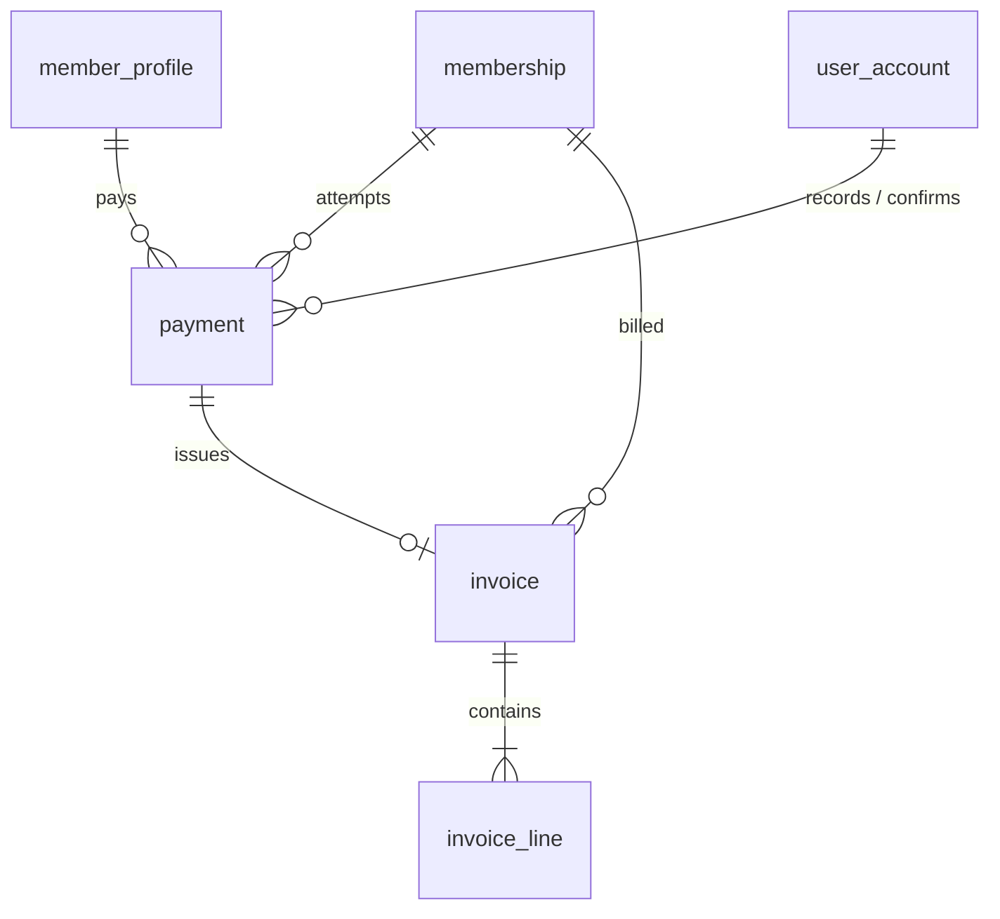

# 04 - Payments, Invoices and Reports

Screens covered: F1-12 Payment and Invoice, F3-01 Payment Overview, F3-02 Find Member, F3-03 Record Payment,
F3-04 Review Payment, F3-05 Invoice Issued, F3-06 Pending or Failed Payment, F3-07 Payment History,
F3-08 Invoice Detail, F3-09 Revenue Overview, F3-10 Report Filters, F3-11 Revenue Report, F3-12 Payment Ledger.

## ERD



## Design Decisions

- **Payments are only for memberships.** Class sessions covered by an active plan are booked with 0 VND and never
  create a payment (F3-01 note). `payment.membership_id` is therefore mandatory.
- **Payment attempts.** A `PENDING` payment is created together with the membership registration (amount due known).
  The receptionist then records method, amount and reference (F3-03), reviews (F3-04) and either:
  - confirms -> `PAID` (activates membership, issues invoice), or
  - keeps `PENDING` ("Save as pending"), or
  - marks `FAILED` with a reason (F3-06). Retrying creates a **new** `PENDING` payment row for the same membership.
- **Exactly one PAID payment per membership** (`ux_payment_one_paid_per_membership`) and at most one open `PENDING`
  attempt (`ux_payment_one_pending_per_membership`). "Confirm a payment only once."
- **Transaction reference is globally unique** across all statuses (`ux_payment_reference`), so "a failed reference
  cannot be reused as a second Paid transaction" (F3-06). Cash payments may omit the reference.
- **PAID integrity check in the database:** a `PAID` row must have `amount_received = amount_due`, a method, a paid
  date, `is_verified = 1` and a confirming user (`ck_payment_paid_complete`). "Must match the plan fee."
- **Invoice = immutable snapshot.** One invoice per PAID payment (`invoice.payment_id` unique). Member name, member
  code, method, reference and the selected sports text are copied, so later profile or plan edits do not alter it.
  Corrections are done by voiding (`status = 'VOID'`) and issuing a new invoice.
- **Revenue is computed, not stored.** Reports read `vw_paid_payment` filtered by `received_on` (paid date), plan and
  method. Pending and Failed remain visible in the ledger but never in revenue (F3-10 rules 01 to 03).
- **Multi-sport revenue is not split by sport** (F3-09 note). Revenue groups by plan only.

## Tables

### `payment`

| Column | Type | Null | Key / Default | Description |
|---|---|---|---|---|
| id | BIGINT | No | PK, IDENTITY | |
| payment_code | NVARCHAR(20) | No | UQ | `PAY-1098` |
| membership_id | BIGINT | No | FK -> membership.id | Registration being paid (`REG-1042`) |
| member_id | BIGINT | No | FK -> member_profile.user_id | Denormalized for history and ledger queries |
| purpose | NVARCHAR(20) | No | | `NEW_MEMBERSHIP`, `RENEWAL` |
| amount_due | DECIMAL(14,2) | No | CHECK >= 0 | Copied from `membership.price_amount` |
| amount_received | DECIMAL(14,2) | Yes | CHECK >= 0 | Entered by receptionist |
| method | NVARCHAR(20) | Yes | | `CASH`, `BANK_TRANSFER`, `CARD` |
| transaction_reference | NVARCHAR(60) | Yes | UX filtered | `FT-20260927-0128` |
| received_on | DATE | Yes | | Paid date, drives revenue period |
| status | NVARCHAR(20) | No | `PENDING` | `PENDING`, `PAID`, `FAILED` |
| is_verified | BIT | No | 0 | "I have verified that the full amount was received" |
| failure_reason | NVARCHAR(255) | Yes | | Required when `FAILED` |
| note | NVARCHAR(500) | Yes | | |
| recorded_by | BIGINT | Yes | FK -> user_account.id | Receptionist who entered details |
| recorded_at | DATETIME2(0) | Yes | | |
| confirmed_by | BIGINT | Yes | FK -> user_account.id | Required when `PAID` |
| confirmed_at | DATETIME2(0) | Yes | | |
| created_at, updated_at | DATETIME2(0) | | | Audit |
| version | INT | No | 0 | Optimistic lock |

Constraints and indexes:
- `ck_payment_paid_complete`, `ck_payment_failed_reason`, `ck_payment_reference_required` (non-cash PAID needs a reference).
- `ux_payment_reference (transaction_reference) WHERE transaction_reference IS NOT NULL`.
- `ux_payment_one_paid_per_membership (membership_id) WHERE status = 'PAID'`.
- `ux_payment_one_pending_per_membership (membership_id) WHERE status = 'PENDING'`.
- `ix_payment_status_received (status, received_on) INCLUDE (amount_received, method, membership_id, member_id)`.
- `ix_payment_member (member_id, created_at)`.

### `invoice`

| Column | Type | Null | Key / Default | Description |
|---|---|---|---|---|
| id | BIGINT | No | PK, IDENTITY | |
| invoice_number | NVARCHAR(30) | No | UQ | `INV-2026-1099` |
| payment_id | BIGINT | No | UQ, FK -> payment.id | One invoice per paid payment |
| membership_id | BIGINT | No | FK -> membership.id | |
| member_id | BIGINT | No | FK -> member_profile.user_id | |
| invoice_date | DATE | No | | Paid date |
| billed_to_name | NVARCHAR(100) | No | | Snapshot "Alex Nguyen" |
| billed_to_member_code | NVARCHAR(20) | No | | Snapshot `MEM-0128` |
| payment_method | NVARCHAR(20) | No | | Snapshot |
| transaction_reference | NVARCHAR(60) | Yes | | Snapshot |
| total_amount | DECIMAL(14,2) | No | CHECK >= 0 | |
| status | NVARCHAR(20) | No | `ISSUED` | `ISSUED`, `VOID` |
| issued_by | BIGINT | No | FK -> user_account.id | |
| issued_at | DATETIME2(0) | No | SYSDATETIME() | |
| voided_at | DATETIME2(0) | Yes | | |
| void_reason | NVARCHAR(255) | Yes | | |

Index: `ix_invoice_member (member_id, invoice_date)`.

### `invoice_line`

| Column | Type | Null | Key / Default | Description |
|---|---|---|---|---|
| id | BIGINT | No | PK, IDENTITY | |
| invoice_id | BIGINT | No | FK -> invoice.id (cascade) | |
| line_no | INT | No | | Unique per invoice |
| description | NVARCHAR(200) | No | | "Multi-Sport membership" |
| period_days | INT | Yes | | 30 |
| period_start | DATE | Yes | | |
| period_end | DATE | Yes | | |
| selected_sports | NVARCHAR(255) | Yes | | Snapshot "Basketball, Badminton, Swimming" |
| quantity | INT | No | 1, CHECK > 0 | |
| unit_price | DECIMAL(14,2) | No | CHECK >= 0 | |
| amount | DECIMAL(14,2) | No | CHECK >= 0 | |

Unique: `(invoice_id, line_no)`.

## Reporting View

### `vw_paid_payment`

Single source for F3-09, F3-11 and the revenue part of F3-12.

```sql
CREATE VIEW vw_paid_payment AS
SELECT p.id              AS payment_id,
       p.payment_code,
       p.received_on,
       p.amount_received AS amount,
       p.method,
       p.member_id,
       m.id              AS membership_id,
       m.plan_id,
       pl.name           AS plan_name,
       i.invoice_number
FROM payment p
JOIN membership m       ON m.id = p.membership_id
JOIN membership_plan pl ON pl.id = m.plan_id
LEFT JOIN invoice i     ON i.payment_id = p.id AND i.status = 'ISSUED'
WHERE p.status = 'PAID';
```

### Report queries

Revenue overview KPIs (F3-09) for a month:

```sql
SELECT SUM(amount) AS paid_revenue,
       COUNT(*)    AS paid_transactions,
       AVG(amount) AS average_payment
FROM vw_paid_payment
WHERE received_on >= @monthStart AND received_on < DATEADD(MONTH, 1, @monthStart);
```

Revenue trend, last six months (F3-09 chart):

```sql
SELECT DATEFROMPARTS(YEAR(received_on), MONTH(received_on), 1) AS month_start,
       SUM(amount) AS revenue
FROM vw_paid_payment
WHERE received_on >= DATEADD(MONTH, -5, @currentMonthStart)
GROUP BY DATEFROMPARTS(YEAR(received_on), MONTH(received_on), 1)
ORDER BY month_start;
```

Revenue by plan with share (F3-11), using the F3-10 filters:

```sql
SELECT plan_name,
       COUNT(*)    AS paid_count,
       SUM(amount) AS revenue,
       CAST(100.0 * SUM(amount) / SUM(SUM(amount)) OVER () AS DECIMAL(5,2)) AS share_percent
FROM vw_paid_payment
WHERE received_on BETWEEN @fromDate AND @toDate
  AND (@planId IS NULL OR plan_id = @planId)
  AND (@method IS NULL OR method = @method)
GROUP BY plan_name
ORDER BY revenue DESC;
```

Paying members (F3-11 "Members with at least one Paid transaction"):

```sql
SELECT COUNT(DISTINCT member_id)
FROM vw_paid_payment
WHERE received_on BETWEEN @fromDate AND @toDate;
```

Payment ledger including Pending and Failed (F3-12):

```sql
SELECT p.created_at, p.payment_code, i.invoice_number, u.full_name, pl.name AS plan_name,
       p.method, p.amount_due, p.amount_received, p.status
FROM payment p
JOIN membership m       ON m.id = p.membership_id
JOIN membership_plan pl ON pl.id = m.plan_id
JOIN user_account u     ON u.id = p.member_id
LEFT JOIN invoice i     ON i.payment_id = p.id
WHERE (@search IS NULL OR p.payment_code LIKE @search + '%' OR u.full_name LIKE '%' + @search + '%')
ORDER BY p.created_at DESC
OFFSET @offset ROWS FETCH NEXT @pageSize ROWS ONLY;
```

CSV export and "Print / Save PDF" are generated by the application from these queries; no table is required.
Each export is recorded in `activity_log` (`REPORT_EXPORTED`).
