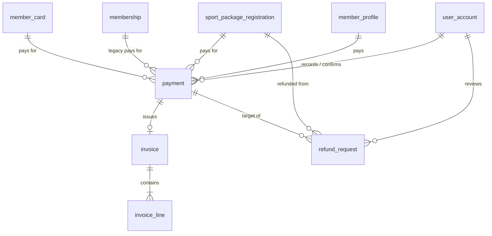

# 04 - Payments, Invoices and Reports

Screens covered: F3-01 Payment Summary, F3-02 Payment Instructions & Status, F3-03 My Payments & Receipts,
F3-04 Payment Requests, F3-05 Verify & Record Payment, F3-06 Payment Confirmed & Receipt,
F3-07 Refund Requests, F3-08 Financial Overview, F3-09 Transactions & Refund Approval, F3-10 Revenue Reports.

## ERD



## Design Decisions

- **Payments cover packages and membership cards.** Payments cover either a `sport_package_registration`, a `member_card` tier purchase, or legacy `membership`. `payment.membership_id` is retained as nullable for backward compatibility.
- **Payment requests & verification (F3-04, F3-05).** A `PENDING` payment is created when a package or card is registered. The receptionist verifies receipt of payment (Cash, Bank Transfer, Card), records the transaction reference, and confirms payment.
- **Card discount on invoices.** When a member holds an active Gold (5%) or VIP (10%) membership card, the discount is calculated at package registration, recorded in `paid_amount`, and itemized on the issued invoice (`invoice_line`). Single visits are excluded from discounts.
- **Refund Request Workflow (F3-07, F3-09).**
  - Receptionist files a refund request at front desk (`F3-07`, `S3-RefundSubmitted`) or member initiates.
  - Refund requests specify the package registration, reason, and requested refund amount (pro-rated based on unused sessions).
  - Center Manager reviews pending refund requests (`F3-09`, `S3-RefundReview`).
  - Manager may approve (`S3-RefundApproved`) or reject (`S3-RefundRejected`) the request with a note.
  - Approved refunds are marked `COMPLETED` (`S3-RefundDone`) upon payout.
- **Invoice = immutable snapshot.** One invoice per PAID payment (`invoice.payment_id` unique). Member name, reference, discount applied, and package details are snapshot into the invoice and invoice lines.
- **Revenue is computed, not stored.** Reports read `vw_paid_payment` filtered by `received_on` (paid date). Pending and Failed transactions remain in the ledger but are excluded from recognized revenue.

## Tables

### `payment`

| Column | Type | Null | Key / Default | Description |
|---|---|---|---|---|
| id | BIGINT | No | PK, IDENTITY | |
| payment_code | NVARCHAR(20) | No | UQ | `PAY-1098` |
| membership_id | BIGINT | No | FK -> membership.id | Registration being paid (`REG-1042`) |
| member_id | BIGINT | No | FK -> member_profile.user_id | Denormalized for history and ledger queries |
| purpose | NVARCHAR(20) | No | | `NEW_MEMBERSHIP`, `RENEWAL` |
| amount_due | DECIMAL(14,2) | No | CHECK >= 0 | Copied from `membership.price_amount` |
| amount_received | DECIMAL(14,2) | Yes | CHECK >= 0 | Entered by receptionist |
| method | NVARCHAR(20) | Yes | | `CASH`, `BANK_TRANSFER`, `CARD` |
| transaction_reference | NVARCHAR(60) | Yes | UX filtered | `FT-20260927-0128` |
| received_on | DATE | Yes | | Paid date, drives revenue period |
| status | NVARCHAR(20) | No | `PENDING` | `PENDING`, `PAID`, `FAILED` |
| is_verified | BIT | No | 0 | "I have verified that the full amount was received" |
| failure_reason | NVARCHAR(255) | Yes | | Required when `FAILED` |
| note | NVARCHAR(500) | Yes | | |
| recorded_by | BIGINT | Yes | FK -> user_account.id | Receptionist who entered details |
| recorded_at | DATETIME2(0) | Yes | | |
| confirmed_by | BIGINT | Yes | FK -> user_account.id | Required when `PAID` |
| confirmed_at | DATETIME2(0) | Yes | | |
| created_at, updated_at | DATETIME2(0) | | | Audit |
| version | INT | No | 0 | Optimistic lock |

Constraints and indexes:
- `ck_payment_paid_complete`, `ck_payment_failed_reason`, `ck_payment_reference_required` (non-cash PAID needs a reference).
- `ux_payment_reference (transaction_reference) WHERE transaction_reference IS NOT NULL`.
- `ux_payment_one_paid_per_membership (membership_id) WHERE status = 'PAID'`.
- `ux_payment_one_pending_per_membership (membership_id) WHERE status = 'PENDING'`.
- `ix_payment_status_received (status, received_on) INCLUDE (amount_received, method, membership_id, member_id)`.
- `ix_payment_member (member_id, created_at)`.

### `invoice`

| Column | Type | Null | Key / Default | Description |
|---|---|---|---|---|
| id | BIGINT | No | PK, IDENTITY | |
| invoice_number | NVARCHAR(30) | No | UQ | `INV-2026-1099` |
| payment_id | BIGINT | No | UQ, FK -> payment.id | One invoice per paid payment |
| membership_id | BIGINT | No | FK -> membership.id | |
| member_id | BIGINT | No | FK -> member_profile.user_id | |
| invoice_date | DATE | No | | Paid date |
| billed_to_name | NVARCHAR(100) | No | | Snapshot "Alex Nguyen" |
| billed_to_member_code | NVARCHAR(20) | No | | Snapshot `MEM-0128` |
| payment_method | NVARCHAR(20) | No | | Snapshot |
| transaction_reference | NVARCHAR(60) | Yes | | Snapshot |
| total_amount | DECIMAL(14,2) | No | CHECK >= 0 | |
| status | NVARCHAR(20) | No | `ISSUED` | `ISSUED`, `VOID` |
| issued_by | BIGINT | No | FK -> user_account.id | |
| issued_at | DATETIME2(0) | No | SYSDATETIME() | |
| voided_at | DATETIME2(0) | Yes | | |
| void_reason | NVARCHAR(255) | Yes | | |

Index: `ix_invoice_member (member_id, invoice_date)`.

### `invoice_line`

| Column | Type | Null | Key / Default | Description |
|---|---|---|---|---|
| id | BIGINT | No | PK, IDENTITY | |
| invoice_id | BIGINT | No | FK -> invoice.id (cascade) | |
| line_no | INT | No | | Unique per invoice |
| description | NVARCHAR(200) | No | | "Multi-Sport membership" |
| period_days | INT | Yes | | 30 |
| period_start | DATE | Yes | | |
| period_end | DATE | Yes | | |
| selected_sports | NVARCHAR(255) | Yes | | Snapshot "Basketball, Badminton, Swimming" |
| quantity | INT | No | 1, CHECK > 0 | |
| unit_price | DECIMAL(14,2) | No | CHECK >= 0 | |
| amount | DECIMAL(14,2) | No | CHECK >= 0 | |

Unique: `(invoice_id, line_no)`.

## Reporting View

### `vw_paid_payment`

Single source for F3-09, F3-11 and the revenue part of F3-12.

```sql
CREATE VIEW vw_paid_payment AS
SELECT p.id              AS payment_id,
       p.payment_code,
       p.received_on,
       p.amount_received AS amount,
       p.method,
       p.member_id,
       m.id              AS membership_id,
       m.plan_id,
       pl.name           AS plan_name,
       i.invoice_number
FROM payment p
JOIN membership m       ON m.id = p.membership_id
JOIN membership_plan pl ON pl.id = m.plan_id
LEFT JOIN invoice i     ON i.payment_id = p.id AND i.status = 'ISSUED'
WHERE p.status = 'PAID';
```

### `refund_request`

Front desk refund filing and Manager review/approval workflow (F3-07, F3-09).

| Column | Type | Null | Key / Default | Description |
|---|---|---|---|---|
| id | BIGINT | No | PK, IDENTITY | |
| refund_code | NVARCHAR(30) | No | UQ | `REF-1000` |
| payment_id | BIGINT | No | FK -> payment.id | Original payment |
| package_registration_id | BIGINT | Yes | FK -> sport_package_registration.id | Package being refunded |
| member_id | BIGINT | No | FK -> member_profile.user_id | Member receiving refund |
| amount_requested | DECIMAL(14,2) | No | CHECK > 0 | Amount requested |
| amount_approved | DECIMAL(14,2) | Yes | CHECK >= 0 | Amount approved by Manager |
| reason | NVARCHAR(500) | No | | Reason for refund |
| status | NVARCHAR(20) | No | `PENDING` | `PENDING`, `APPROVED`, `REJECTED`, `COMPLETED` |
| requested_by | BIGINT | No | FK -> user_account.id | Member or Receptionist |
| reviewed_by | BIGINT | Yes | FK -> user_account.id | Center Manager |
| reviewed_at | DATETIME2(0) | Yes | | Review timestamp |
| manager_note | NVARCHAR(500) | Yes | | Manager decision note |
| created_at, updated_at | DATETIME2(0) | | | Audit |

### Report queries

Revenue overview KPIs (F3-09) for a month:

```sql
SELECT SUM(amount) AS paid_revenue,
       COUNT(*)    AS paid_transactions,
       AVG(amount) AS average_payment
FROM vw_paid_payment
WHERE received_on >= @monthStart AND received_on < DATEADD(MONTH, 1, @monthStart);
```

Revenue trend, last six months (F3-09 chart):

```sql
SELECT DATEFROMPARTS(YEAR(received_on), MONTH(received_on), 1) AS month_start,
       SUM(amount) AS revenue
FROM vw_paid_payment
WHERE received_on >= DATEADD(MONTH, -5, @currentMonthStart)
GROUP BY DATEFROMPARTS(YEAR(received_on), MONTH(received_on), 1)
ORDER BY month_start;
```

Revenue by plan with share (F3-11), using the F3-10 filters:

```sql
SELECT plan_name,
       COUNT(*)    AS paid_count,
       SUM(amount) AS revenue,
       CAST(100.0 * SUM(amount) / SUM(SUM(amount)) OVER () AS DECIMAL(5,2)) AS share_percent
FROM vw_paid_payment
WHERE received_on BETWEEN @fromDate AND @toDate
  AND (@planId IS NULL OR plan_id = @planId)
  AND (@method IS NULL OR method = @method)
GROUP BY plan_name
ORDER BY revenue DESC;
```

Paying members (F3-11 "Members with at least one Paid transaction"):

```sql
SELECT COUNT(DISTINCT member_id)
FROM vw_paid_payment
WHERE received_on BETWEEN @fromDate AND @toDate;
```

Payment ledger including Pending and Failed (F3-12):

```sql
SELECT p.created_at, p.payment_code, i.invoice_number, u.full_name, pl.name AS plan_name,
       p.method, p.amount_due, p.amount_received, p.status
FROM payment p
JOIN membership m       ON m.id = p.membership_id
JOIN membership_plan pl ON pl.id = m.plan_id
JOIN user_account u     ON u.id = p.member_id
LEFT JOIN invoice i     ON i.payment_id = p.id
WHERE (@search IS NULL OR p.payment_code LIKE @search + '%' OR u.full_name LIKE '%' + @search + '%')
ORDER BY p.created_at DESC
OFFSET @offset ROWS FETCH NEXT @pageSize ROWS ONLY;
```

CSV export and "Print / Save PDF" are generated by the application from these queries; no table is required.
Each export is recorded in `activity_log` (`REPORT_EXPORTED`).
