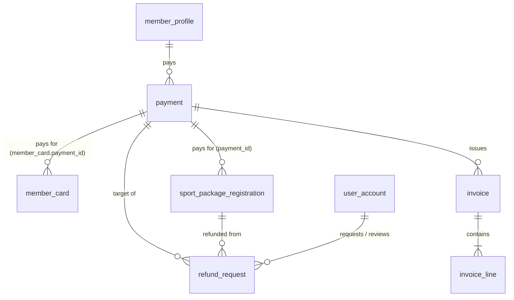

# 04 - Payments, Invoices and Reports

Screens covered: F3-01 Payment Summary, F3-02 Payment Instructions & Status, F3-03 My Payments & Receipts,
F3-04 Payment Requests, F3-05 Verify & Record Payment, F3-06 Payment Confirmed & Receipt,
F3-07 Refund Requests, F3-08 Financial Overview, F3-09 Transactions & Refund Approval, F3-10 Revenue Reports.

## ERD



Implemented in migration V14 (payment, invoice, invoice_line, payment_id on member_card,
sport_package_registration and refund_request). `refund_request` is from V10/V11.
No JPA entity maps `payment`, `invoice` or `invoice_line` yet.

## Design Decisions

- **One payment row, linked from what it pays for.** `member_card`, `sport_package_registration` and `refund_request` hold a nullable `payment_id`. A payment does not point back to the item; `invoice_line.item_type` + `item_reference_id` say what was bought.
- **Payment requests and verification (F3-04, F3-05).** A `PENDING` payment is created when a package or card is requested online. The receptionist checks the money, records `reference_code`, and sets `payment_status = 'SUCCESS'`. The linked card or package is then activated (`PENDING_PAYMENT -> ACTIVE`).
- **Card discount on invoices.** A Gold (5%) or VIP (10%) discount is computed at package registration and shown in `invoice.discount_amount` and the invoice lines. Single visits get no discount.
- **Refund Request Workflow (F3-07, F3-09).** Receptionist or member files a request, the Center Manager approves or rejects it with a note, approved refunds become `COMPLETED` on payout, and the payment becomes `REFUNDED`.
- **Invoice = snapshot.** An invoice is issued for a successful payment. `invoice.payment_id` is indexed but not unique.
- **Revenue is computed, not stored.** Reports read `vw_paid_payment` (planned view) filtered by `payment_time`. `PENDING` and `FAILED` rows stay in the ledger but are not revenue.
- **Not in V14 (left out on purpose or later):** who recorded or confirmed a payment, amount received (cash change), failure reason. Add them in a later migration if F3-05 needs them.

## Tables

### `payment` (V14)

| Column | Type | Null | Key / Default | Description |
|---|---|---|---|---|
| id | BIGINT | No | PK, IDENTITY | |
| payment_code | VARCHAR(30) | No | UQ `uq_payment_code` | From `seq_payment_code` (starts at 1000) |
| member_id | BIGINT | No | FK -> member_profile.user_id | Paying member |
| amount | DECIMAL(12,2) | No | CHECK > 0 | Amount to pay |
| payment_method | VARCHAR(30) | No | CHECK | `CASH`, `CREDIT_CARD`, `BANK_TRANSFER`, `MOMO`, `VNPAY`, `ZALOPAY` |
| payment_status | VARCHAR(20) | No | CHECK | `PENDING`, `SUCCESS`, `FAILED`, `REFUNDED` |
| reference_code | VARCHAR(100) | Yes | | Bank or e-wallet transaction reference |
| notes | NVARCHAR(500) | Yes | | |
| payment_time | DATETIME2(0) | No | SYSDATETIME() | Payment time, drives the revenue period |
| version | INT | No | 0 | Optimistic lock |
| created_at, updated_at | DATETIME2(0) | No | SYSDATETIME() | Audit |

Indexes: `ix_payment_member_id (member_id)`, `ix_payment_payment_time (payment_time)`, `ix_payment_status (payment_status)`.

### `invoice` (V14)

| Column | Type | Null | Key / Default | Description |
|---|---|---|---|---|
| id | BIGINT | No | PK, IDENTITY | |
| invoice_number | VARCHAR(30) | No | UQ `uq_invoice_number` | From `seq_invoice_number` |
| payment_id | BIGINT | No | FK -> payment.id | Payment that produced the invoice |
| member_id | BIGINT | No | FK -> member_profile.user_id | |
| subtotal_amount | DECIMAL(12,2) | No | CHECK >= 0 | Before discount and tax |
| discount_amount | DECIMAL(12,2) | No | 0 | Card discount |
| tax_amount | DECIMAL(12,2) | No | 0 | |
| total_amount | DECIMAL(12,2) | No | CHECK >= 0 | |
| status | VARCHAR(20) | No | CHECK | `ISSUED`, `PAID`, `CANCELLED`, `REFUNDED` |
| issue_date | DATETIME2(0) | No | SYSDATETIME() | |
| created_at, updated_at | DATETIME2(0) | No | SYSDATETIME() | Audit |

Indexes: `ix_invoice_payment_id`, `ix_invoice_member_id`, `ix_invoice_issue_date`.

### `invoice_line` (V14)

| Column | Type | Null | Key / Default | Description |
|---|---|---|---|---|
| id | BIGINT | No | PK, IDENTITY | |
| invoice_id | BIGINT | No | FK -> invoice.id (cascade) | |
| item_type | VARCHAR(30) | No | CHECK | `SPORT_PACKAGE`, `MEMBERSHIP_CARD`, `CLASS_DROP_IN`, `PENALTY_FEE` |
| item_reference_id | BIGINT | No | | Id of the package registration, card, etc. (no FK) |
| description | NVARCHAR(255) | No | | |
| quantity | INT | No | 1, CHECK > 0 | |
| unit_price | DECIMAL(12,2) | No | | |
| line_total | DECIMAL(12,2) | No | | |
| created_at | DATETIME2(0) | No | SYSDATETIME() | |

Index: `ix_invoice_line_invoice_id`.

## Reporting View

### `vw_paid_payment` (planned, not in any migration)

Single source for the revenue screens.

```sql
CREATE VIEW vw_paid_payment AS
SELECT p.id           AS payment_id,
       p.payment_code,
       p.payment_time,
       CAST(p.payment_time AS DATE) AS paid_on,
       p.amount,
       p.payment_method,
       p.member_id,
       i.invoice_number
FROM payment p
LEFT JOIN invoice i ON i.payment_id = p.id AND i.status IN ('ISSUED', 'PAID')
WHERE p.payment_status = 'SUCCESS';
```

### `refund_request`

Front desk refund filing and Manager review/approval workflow (F3-07, F3-09).

| Column | Type | Null | Key / Default | Description |
|---|---|---|---|---|
| id | BIGINT | No | PK, IDENTITY | |
| refund_code | NVARCHAR(30) | No | UQ | `REF-1000` |
| payment_id | BIGINT | Yes | FK -> payment.id | Original payment (added in V14) |
| package_registration_id | BIGINT | Yes | FK -> sport_package_registration.id | Package being refunded |
| member_id | BIGINT | No | FK -> member_profile.user_id | Member receiving refund |
| amount_requested | DECIMAL(14,2) | No | CHECK > 0 | Amount requested |
| amount_approved | DECIMAL(14,2) | Yes | CHECK >= 0 | Amount approved by Manager |
| reason | NVARCHAR(500) | No | | Reason for refund |
| status | NVARCHAR(20) | No | `PENDING` | `PENDING`, `APPROVED`, `REJECTED`, `COMPLETED` |
| requested_by | BIGINT | No | FK -> user_account.id | Member or Receptionist |
| reviewed_by | BIGINT | Yes | FK -> user_account.id | Center Manager |
| reviewed_at | DATETIME2(0) | Yes | | Review timestamp |
| manager_note | NVARCHAR(500) | Yes | | Manager decision note |
| created_at, updated_at | DATETIME2(0) | | | Audit |

### Report queries

Revenue overview KPIs (F3-08) for a month:

```sql
SELECT SUM(amount) AS paid_revenue,
       COUNT(*)    AS paid_transactions,
       AVG(amount) AS average_payment
FROM vw_paid_payment
WHERE paid_on >= @monthStart AND paid_on < DATEADD(MONTH, 1, @monthStart);
```

Revenue trend, last six months:

```sql
SELECT DATEFROMPARTS(YEAR(paid_on), MONTH(paid_on), 1) AS month_start,
       SUM(amount) AS revenue
FROM vw_paid_payment
WHERE paid_on >= DATEADD(MONTH, -5, @currentMonthStart)
GROUP BY DATEFROMPARTS(YEAR(paid_on), MONTH(paid_on), 1)
ORDER BY month_start;
```

Revenue by item type (F3-10):

```sql
SELECT il.item_type,
       COUNT(DISTINCT v.payment_id) AS paid_count,
       SUM(il.line_total)           AS revenue
FROM vw_paid_payment v
JOIN invoice i       ON i.payment_id = v.payment_id
JOIN invoice_line il ON il.invoice_id = i.id
WHERE v.paid_on BETWEEN @fromDate AND @toDate
  AND (@method IS NULL OR v.payment_method = @method)
GROUP BY il.item_type
ORDER BY revenue DESC;
```

Paying members:

```sql
SELECT COUNT(DISTINCT member_id)
FROM vw_paid_payment
WHERE paid_on BETWEEN @fromDate AND @toDate;
```

Payment ledger including PENDING and FAILED (F3-09):

```sql
SELECT p.payment_time, p.payment_code, i.invoice_number, u.full_name,
       p.payment_method, p.amount, p.payment_status
FROM payment p
JOIN user_account u ON u.id = p.member_id
LEFT JOIN invoice i ON i.payment_id = p.id
WHERE (@search IS NULL OR p.payment_code LIKE @search + '%' OR u.full_name LIKE '%' + @search + '%')
ORDER BY p.payment_time DESC
OFFSET @offset ROWS FETCH NEXT @pageSize ROWS ONLY;
```

CSV export and "Print / Save PDF" are generated by the application from these queries; no table is required.
