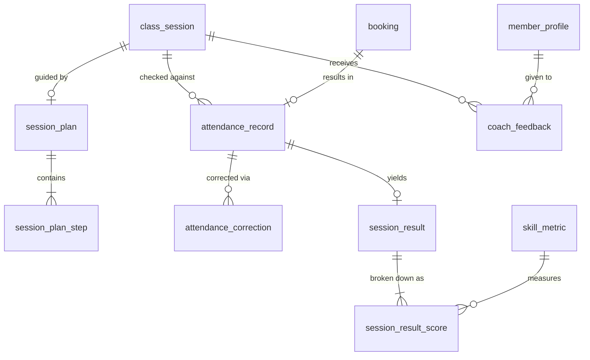

# 05 - Training, Attendance and Progress

Screens covered: F4-01 Training Dashboard, F4-02 Coach Schedule, F4-03 Session Plan, F4-04 Class Roster and Attendance, F4-05 Record Attendance, F4-06 Attendance Summary, F4-07 Record Member Results, F4-08 Provide Feedback, F4-09 Member Progress Tracking, F4-10 Member Class History, F4-11 Member Training Report.

## ERD



## Design Decisions

- **Session Plan.** `session_plan` is created by the coach before the class (F4-03). It is 1:1 with `class_session`. It includes a sequence of `session_plan_step` rows.
- **Attendance Record.** `attendance_record` is exactly 1:1 with a confirmed `booking`. The coach submits attendance for the whole class at once.
- **Attendance States on Session.** To track whether attendance was done, `class_session` has `attendance_status` (`NOT_STARTED`, `DRAFT`, `SUBMITTED`). Members only see attendance on their side if it is `SUBMITTED`.
- **Attendance Correction.** Changes to attendance after submission are logged in `attendance_correction` for audit purposes.
- **Skill Metrics.** `skill_metric` defines the criteria per sport (e.g., Basketball: Ball Control, Passing, Teamwork). These are scored 0 to 10 (or 0 to 5) in `session_result_score`.
- **Session Results.** `session_result` requires the member to be PRESENT or LATE. It aggregates the scores and adds qualitative notes.
- **Coach Feedback.** `coach_feedback` (F4-08) is a text assessment (Went well, To improve). It has a DRAFT and PUBLISHED status.

## Tables

### `session_plan`

| Column | Type | Null | Key / Default | Description |
|---|---|---|---|---|
| id | BIGINT | No | PK, IDENTITY | |
| session_id | BIGINT | No | UQ, FK -> class_session.id | |
| coach_id | BIGINT | No | FK -> coach_profile.user_id | |
| session_goal | NVARCHAR(100) | Yes | | |
| training_level | NVARCHAR(20) | Yes | | `BEGINNER`, `INTERMEDIATE`, `ADVANCED` |
| warmup_minutes | INT | Yes | CHECK >= 0 | |
| main_drill_minutes | INT | Yes | CHECK >= 0 | |
| drills_notes | NVARCHAR(MAX) | Yes | | |
| expected_outcome | NVARCHAR(255) | Yes | | |
| created_at, updated_at | DATETIME2(0) | | | Audit |
| version | INT | No | 0 | |

### `session_plan_step`

| Column | Type | Null | Key / Default | Description |
|---|---|---|---|---|
| id | BIGINT | No | PK, IDENTITY | |
| session_plan_id | BIGINT | No | FK -> session_plan.id (cascade) | |
| step_order | INT | No | | Sequence 1, 2, 3... |
| start_time | TIME(0) | Yes | | |
| activity | NVARCHAR(150) | No | | |
| duration_minutes | INT | No | CHECK > 0 | |

Unique: `(session_plan_id, step_order)`.

### `attendance_record`

| Column | Type | Null | Key / Default | Description |
|---|---|---|---|---|
| id | BIGINT | No | PK, IDENTITY | |
| session_id | BIGINT | No | FK -> class_session.id | |
| booking_id | BIGINT | No | UQ, FK -> booking.id | |
| member_id | BIGINT | No | FK -> member_profile.user_id | |
| status | NVARCHAR(20) | No | | `PRESENT`, `LATE`, `ABSENT`, `EXCUSED` |
| note | NVARCHAR(255) | Yes | | |
| recorded_by | BIGINT | No | FK -> user_account.id | Coach who submitted |
| recorded_at | DATETIME2(0) | No | SYSDATETIME() | |
| version | INT | No | 0 | |

Unique: `(session_id, member_id)`.

### `attendance_correction`

| Column | Type | Null | Key / Default | Description |
|---|---|---|---|---|
| id | BIGINT | No | PK, IDENTITY | |
| attendance_id | BIGINT | No | FK -> attendance_record.id | |
| old_status | NVARCHAR(20) | No | | |
| new_status | NVARCHAR(20) | No | | |
| reason | NVARCHAR(255) | No | | |
| corrected_by | BIGINT | No | FK -> user_account.id | Manager or Coach |
| corrected_at | DATETIME2(0) | No | SYSDATETIME() | |

### `skill_metric`

| Column | Type | Null | Key / Default | Description |
|---|---|---|---|---|
| id | BIGINT | No | PK, IDENTITY | |
| sport_id | BIGINT | No | FK -> sport.id | |
| code | NVARCHAR(30) | No | | `BALL_CONTROL`, `ENDURANCE` |
| name | NVARCHAR(50) | No | | |
| max_score | INT | No | 5 | |
| display_order | INT | No | 0 | |
| is_active | BIT | No | 1 | |

Unique: `(sport_id, code)`.

### `session_result`

| Column | Type | Null | Key / Default | Description |
|---|---|---|---|---|
| id | BIGINT | No | PK, IDENTITY | |
| session_id | BIGINT | No | FK -> class_session.id | |
| member_id | BIGINT | No | FK -> member_profile.user_id | |
| attendance_id | BIGINT | No | UQ, FK -> attendance_record.id | Must be PRESENT or LATE |
| observed_result | NVARCHAR(500) | Yes | | |
| recorded_by | BIGINT | No | FK -> user_account.id | Coach |
| recorded_at | DATETIME2(0) | No | SYSDATETIME() | |

Unique: `(session_id, member_id)`.

### `session_result_score`

| Column | Type | Null | Key / Default | Description |
|---|---|---|---|---|
| id | BIGINT | No | PK, IDENTITY | |
| session_result_id | BIGINT | No | FK -> session_result.id (cascade) | |
| skill_metric_id | BIGINT | No | FK -> skill_metric.id | |
| score | INT | No | CHECK 0..10 | |

Unique: `(session_result_id, skill_metric_id)`.

### `coach_feedback`

| Column | Type | Null | Key / Default | Description |
|---|---|---|---|---|
| id | BIGINT | No | PK, IDENTITY | |
| session_id | BIGINT | No | FK -> class_session.id | |
| member_id | BIGINT | No | FK -> member_profile.user_id | |
| coach_id | BIGINT | No | FK -> coach_profile.user_id | |
| went_well | NVARCHAR(MAX) | Yes | | |
| improve_next | NVARCHAR(MAX) | Yes | | |
| status | NVARCHAR(20) | No | `DRAFT` | `DRAFT`, `PUBLISHED` |
| published_at | DATETIME2(0) | Yes | | |
| created_at, updated_at | DATETIME2(0) | | | Audit |

Unique: `(session_id, member_id)`.

## Views

### `vw_session_attendance_summary`

Used for class listings (F4-02).

```sql
CREATE VIEW vw_session_attendance_summary AS
SELECT session_id,
       SUM(CASE WHEN status IN ('PRESENT', 'LATE') THEN 1 ELSE 0 END) AS attended_count,
       SUM(CASE WHEN status = 'ABSENT' THEN 1 ELSE 0 END) AS absent_count,
       SUM(CASE WHEN status = 'EXCUSED' THEN 1 ELSE 0 END) AS excused_count
FROM attendance_record
GROUP BY session_id;
```

### `vw_member_skill_latest`

Used for F4-09 Member Progress Tracking to show the latest score per metric.

```sql
CREATE VIEW vw_member_skill_latest AS
WITH RankedScores AS (
    SELECT sr.member_id,
           srs.skill_metric_id,
           srs.score,
           cs.session_date,
           ROW_NUMBER() OVER (PARTITION BY sr.member_id, srs.skill_metric_id ORDER BY cs.session_date DESC) as rn
    FROM session_result_score srs
    JOIN session_result sr ON sr.id = srs.session_result_id
    JOIN class_session cs ON cs.id = sr.session_id
)
SELECT member_id, skill_metric_id, score, session_date
FROM RankedScores
WHERE rn = 1;
```
