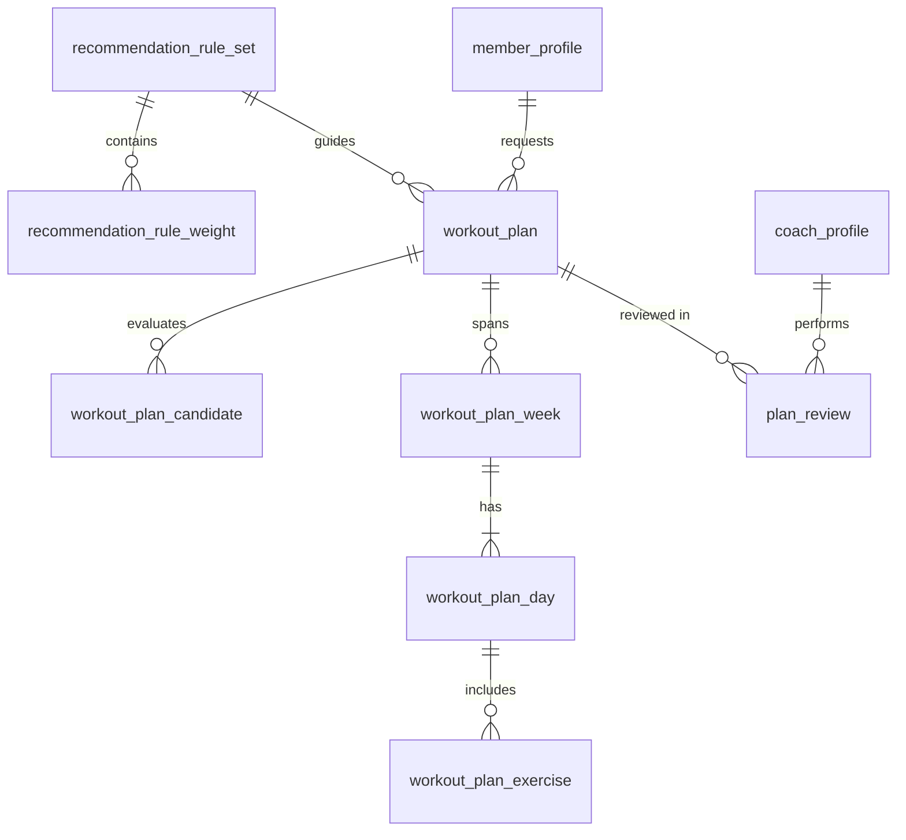

# 06 - AI Workout Recommendation

Screens covered: F5-01 My Training Goals, F5-02 Recommended Sports & Classes, F5-03 Recommendation Detail,
F5-04 Suitable Sessions, F5-05 Saved Recommendations, F5-06 AI Exercise Suggestions,
F5-07 Review Suggested Exercises, F5-08 Training Plan Draft.

## ERD

## Design Decisions

- **Rule Sets & AI Guidance.** The system provides recommendation weights (`recommendation_rule_weight`) to align member goals with available sports, classes, and schedules.
- **Member Flow (F5-01 to F5-05).** The member sets training goals, receives ranked recommendations for sports and classes, inspects recommendation details, reviews suitable scheduled sessions, and saves recommendations. Booking recommended sessions requires an eligible sport package (`S5-NoPackage`).
- **Coach AI Assisted Training Plans (F5-06 to F5-08).** Coaches leverage AI suggestions for exercises and drills based on member skill levels and sport objectives, reviewing and modifying suggested exercises before finalizing a training plan draft.
- **Candidates & Evaluations.** `workout_plan_candidate` stores the sessions or classes evaluated and ranked.
- **History & Revisions.** When plans or recommendations are adjusted, earlier drafts transition statuses (`SUPERSEDED` or `ARCHIVED`) with `previous_plan_id` audit links.

## Tables

### `recommendation_rule_set`

| Column | Type | Null | Key / Default | Description |
|---|---|---|---|---|
| id | BIGINT | No | PK, IDENTITY | |
| version_no | INT | No | UQ | |
| safety_gate_enabled | BIT | No | 1 | |
| is_active | BIT | No | | 1 = current active rule set |
| note | NVARCHAR(255) | Yes | | |
| created_by | BIGINT | No | FK -> user_account.id | |
| activated_at | DATETIME2(0) | Yes | | |

Filtered unique index: `ux_recommendation_rule_set_active (is_active) WHERE is_active = 1`.

### `recommendation_rule_weight`

| Column | Type | Null | Key / Default | Description |
|---|---|---|---|---|
| id | BIGINT | No | PK, IDENTITY | |
| rule_set_id | BIGINT | No | FK -> recommendation_rule_set.id (cascade) | |
| criterion | NVARCHAR(30) | No | | `GOAL_ALIGNMENT`, `SCHEDULE_FIT`, `MEMBER_PREFERENCE`, `MEMBERSHIP_COVERAGE` |
| weight_percent | INT | No | CHECK 0..100 | App rule: sum per set = 100 |

Unique: `(rule_set_id, criterion)`.

### `workout_plan`

| Column | Type | Null | Key / Default | Description |
|---|---|---|---|---|
| id | BIGINT | No | PK, IDENTITY | |
| plan_code | NVARCHAR(20) | No | UQ | `WP-0001` |
| member_id | BIGINT | No | FK -> member_profile.user_id | |
| rule_set_id | BIGINT | No | FK -> recommendation_rule_set.id | |
| membership_id | BIGINT | Yes | FK -> membership.id | |
| previous_plan_id | BIGINT | Yes | FK -> workout_plan.id | |
| goal | NVARCHAR(30) | No | | |
| sessions_per_week | INT | No | CHECK 1..7 | |
| preferred_time | NVARCHAR(30) | Yes | | `WEEKDAY_MORNING`, `ANY`, etc. |
| available_day | NVARCHAR(30) | Yes | | `MONDAY`, `TUESDAY`, etc. (CSV or JSON if multiple) |
| preferred_sport_id | BIGINT | Yes | FK -> sport.id | |
| age_group_id | BIGINT | Yes | FK -> age_group.id | Snapshot |
| experience_level | NVARCHAR(20) | Yes | | Snapshot |
| focus_sport_id | BIGINT | Yes | FK -> sport.id | AI output |
| focus_summary | NVARCHAR(255) | Yes | | AI output |
| headline | NVARCHAR(150) | Yes | | AI output |
| duration_weeks | INT | No | CHECK 1..12 | AI output |
| ai_summary | NVARCHAR(MAX) | Yes | | AI output |
| recommended_class_id | BIGINT | Yes | FK -> sport_class.id | AI output |
| recommended_session_id | BIGINT | Yes | FK -> class_session.id | AI output |
| reviewer_coach_id | BIGINT | Yes | FK -> coach_profile.user_id | |
| match_score | INT | Yes | CHECK 0..100 | AI output |
| status | NVARCHAR(20) | No | `DRAFT` | `DRAFT`, `PENDING_REVIEW`, `APPROVED`, `CHANGES_REQUESTED`, `SUPERSEDED`, `DISCARDED` |
| ai_model | NVARCHAR(50) | Yes | | Used for logging / token tracking |
| ai_raw_response | NVARCHAR(MAX) | Yes | CHECK ISJSON | |
| generated_at | DATETIME2(0) | Yes | | |
| submitted_at | DATETIME2(0) | Yes | | |
| approved_at | DATETIME2(0) | Yes | | |
| version | INT | No | 0 | |

Filtered unique indexes: 
- `ux_workout_plan_approved (member_id) WHERE status = 'APPROVED'`
- `ux_workout_plan_pending (member_id) WHERE status = 'PENDING_REVIEW'`

### `workout_plan_candidate`

| Column | Type | Null | Key / Default | Description |
|---|---|---|---|---|
| id | BIGINT | No | PK, IDENTITY | |
| plan_id | BIGINT | No | FK -> workout_plan.id (cascade) | |
| class_id | BIGINT | Yes | FK -> sport_class.id | |
| session_id | BIGINT | Yes | FK -> class_session.id | |
| rank_no | INT | No | CHECK > 0 | |
| total_score | INT | No | CHECK 0..100 | |
| goal_score | INT | No | CHECK 0..100 | |
| schedule_score | INT | No | CHECK 0..100 | |
| preference_score | INT | No | CHECK 0..100 | |
| coverage_score | INT | No | CHECK 0..100 | |
| reason | NVARCHAR(255) | Yes | | AI explanation |

Unique: `(plan_id, rank_no)`.

### `workout_plan_week`

| Column | Type | Null | Key / Default | Description |
|---|---|---|---|---|
| id | BIGINT | No | PK, IDENTITY | |
| plan_id | BIGINT | No | FK -> workout_plan.id (cascade) | |
| week_no | INT | No | CHECK > 0 | |
| focus | NVARCHAR(255) | Yes | | |

Unique: `(plan_id, week_no)`.

### `workout_plan_day`

| Column | Type | Null | Key / Default | Description |
|---|---|---|---|---|
| id | BIGINT | No | PK, IDENTITY | |
| plan_id | BIGINT | No | FK -> workout_plan.id (cascade) | |
| day_of_week | NVARCHAR(15) | No | | `MONDAY`, `TUESDAY`, etc. |
| display_order | INT | No | | Order within the week |
| activity_type | NVARCHAR(30) | No | | `CLASS`, `SKILL_PRACTICE`, `FITNESS`, `RECOVERY`, `REST`, `PREPARE` |
| title | NVARCHAR(100) | No | | |
| description | NVARCHAR(500) | Yes | | |
| duration_minutes | INT | Yes | CHECK > 0 | |
| class_session_id | BIGINT | Yes | FK -> class_session.id | Required when `CLASS` |

Unique: `(plan_id, day_of_week, display_order)`.

### `workout_plan_exercise`

| Column | Type | Null | Key / Default | Description |
|---|---|---|---|---|
| id | BIGINT | No | PK, IDENTITY | |
| plan_id | BIGINT | No | FK -> workout_plan.id (cascade) | |
| seq_no | INT | No | CHECK > 0 | |
| description | NVARCHAR(255) | No | | |
| source | NVARCHAR(20) | No | `AI` | `AI`, `COACH` |
| added_by | BIGINT | Yes | FK -> user_account.id | |

### `plan_review`

| Column | Type | Null | Key / Default | Description |
|---|---|---|---|---|
| id | BIGINT | No | PK, IDENTITY | |
| plan_id | BIGINT | No | FK -> workout_plan.id | |
| coach_id | BIGINT | Yes | FK -> coach_profile.user_id | |
| requested_by | BIGINT | No | FK -> user_account.id | Member |
| member_note | NVARCHAR(500) | Yes | | |
| status | NVARCHAR(20) | No | `PENDING` | `PENDING`, `DECIDED`, `CANCELLED` |
| decision | NVARCHAR(20) | Yes | | `APPROVED`, `CHANGES_REQUESTED` |
| coach_note | NVARCHAR(500) | Yes | | |
| requested_at | DATETIME2(0) | No | SYSDATETIME() | |
| decided_at | DATETIME2(0) | Yes | | |

Filtered unique index: `ux_plan_review_pending (plan_id) WHERE status = 'PENDING'`.
Index: `ix_plan_review_coach_status (coach_id, status, requested_at)`.
