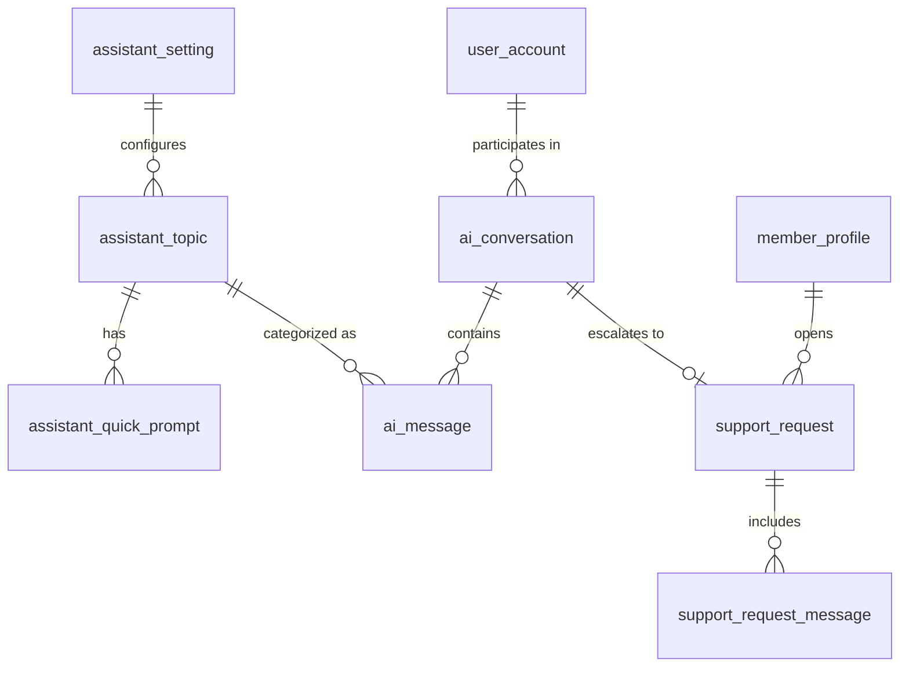

# 07 - AI Assistant and Support

Screens covered: F6-01 AI Assistant Welcome, F6-02 Assistant Conversation, F6-03 Suggest Classes, F6-04 Query Membership, F6-05 Hand-off to Staff, F6-06 Suggest Exercise, F6-07 Handoff Sent, F6-08 Member Support Hub, F6-09 Staff Support Queue, F6-10 Request Details, F6-11 Resolution, F6-12 Assistant Settings.

## ERD

## Design Decisions

- **Assistant Settings.** Single row table `assistant_setting` (enforced by CHECK id = 1) for system-wide AI configuration (F6-12).
- **Assistant Topics.** Pre-defined topics `assistant_topic` (CLASS_SCHEDULE, MEMBERSHIP, SERVICES_EXERCISE, BOOKING) guide the AI's prompts and capabilities.
- **Conversations and Messages.** The AI chat history is stored in `ai_conversation` and `ai_message`. Each message tracks the sender (USER, ASSISTANT, SYSTEM), intent, tokens, and latency for monitoring. `referenced_entities` stores JSON links to suggested classes or memberships.
- **Handoff (Support Request).** If the user needs human help, a `support_request` is created. It links back to the `ai_conversation_id` so staff can read the context.
- **Support Workflow.** A request starts as OPEN, moves to IN_PROGRESS when assigned, and becomes RESOLVED. A request may be RESOLVED only after a staff reply (app rule).
- **Support Messages.** Both members and staff communicate on a ticket via `support_request_message`.

## Tables

### `assistant_setting`

| Column | Type | Null | Key / Default | Description |
|---|---|---|---|---|
| id | INT | No | PK, CHECK id = 1 | Single row config |
| welcome_message | NVARCHAR(500) | No | | |
| escalation_enabled | BIT | No | 1 | Allow hand-off |
| clarification_enabled | BIT | No | 1 | |
| fallback_message | NVARCHAR(255) | No | | |
| ai_model | NVARCHAR(50) | No | | |
| updated_by | BIGINT | Yes | FK -> user_account.id | |
| updated_at | DATETIME2(0) | Yes | | |

### `assistant_topic`

| Column | Type | Null | Key / Default | Description |
|---|---|---|---|---|
| id | BIGINT | No | PK, IDENTITY | |
| code | NVARCHAR(30) | No | UQ | `CLASS_SCHEDULE`, `MEMBERSHIP`, `SERVICES_EXERCISE`, `BOOKING` |
| name | NVARCHAR(100) | No | | |
| guidance | NVARCHAR(MAX) | Yes | | System prompt text for this topic |
| is_active | BIT | No | 1 | |
| display_order | INT | No | 0 | |

### `assistant_quick_prompt`

| Column | Type | Null | Key / Default | Description |
|---|---|---|---|---|
| id | BIGINT | No | PK, IDENTITY | |
| topic_id | BIGINT | No | FK -> assistant_topic.id | |
| prompt_text | NVARCHAR(255) | No | | |
| display_order | INT | No | 0 | |
| is_active | BIT | No | 1 | |

### `ai_conversation`

| Column | Type | Null | Key / Default | Description |
|---|---|---|---|---|
| id | BIGINT | No | PK, IDENTITY | |
| user_id | BIGINT | No | FK -> user_account.id | |
| title | NVARCHAR(150) | Yes | | Auto-generated summary |
| status | NVARCHAR(20) | No | `OPEN` | `OPEN`, `CLOSED`, `HANDED_OFF` |
| started_at | DATETIME2(0) | No | SYSDATETIME() | |
| last_message_at | DATETIME2(0) | No | SYSDATETIME() | |

### `ai_message`

| Column | Type | Null | Key / Default | Description |
|---|---|---|---|---|
| id | BIGINT | No | PK, IDENTITY | |
| conversation_id | BIGINT | No | FK -> ai_conversation.id (cascade) | |
| sender | NVARCHAR(20) | No | | `USER`, `ASSISTANT`, `SYSTEM` |
| content | NVARCHAR(MAX) | No | | |
| intent | NVARCHAR(30) | Yes | | `CLASS_SCHEDULE`, `MEMBERSHIP`, `EXERCISE`, `BOOKING`, `CLARIFY`, `HANDOFF`, `GREETING`, `OUT_OF_SCOPE` |
| topic_id | BIGINT | Yes | FK -> assistant_topic.id | |
| needs_clarification | BIT | No | 0 | |
| clarification_data | NVARCHAR(MAX) | Yes | CHECK ISJSON | |
| referenced_entities | NVARCHAR(MAX) | Yes | CHECK ISJSON | E.g. `[{"type": "CLASS", "id": 12}]` |
| model | NVARCHAR(50) | Yes | | |
| prompt_tokens | INT | Yes | | |
| completion_tokens | INT | Yes | | |
| latency_ms | INT | Yes | | |
| created_at | DATETIME2(0) | No | SYSDATETIME() | |

### `support_request`

| Column | Type | Null | Key / Default | Description |
|---|---|---|---|---|
| id | BIGINT | No | PK, IDENTITY | |
| request_code | NVARCHAR(20) | No | UQ | `REQ-1082` |
| member_id | BIGINT | No | FK -> member_profile.user_id | |
| topic | NVARCHAR(30) | No | | `MEMBERSHIP`, `PAYMENT`, `PROFILE`, `CLASS_SCHEDULE`, `BOOKING`, `OTHER` |
| subject | NVARCHAR(255) | No | | |
| question | NVARCHAR(MAX) | No | | Initial message |
| source | NVARCHAR(30) | No | | `AI_HANDOFF`, `RECEPTION`, `MEMBER_PORTAL` |
| ai_conversation_id | BIGINT | Yes | FK -> ai_conversation.id | Link to AI chat context |
| status | NVARCHAR(20) | No | `OPEN` | `OPEN`, `IN_PROGRESS`, `RESOLVED`, `CLOSED` |
| assigned_to | BIGINT | Yes | FK -> user_account.id | Staff member |
| created_by | BIGINT | No | FK -> user_account.id | Member or Receptionist |
| created_at | DATETIME2(0) | No | SYSDATETIME() | |
| resolved_by | BIGINT | Yes | FK -> user_account.id | Required when `RESOLVED` |
| resolved_at | DATETIME2(0) | Yes | | Required when `RESOLVED` |
| version | INT | No | 0 | |

### `support_request_message`

| Column | Type | Null | Key / Default | Description |
|---|---|---|---|---|
| id | BIGINT | No | PK, IDENTITY | |
| request_id | BIGINT | No | FK -> support_request.id (cascade) | |
| author_id | BIGINT | No | FK -> user_account.id | |
| author_type | NVARCHAR(20) | No | | `MEMBER`, `STAFF` |
| body | NVARCHAR(MAX) | No | | |
| status_after | NVARCHAR(20) | No | | Status of request after this message |
| created_at | DATETIME2(0) | No | SYSDATETIME() | |
