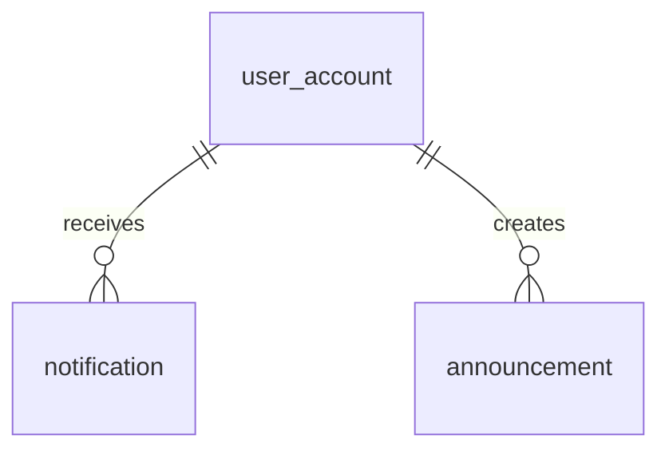

# 08 - Notifications and System

Screens covered: Global (Top nav notification bell), Announcements, System Configuration.

## ERD

## Design Decisions

- **Notifications.** `notification` table stores in-app alerts (e.g. "Your waitlist offer expires in 12 hours", "New AI workout plan generated"). It tracks read status.
- **System Settings.** `system_setting` stores global configuration (Center Name, Opening Hours, Booking Rules). Key is the PK.
- **Announcements.** `announcement` table stores global messages for the dashboard ("Holiday closing hours"). It has an audience filter.
- **Sequences.** Documenting the SQL Server sequences used for business codes.

## Tables

### `notification`

| Column | Type | Null | Key / Default | Description |
|---|---|---|---|---|
| id | BIGINT | No | PK, IDENTITY | |
| recipient_id | BIGINT | No | FK -> user_account.id | |
| type | NVARCHAR(30) | No | | `WAITLIST_OFFER`, `PAYMENT_REMINDER`, `BOOKING_CANCELLED`, `PLAN_APPROVED` |
| title | NVARCHAR(150) | No | | |
| message | NVARCHAR(500) | No | | |
| link_url | NVARCHAR(255) | Yes | | App route, e.g. `/my-bookings` |
| related_entity_type | NVARCHAR(40) | Yes | | `WAITLIST_ENTRY`, `MEMBERSHIP`, `CLASS_SESSION` |
| related_entity_id | BIGINT | Yes | | |
| is_read | BIT | No | 0 | |
| read_at | DATETIME2(0) | Yes | | |
| created_at | DATETIME2(0) | No | SYSDATETIME() | |

Index: `ix_notification_recipient (recipient_id, is_read, created_at)`.

### `announcement`

| Column | Type | Null | Key / Default | Description |
|---|---|---|---|---|
| id | BIGINT | No | PK, IDENTITY | |
| title | NVARCHAR(150) | No | | |
| body | NVARCHAR(MAX) | No | | |
| audience | NVARCHAR(20) | No | | `PUBLIC`, `MEMBERS`, `STAFF` |
| status | NVARCHAR(20) | No | `DRAFT` | `DRAFT`, `PUBLISHED`, `ARCHIVED` |
| published_at | DATETIME2(0) | Yes | | |
| expires_at | DATETIME2(0) | Yes | | |
| created_by | BIGINT | No | FK -> user_account.id | |
| created_at, updated_at | DATETIME2(0) | | | Audit |

### `system_setting`

| Column | Type | Null | Key / Default | Description |
|---|---|---|---|---|
| setting_key | NVARCHAR(60) | No | PK | E.g. `CENTER_NAME`, `WAITLIST_OFFER_HOURS` |
| setting_value | NVARCHAR(MAX) | Yes | | |
| value_type | NVARCHAR(20) | No | | `STRING`, `INTEGER`, `DECIMAL`, `BOOLEAN`, `JSON` |
| description | NVARCHAR(255) | Yes | | |
| updated_by | BIGINT | Yes | FK -> user_account.id | |
| updated_at | DATETIME2(0) | No | SYSDATETIME() | |

Required Keys:
- `CENTER_NAME`
- `OPENING_HOURS` (e.g. `06:00-22:00`)
- `CURRENCY` (`VND`)
- `TIMEZONE` (`Asia/Ho_Chi_Minh`)
- `BOOKING_CANCEL_CUTOFF_HOURS` (e.g. `2`)
- `WAITLIST_OFFER_HOURS` (e.g. `12`)
- `MEMBERSHIP_EXPIRY_REMINDER_DAYS` (e.g. `5`)

## Sequences

The following sequences are defined in the schema design to generate business codes via `NEXT VALUE FOR`:

- `seq_member_code`: Format `MEM-0001` (Implemented in V2)
- `seq_registration_code`: Format `REG-0001` (Implemented in V9)
- `seq_card_code`: Format `CARD-1001` (Implemented in V10)
- `seq_package_reg_code`: Format `SPR-1001` (Implemented in V10)
- `seq_refund_code`: Format `REF-1001` (Implemented in V10)
- `seq_booking_code`: Format `BK-0001` (Implemented in V10)
- `seq_class_code`: Format `CL-0001` (Implemented in V10)
- `seq_payment_code`: Format `PAY-0001` (Planned)
- `seq_invoice_number`: Format `INV-YYYY-0001` (YYYY handled in app or trigger, Planned)
- `seq_support_request_code`: Format `REQ-0001` (Planned)
- `seq_workout_plan_code`: Format `WP-0001` (Planned)
