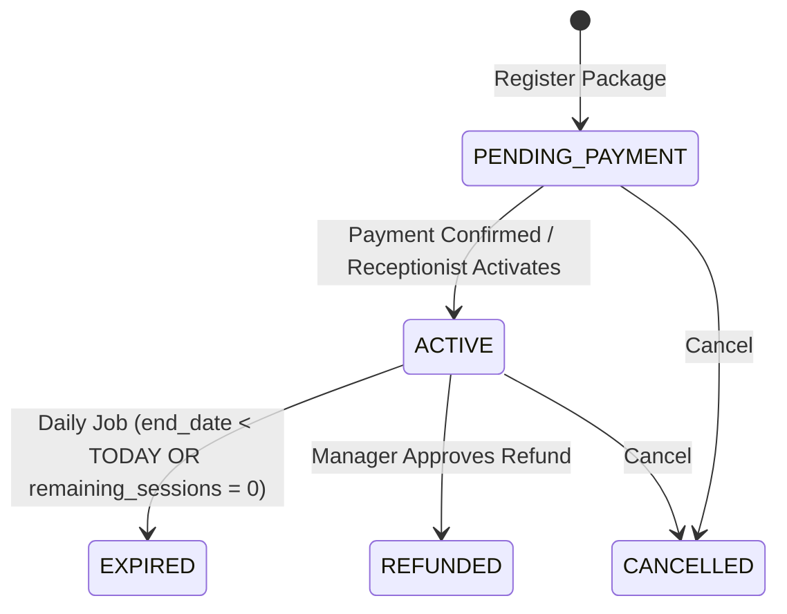
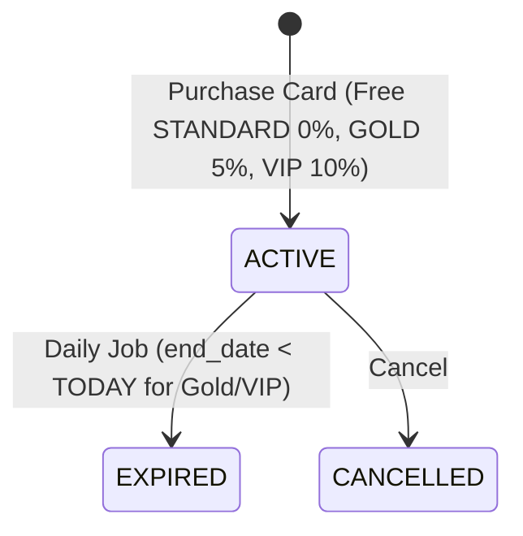
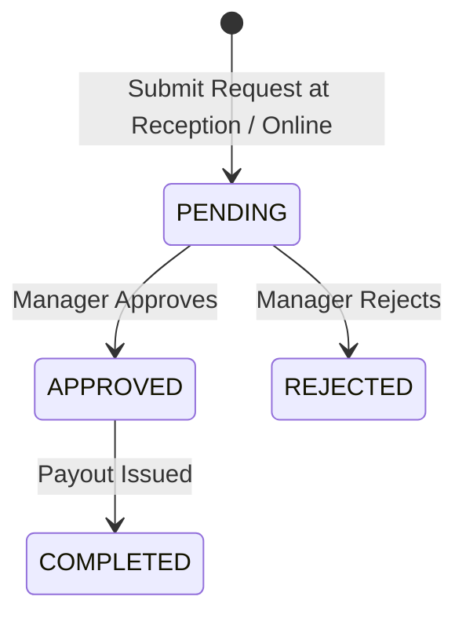
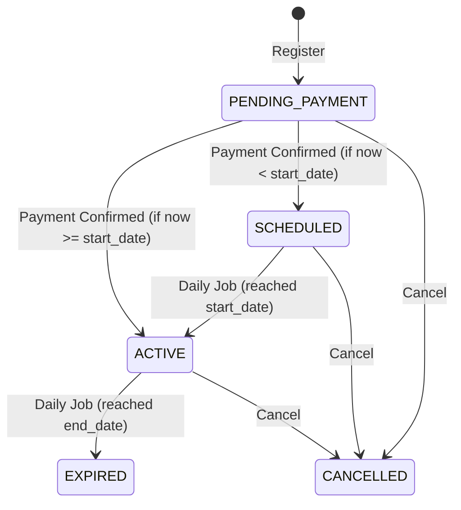
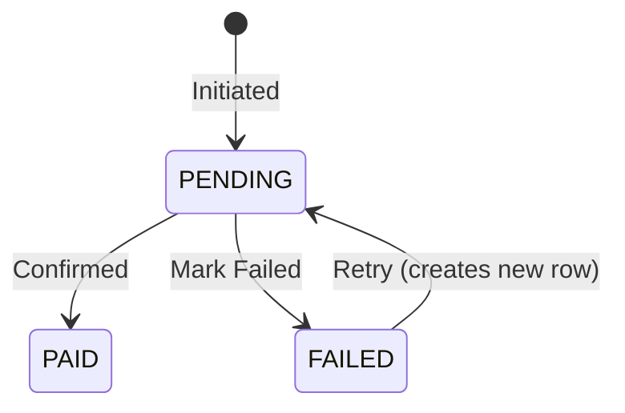
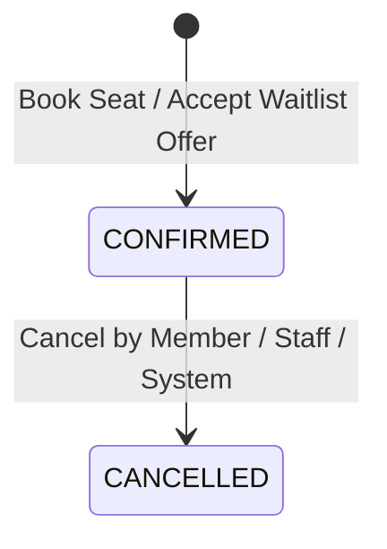
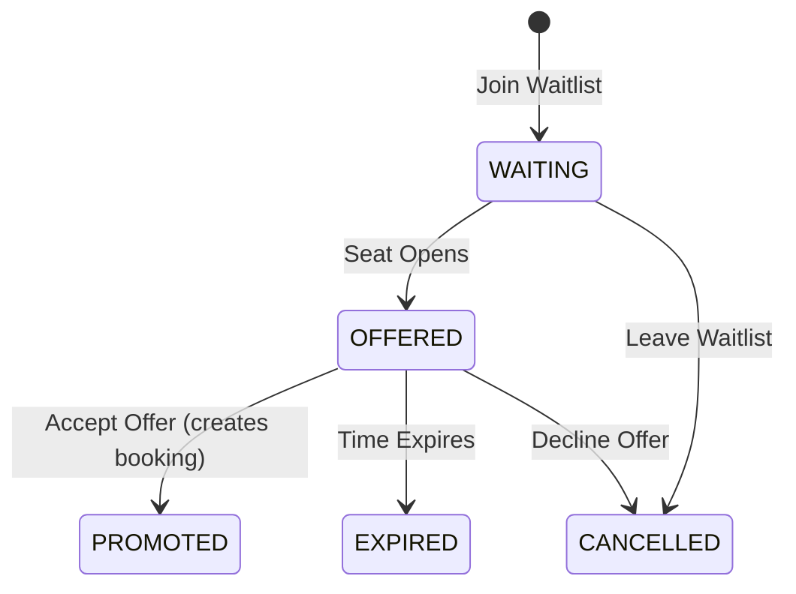
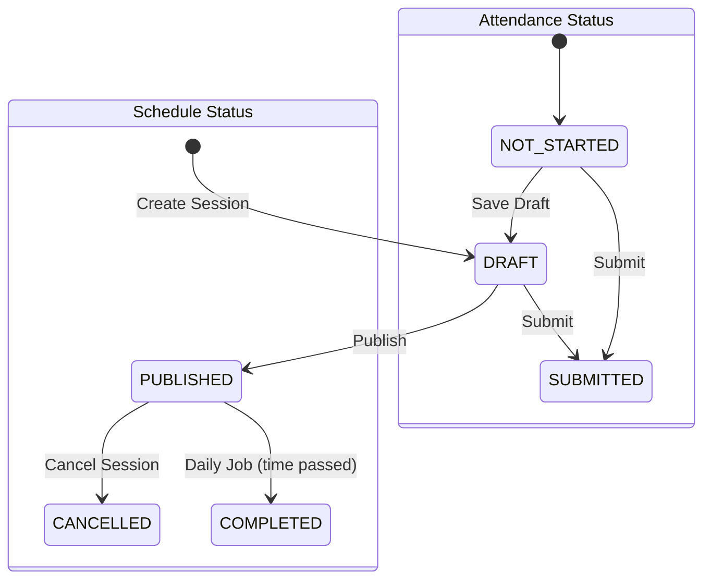
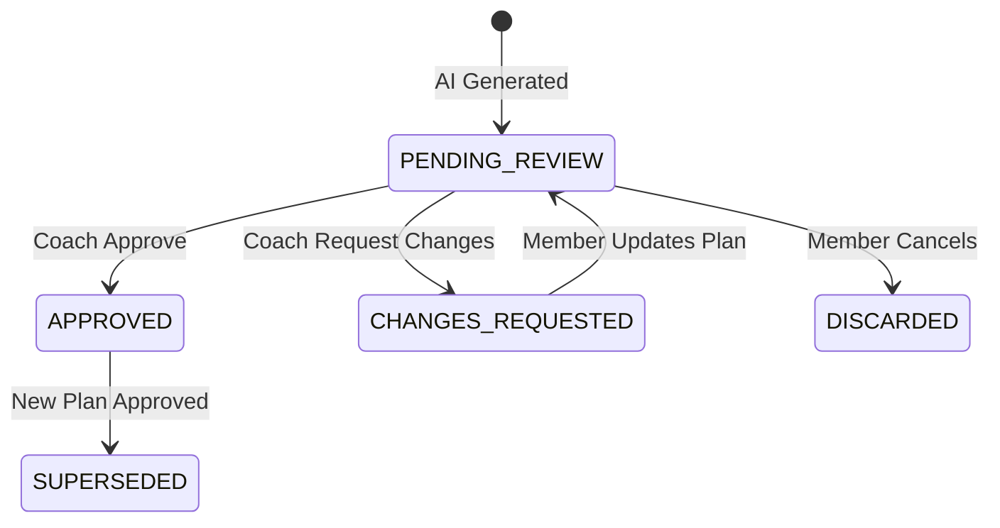
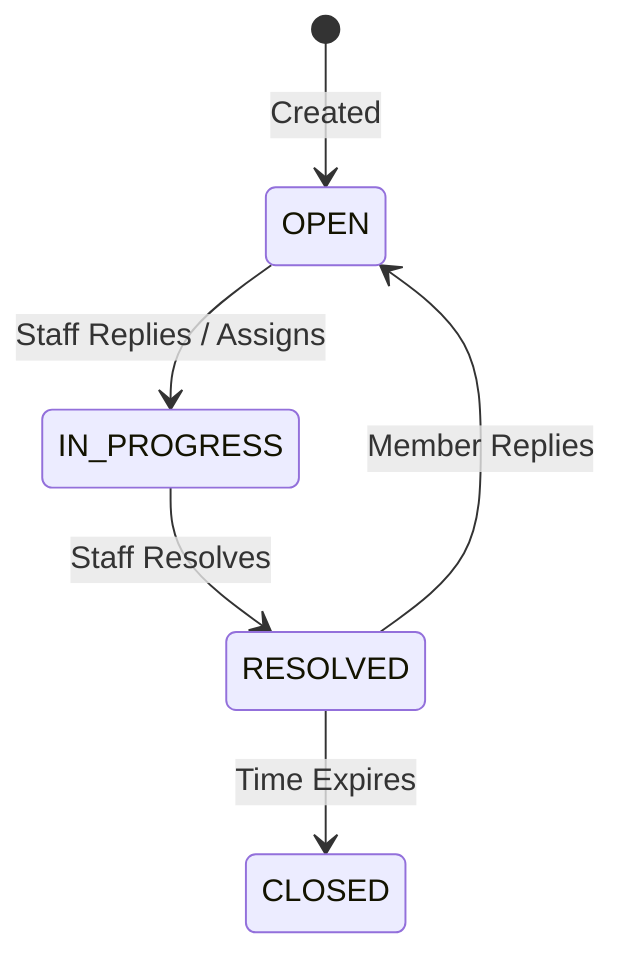

# 09 - Business Rules and State Machines

Screens covered: Global logic and flows across all flows.

## State Machines

### Sport Package Registration (`sport_package_registration.status`)

### Member Card (`member_card.status`)

### Refund Request (`refund_request.status`)

### Legacy Membership (`membership.status`)

### Payment (`payment.status`)

### Booking (`booking.status`)

### Waitlist (`waitlist_entry.status`)

### Class Session (`class_session.status` & `attendance_status`)

### Workout Plan (`workout_plan.status`)

### Support Request (`support_request.status`)

## Front Desk Check-in Rules (Screen F1-15)

Front desk check-in validates member arrival at the center:

1. **Today's Confirmed Booking Required:** The member MUST have at least one confirmed session booking for the current day (`session_date = CAST(SYSDATETIME() AS DATE)`, `status = 'CONFIRMED'`).
2. **Active Package Coverage:** The member must have an active paid sport package (or legacy active membership) covering the sport and format of the booked session.
3. **No Duplicate Check-in:** The member must not have already checked in for the same session today.
4. **Attendance Independence:** Front desk check-in does not mark session attendance and does not double-deduct remaining package sessions (attendance is separately recorded by coaches in classes or receptionists in self-training slots).
5. **Result & Denial Reasons:**
   - If conditions 1 and 2 are satisfied, result is `ALLOWED`.
   - If no confirmed booking exists for today, result is `DENIED` with reason `"No confirmed booking for today"`.
   - If package is expired or inactive, result is `DENIED` with reason `"No active sport package"`.
   - If duplicate check-in detected, result is `DENIED` with reason `"Already checked in for this session"`.

## Membership Card & Discount Rules

1. **Card Validity:**
   - Standard Card (STANDARD): Free, permanent validity, 0% discount.
   - Gold Card (GOLD): 300,000 VND / 12 months, 5% discount on 30-day and 90-day packages.
   - VIP Card (VIP): 600,000 VND / 12 months, 10% discount on 30-day and 90-day packages.
2. **Discount Scope & Exclusions:**
   - Single-visit packages (1 day, 1 session) are strictly EXCLUDED from discounts.
   - Discounts apply only to 30-day and 90-day packages.
   - Discounts do not stack. The member's single highest active card discount is applied.
3. **Consecutive Renewal:** Renewing an active Gold/VIP card extends the `end_date` by 12 months from the existing expiry date.

## Sport Package & Booking Eligibility Rules

1. **Multiple Concurrent Packages:** Members can hold multiple active packages simultaneously across different sports and formats.
2. **Session Reservation:** Booking a session reserves 1 session from `remaining_sessions`. Cancelling a booking restores 1 session to `remaining_sessions`.
3. **Booking Eligibility Checklist:**
   - Session State: `PUBLISHED` and in the future.
   - Capacity: Available seats (`capacity - booked_count > 0`), otherwise waitlist.
   - Package Coverage: Active package for the class sport with `remaining_sessions > 0` and `session_date` between `start_date` and `end_date`.
   - Format Match: Self-training package for self-training sessions; Coach-led package for coach-led classes.
   - Age Restriction: Member's age falls within `age_group` range.
   - No Overlap: Member does not have an overlapping confirmed booking.
   - Double Booking: Database enforces at most one confirmed booking per member per session.

## Refund Rules

1. **Eligibility:** Refund requests can be submitted at reception (`F3-07`) or initiated by members for active package registrations.
2. **Amount Calculation:** Pro-rated based on unused remaining sessions:
   - `refund_amount = (remaining_sessions / total_sessions) * paid_amount`
3. **Manager Approval:** Center Manager must review all pending refund requests (`F3-09`).
4. **Resolution:** Upon Manager approval, refund status becomes `APPROVED`, and upon disbursement becomes `COMPLETED`. The package registration status transitions to `REFUNDED`. If rejected, status is `REJECTED` with a mandatory reason note.

## Critical Transactions & Concurrency Control

### Booking a Seat

1. `UPDATE class_session SET booked_count = booked_count + 1 WHERE id = @id AND booked_count < capacity`
2. If row count is 0, session is full. Return error or prompt waitlist.
3. Decrement package remaining sessions:
   `UPDATE sport_package_registration SET remaining_sessions = remaining_sessions - 1 WHERE id = @pkgId AND remaining_sessions > 0`
4. Insert `booking` row (`status = 'CONFIRMED'`).

### Cancelling a Booking

1. Update `booking` status to `CANCELLED`.
2. `UPDATE class_session SET booked_count = booked_count - 1 WHERE id = @id`.
3. Restore package session:
   `UPDATE sport_package_registration SET remaining_sessions = remaining_sessions + 1 WHERE id = @pkgId`.
4. Check `waitlist_entry` for the oldest `WAITING` entry and offer seat.

### Confirming a Payment

1. Pessimistic lock on `payment` to prevent double confirmation.
2. Verify status is `PENDING`.
3. Set status to `PAID`, record `received_on` and `amount_received`.
4. Activate corresponding package registration or member card.
5. Issue `invoice` and itemized `invoice_line` snapshot with applied discounts.
6. Insert `activity_log`.

## Scheduled Jobs

1. **Package Expiration:** Daily at midnight, set packages to `EXPIRED` if `end_date < TODAY` or `remaining_sessions = 0`.
2. **Card Expiration:** Daily at midnight, set member cards to `EXPIRED` if `end_date < TODAY`.
3. **Session Completion:** Hourly, mark sessions as `COMPLETED` when session date and time have passed.
4. **Waitlist Expiry:** Hourly, expire offered waitlist entries that exceeded the acceptance window.
