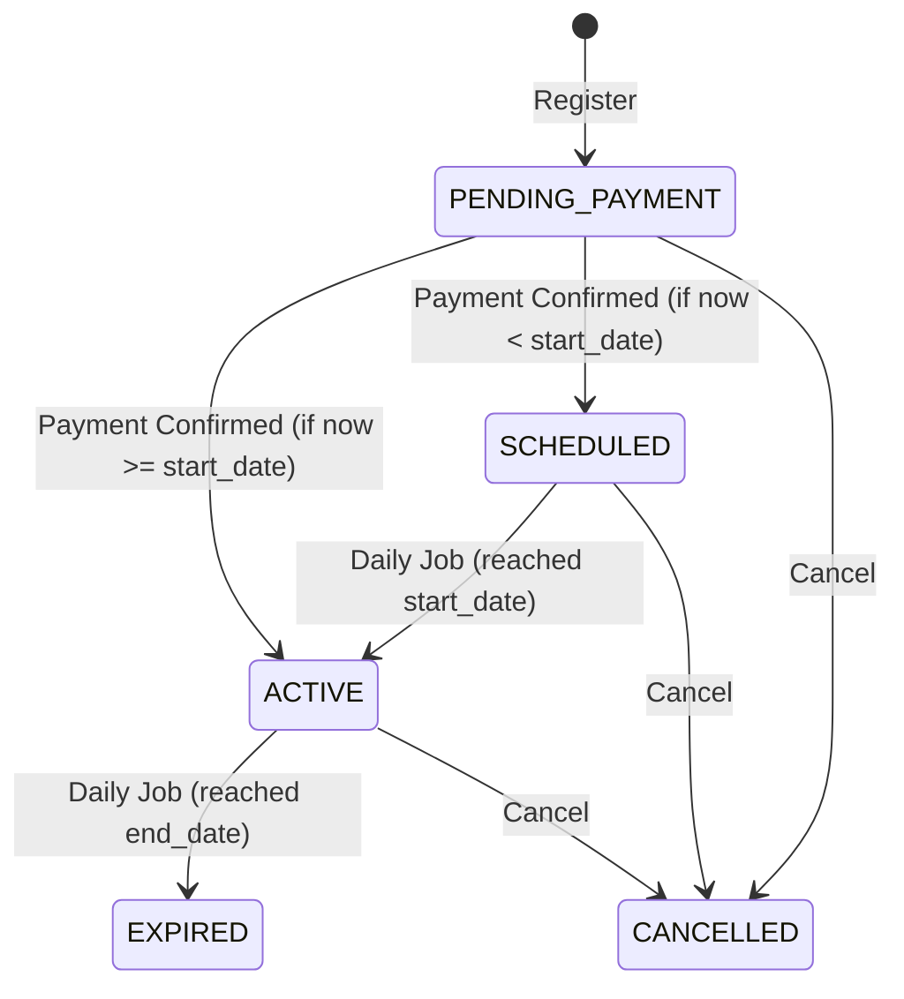
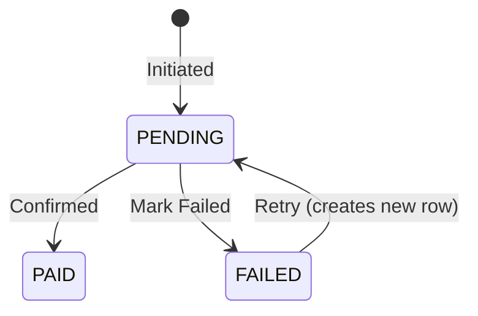
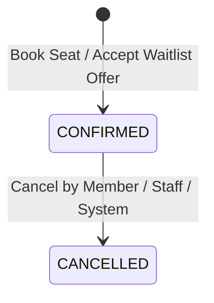
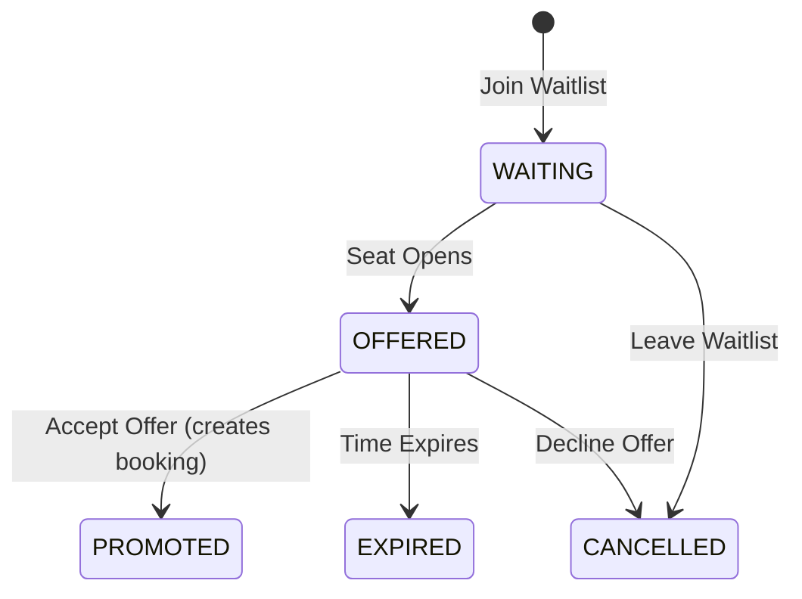
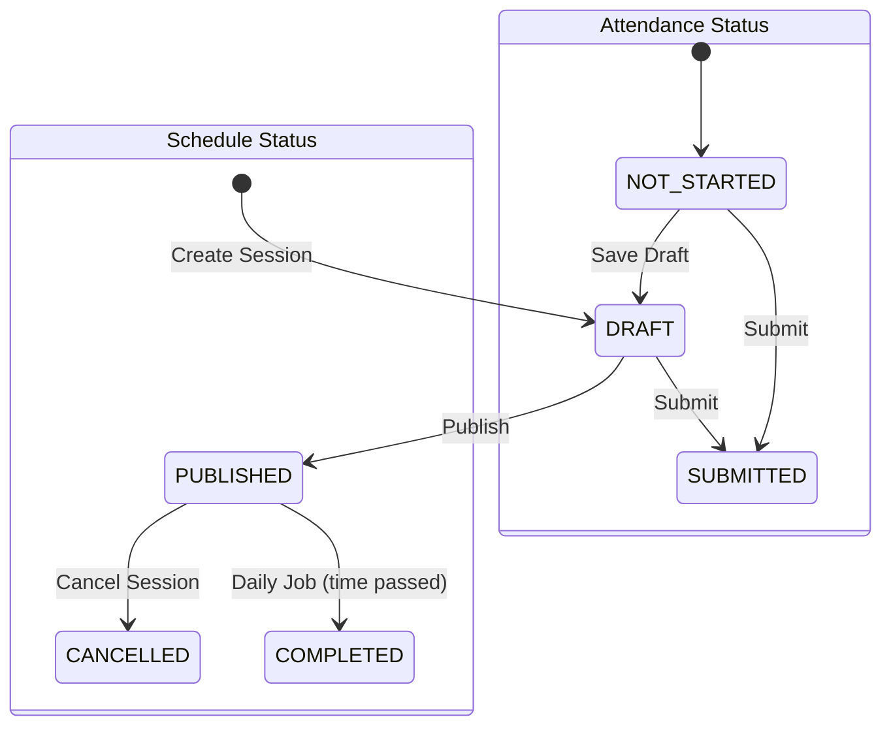
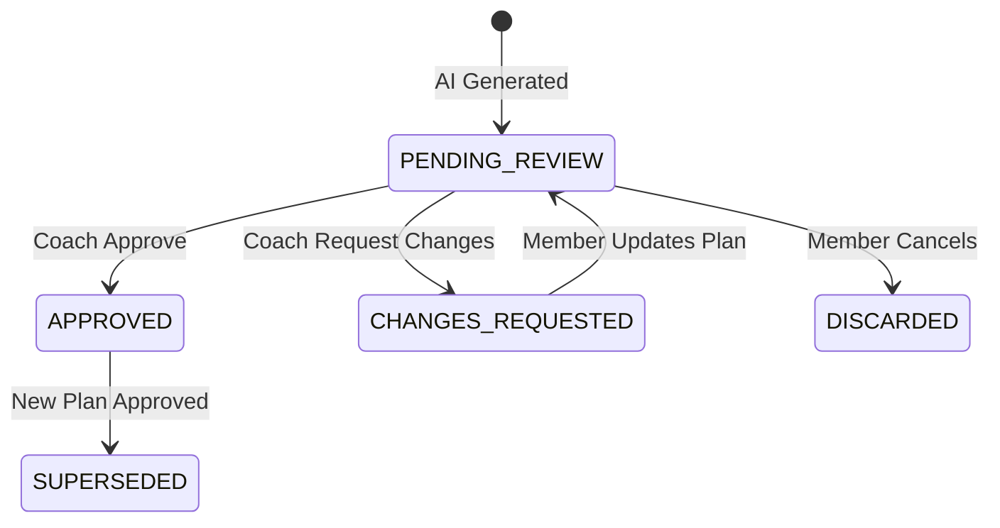
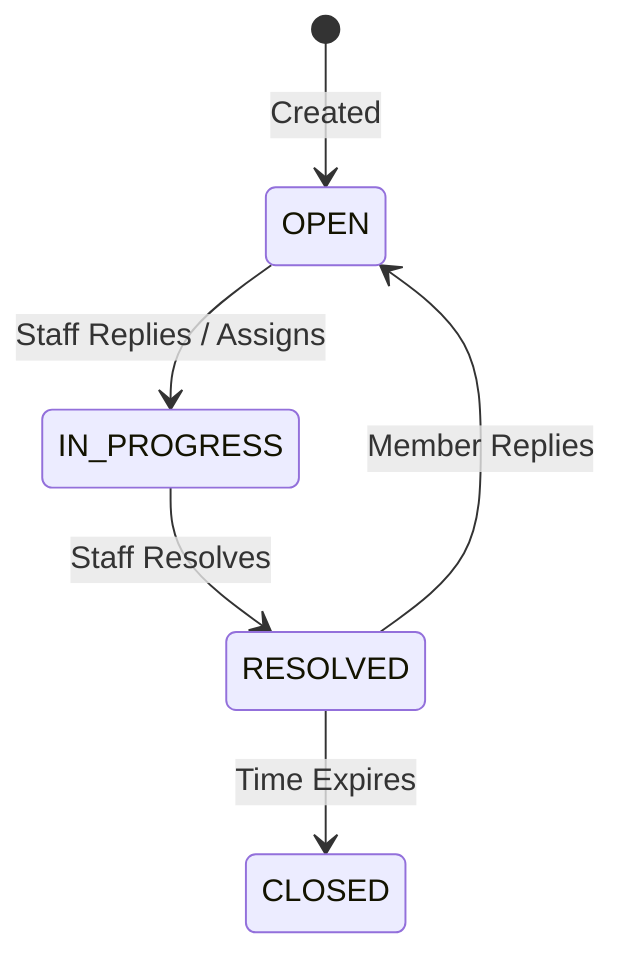

# 09 - Business Rules and State Machines

Screens covered: Global logic and flows.

## State Machines

### Membership (`membership.status`)

### Payment (`payment.status`)

### Booking (`booking.status`)

### Waitlist (`waitlist_entry.status`)

### Class Session (`class_session.status` & `attendance_status`)

### Workout Plan (`workout_plan.status`)

### Support Request (`support_request.status`)

## Booking Eligibility Rules

Before inserting a `booking`, the service MUST validate:

1. **Session State:** The session must be `PUBLISHED` and in the future.
2. **Capacity:** There must be available seats (`capacity - booked_count > 0`), otherwise the user goes to the waitlist.
3. **Membership Coverage:** The member must have an `ACTIVE` or `SCHEDULED` membership whose `[start_date, end_date]` covers the `session_date`.
4. **Sport Coverage:** The `class_session.class.sport_id` must be in the `membership_sport` list for that membership.
5. **Age Restriction:** The member's age at the `session_date` must fall within the class's `age_group` range.
6. **Level Match:** The member's `current_level` should match the class `level`.
7. **No Overlap:** The member must not have another `CONFIRMED` booking for a session that overlaps in time.
8. **Double Booking:** The database enforces at most one `CONFIRMED` booking per member per session via `ux_booking_active`.

## Critical Transactions

To prevent race conditions, the following operations require specific concurrency control.

### Booking a Seat

Use optimistic locking (`@Version`) OR an atomic update:
1. `UPDATE class_session SET booked_count = booked_count + 1 WHERE id = @id AND booked_count < capacity`
2. If row count is 0, the session is full. Return error.
3. Insert `booking` row.

### Cancelling a Booking

1. Update `booking` status to `CANCELLED`.
2. `UPDATE class_session SET booked_count = booked_count - 1 WHERE id = @id`.
3. Check `waitlist_entry` for the oldest `WAITING` entry.
4. If found, set its status to `OFFERED`, set `offer_expires_at = NOW + WAITLIST_OFFER_HOURS`, and send notification.

### Confirming a Payment

1. Pessimistic read lock on `payment` to prevent double confirmation.
2. Verify status is `PENDING`.
3. Set status to `PAID`, set `received_on`.
4. Update `membership` dates based on current active memberships, set to `ACTIVE` or `SCHEDULED`.
5. Insert `invoice` and `invoice_line` snapshot.
6. Insert `activity_log`.
7. Send notification.

## Scheduled Jobs

The system requires a scheduler (e.g. Spring `@Scheduled`) for the following background tasks:

1. **Membership Activation:** Daily at midnight, find `SCHEDULED` memberships where `start_date <= TODAY` and set to `ACTIVE`.
2. **Membership Expiration:** Daily at midnight, find `ACTIVE` memberships where `end_date < TODAY` and set to `EXPIRED`.
3. **Expiry Reminders:** Daily, find `ACTIVE` memberships expiring in `MEMBERSHIP_EXPIRY_REMINDER_DAYS` and send a notification.
4. **Waitlist Expiry:** Hourly, find `OFFERED` waitlist entries where `offer_expires_at < NOW`. Set to `EXPIRED`, offer seat to the next person, and notify both.
5. **Session Completion:** Hourly, find `PUBLISHED` sessions where `session_date` and `end_time` are in the past. Set to `COMPLETED`.

## Privacy and Data Access

Data access rules enforced by the service layer:
- **Members:** Can only view their own `member_profile`, `membership`, `payment`, `booking`, `attendance_record`, `workout_plan`, and `support_request`.
- **Coaches:** Can view profiles and attendance of members assigned to their classes (`class_session.coach_id = current_user`).
- **Staff/Managers:** Controlled by `permission` codes (e.g. `MANAGE_MEMBER_PROFILES`).
