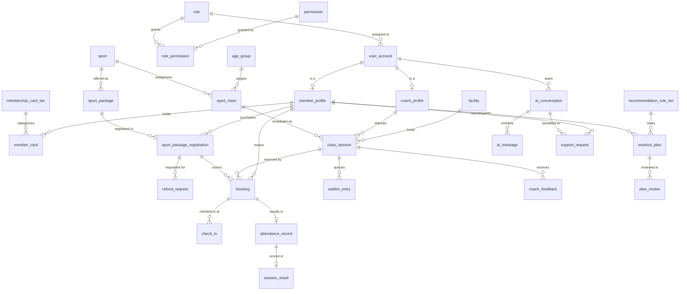

# Sportify Center - Database Design

This folder contains the proposed database design for **Sportify Center**, a single-location sports center
(six sports: Football, Badminton, Basketball, Volleyball, Swimming, Tennis) with four user roles:
Member, Coach, Receptionist and Center Manager.

The design is derived from the UI mockups in `context/` (Home + Flow 1 to Flow 6, 135 screens after the 10/05 product context refresh).

## Target Stack

| Layer | Choice |
|---|---|
| Language | Java 17+ (LTS) |
| Framework | Spring Boot 3.x |
| Persistence | Spring Data JPA (Hibernate 6) |
| Database | Microsoft SQL Server 2019+ (also works on Azure SQL) |
| Migrations | Flyway: Identity (`V1` to `V4`), Catalog, Booking, Refunds & Packages (`V5`, `V6`, `V9`, `V10`, `V11`, `V12`). `V7` and `V8` do not exist because booking migration `V7` was renumbered to `V10` (commit f545759); `V12` is data-only (updates 7 seeded packages in place, inserts 29, adds no tables). |
| Security | Spring Security (role + permission authorities) |

## Document Index

| File | Content |
|---|---|
| [01-identity-and-access.md](01-identity-and-access.md) | Accounts, roles, permissions, member and coach profiles, activity log |
| [02-catalog-and-membership.md](02-catalog-and-membership.md) | Sports, age groups, facilities, membership plans, memberships, check-in |
| [03-classes-and-booking.md](03-classes-and-booking.md) | Classes, scheduled sessions, bookings, waitlist |
| [04-payments-invoices-reports.md](04-payments-invoices-reports.md) | Payments, invoices, revenue reporting views |
| [05-training-attendance-progress.md](05-training-attendance-progress.md) | Session plans, attendance, results, skill scores, coach feedback |
| [06-ai-workout-recommendation.md](06-ai-workout-recommendation.md) | Recommendation rules, AI workout plans, coach review |
| [07-ai-assistant-and-support.md](07-ai-assistant-and-support.md) | AI assistant content, conversations, support requests |
| [08-notifications-and-system.md](08-notifications-and-system.md) | Notifications, announcements, system settings, code sequences |
| [09-business-rules-and-state-machines.md](09-business-rules-and-state-machines.md) | Cross-flow rules, state machines, transactions, scheduled jobs |
| [10-ddl-sqlserver.md](10-ddl-sqlserver.md) | Complete SQL Server DDL, views and seed data |
| [11-jpa-mapping-guide.md](11-jpa-mapping-guide.md) | Java 17 / Spring Boot 3 entity mapping conventions and examples |
| [12-screen-traceability.md](12-screen-traceability.md) | Screen ID -> tables matrix |

## Key Assumptions (from the mockups)

1. **One center only.** "This project has one center. No branch selector is required." (F3-10). There is no `center`
   or `branch` table; center details live in `system_setting`.
2. **One role per account.** Every screen shows a single role per user. Permissions per role are configurable (F1-03).
3. **Sport package and card tier architecture.** Members purchase individual sport packages (`sport_package`) specified by sport,
   training format (`SELF_TRAINING`, `COACH_LED`), duration in days, and session count. In addition, members hold a
   membership card (`member_card`) with a discount tier (`membership_card_tier`: Standard 0%, Gold 5%, VIP 10%)
   that provides discounts on eligible packages. Legacy `membership_plan` is retained for backwards compatibility.
4. **Registration activation and payment lifecycle.** Online sport package registrations start in `PENDING_PAYMENT`
   status with sessions locked until payment confirmation or reception activation, which transitions the registration
   to `ACTIVE`, computes start/end dates, and unlocks class bookings.
5. **Class booking inside an active package consumes remaining sessions** and does not create an immediate payment at booking time (F2-07, F3-01).
6. **Center check-in (Receptionist) is different from class attendance (Coach)** (F1-13, F4-01, F4-10).
7. **AI never commits business actions.** The AI assistant does not book or register; AI workout plans become
   effective only after Coach approval (F5-07, F5-11, F6-06).
8. **Revenue counts only unique PAID payments** by paid date; Pending and Failed stay in the ledger (F3-10, F3-12).

## Global Conventions

| Topic | Convention |
|---|---|
| Table names | `snake_case`, singular (`booking`, `class_session`). Reserved words avoided (`user_account`, `sport_class`). |
| Primary key | `id BIGINT IDENTITY(1,1)`. 1:1 profile tables reuse the parent key (`member_profile.user_id`). |
| Business codes | Human readable codes (`MEM-0128`, `REG-1042`, `CARD-1000`, `REG-PKG-1000`, `REF-1000`, `BK-2048`, `CL-1204`, `PAY-1098`, `INV-2026-1099`, `REQ-1082`, `WP-0001`) stored in a separate `UNIQUE` column, generated from SQL Server `SEQUENCE` objects. |
| Text | `NVARCHAR` for every string column (Vietnamese names, plus avoids implicit conversion with the JDBC driver). |
| Enums | `NVARCHAR(20..40)` + `CHECK` constraint, mapped with `@Enumerated(EnumType.STRING)`. |
| Money | `DECIMAL(14,2)` in VND, mapped to `java.math.BigDecimal`. |
| Date / time | `DATE` -> `LocalDate`, `TIME(0)` -> `LocalTime`, `DATETIME2(0)` -> `LocalDateTime` stored in center local time (Asia/Ho_Chi_Minh). |
| Small numbers | `INT` (not `TINYINT`, which is unsigned in SQL Server but signed `Byte` in Java). |
| Booleans | `BIT` named `is_xxx` -> `boolean`. |
| JSON | `NVARCHAR(MAX)` + `CHECK (ISJSON(col) = 1)`, mapped as `String` or Hibernate JSON type. |
| Audit | `created_at`, `updated_at` on most tables; `created_by`, `updated_by` (user id, no FK) on master data. Explicit actor columns (`recorded_by`, `confirmed_by`) are real FKs. |
| Concurrency | `version INT` (`@Version`) on rows edited concurrently (sessions, memberships, payments, bookings). |
| Deletes | No physical delete for business data. Use `status` (`ARCHIVED`, `CANCELLED`, `INACTIVE`). `ON DELETE CASCADE` only for pure composition children. |
| Constraint names | `pk_`, `fk_`, `uq_`, `ck_`, `ix_` (index), `ux_` (unique / filtered unique index). |

## Module Overview

| Module | Tables | Main flows |
|---|---|---|
| Identity and access | `role`, `permission`, `role_permission`, `user_account`, `member_profile`, `member_sport_interest`, `coach_profile`, `coach_sport`, `coach_certification`, `password_reset_token`, `activity_log` | Flow 1 |
| Catalog and membership | `sport`, `age_group`, `facility`, `membership_plan`, `plan_eligible_sport`, `plan_feature`, `membership`, `membership_sport`, `sport_package`, `membership_card_tier`, `member_card`, `sport_package_registration`, `refund_request`, `check_in` | Flow 1, Home, Flow 3 |
| Classes and booking | `sport_class`, `class_session`, `booking`, `waitlist_entry` | Flow 2 |
| Payments and reports | `payment`, `invoice`, `invoice_line` + views | Flow 1, Flow 3 |
| Training and progress | `session_plan`, `session_plan_step`, `attendance_record`, `attendance_correction`, `skill_metric`, `session_result`, `session_result_score`, `coach_feedback` + views | Flow 4 |
| AI workout recommendation | `recommendation_rule_set`, `recommendation_rule_weight`, `workout_plan`, `workout_plan_candidate`, `workout_plan_week`, `workout_plan_day`, `workout_plan_exercise`, `plan_review` | Flow 5 |
| AI assistant and support | `assistant_setting`, `assistant_topic`, `assistant_quick_prompt`, `ai_conversation`, `ai_message`, `support_request`, `support_request_message` | Flow 6, Flow 1 |
| Notifications and system | `notification`, `announcement`, `system_setting` | All |

Total: **58 tables** (26 implemented in migrations V1-V12, 32 planned; V12 is data-only so table count is unchanged), **3 reporting views** (planned), **11 sequences** (7 implemented in migrations V2, V9-V10: seq_booking_code, seq_card_code, seq_class_code, seq_member_code, seq_package_reg_code, seq_refund_code, seq_registration_code; 4 planned: seq_payment_code, seq_invoice_number, seq_support_request_code, seq_workout_plan_code).

## High Level ERD

## Open Questions and Inconsistencies Found in the Mockups

These do not block the schema (the design handles both cases), but the team should confirm them.

| # | Observation | Impact on design |
|---|---|---|
| 1 | Sport package pricing across Figma screens. | Packages have dedicated pricing per item in `sport_package` (e.g. PK-001 through PK-036). Base prices and session counts are snapshotted on `sport_package_registration`. |
| 2 | Goal labels differ: "Improve fitness" (Home, F1-06), "Improve health" (F5-02), "Fitness" (F4-09). | One enum `IMPROVE_FITNESS` with display label "Improve health and fitness". |
| 3 | Age group for members is shown as "Adults 18+" (F1-06) while classes use "Ages 16+". | Member age group is not stored; eligibility is computed from `date_of_birth` against the class `age_group` range. |
| 4 | F5-10 Coach Review Queue lists a plan with status "Not submitted". | Queue should only list `plan_review.status = 'PENDING'`. Draft plans are not visible to coaches. |
| 5 | Single sport packages vs multi-sport packages. | Modeled cleanly as individual `sport_package` rows per sport (Football, Badminton, Basketball, Volleyball, Swimming, Tennis). |
| 6 | Home shows recurring times ("Tue and Thu - 17:00") while F2-03 schedules one session date. | v1 stores individual `class_session` rows. A recurrence pattern table is listed as a future extension. |
| 7 | Membership card tiers and benefits (F1-03, F1-04, F1-05). | Handled by `membership_card_tier` (Standard 0 VND / 0%, Gold 300,000 VND / 5%, VIP 600,000 VND / 10%) and member holdings in `member_card`. |
