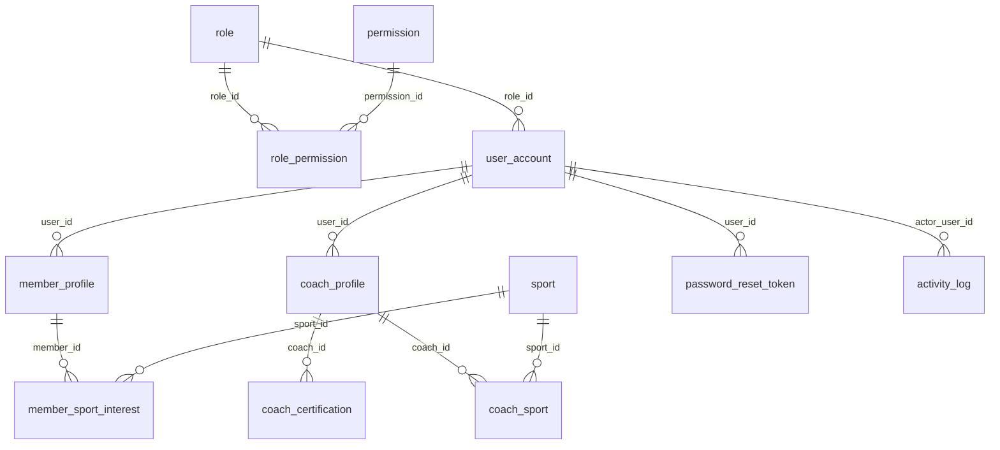

# 01 - Identity and Access

Accounts, roles, member and coach profiles, password reset, activity log.

Generated from the Flyway migrations V1-V20 on main (after PR #6). Source of truth: `backend/src/main/resources/db/migration`.

| Table | Status | Created in | Java entity | Columns |
|---|---|---|---|---|
| [`role`](#role) | In use | V1 | Role | 7 |
| [`permission`](#permission) | In use | V1 | Permission | 6 |
| [`role_permission`](#role_permission) | In use | V1 | Role.permissions (@JoinTable) | 2 |
| [`user_account`](#user_account) | In use | V1 | UserAccount | 16 |
| [`member_profile`](#member_profile) | In use | V2 | MemberProfile | 8 |
| [`coach_profile`](#coach_profile) | In use | V2 | CoachProfile | 10 |
| [`coach_certification`](#coach_certification) | In use | V2 | CoachCertification | 10 |
| [`coach_sport`](#coach_sport) | Planned for Flow 1-3 (BE-01) | V19 | - | 2 |
| [`member_sport_interest`](#member_sport_interest) | Not planned yet: Flow 1 (sports a member likes) | V19 | - | 2 |
| [`password_reset_token`](#password_reset_token) | In use | V2 | PasswordResetToken | 6 |
| [`activity_log`](#activity_log) | In use | V2 | ActivityLog | 10 |

## Relationships

Arrows read "parent ||--o{ child : child column". Tables from other files appear when they are referenced.

## `role`

- Status: **In use**
- Created in: V1
- Java entity: Role

| # | Column | Type | Null | Default | Key | Since | Note |
|---|---|---|---|---|---|---|---|
| 1 | id | BIGINT | No | - | PK, IDENTITY | V1 | - |
| 2 | code | NVARCHAR(30) | No | - | UQ | V1 | - |
| 3 | name | NVARCHAR(50) | No | - | - | V1 | - |
| 4 | description | NVARCHAR(255) | Yes | - | - | V1 | - |
| 5 | is_system | BIT | No | 1 | - | V1 | - |
| 6 | created_at | DATETIME2(0) | No | SYSDATETIME() | - | V1 | - |
| 7 | updated_at | DATETIME2(0) | Yes | - | - | V1 | - |

## `permission`

- Status: **In use**
- Created in: V1
- Java entity: Permission

| # | Column | Type | Null | Default | Key | Since | Note |
|---|---|---|---|---|---|---|---|
| 1 | id | BIGINT | No | - | PK, IDENTITY | V1 | - |
| 2 | code | NVARCHAR(60) | No | - | UQ | V1 | - |
| 3 | name | NVARCHAR(100) | No | - | - | V1 | - |
| 4 | description | NVARCHAR(255) | Yes | - | - | V1 | - |
| 5 | module | NVARCHAR(30) | No | - | - | V1 | - |
| 6 | display_order | INT | No | 0 | - | V1 | - |

## `role_permission`

- Status: **In use**
- Created in: V1
- Java entity: Role.permissions (@JoinTable)

| # | Column | Type | Null | Default | Key | Since | Note |
|---|---|---|---|---|---|---|---|
| 1 | role_id | BIGINT | No | - | PK, FK -> role.id | V1 | - |
| 2 | permission_id | BIGINT | No | - | PK, FK -> permission.id | V1 | - |

Primary key: (role_id, permission_id)

Foreign keys:

- `fk_role_permission_role`: (role_id) -> role(id) ON DELETE CASCADE
- `fk_role_permission_permission`: (permission_id) -> permission(id) ON DELETE CASCADE

## `user_account`

- Status: **In use**
- Created in: V1
- Java entity: UserAccount

| # | Column | Type | Null | Default | Key | Since | Note |
|---|---|---|---|---|---|---|---|
| 1 | id | BIGINT | No | - | PK, IDENTITY | V1 | - |
| 2 | email | NVARCHAR(255) | No | - | UQ | V1 | - |
| 3 | password_hash | NVARCHAR(100) | No | - | - | V1 | - |
| 4 | full_name | NVARCHAR(100) | No | - | - | V1 | - |
| 5 | phone | NVARCHAR(20) | Yes | - | - | V1 | - |
| 6 | date_of_birth | DATE | Yes | - | - | V1 | - |
| 7 | address | NVARCHAR(255) | Yes | - | - | V1 | - |
| 8 | avatar_url | NVARCHAR(500) | Yes | - | - | V1 | - |
| 9 | role_id | BIGINT | No | - | FK -> role.id | V1 | - |
| 10 | status | NVARCHAR(20) | No | 'ACTIVE' | - | V1 | - |
| 11 | last_login_at | DATETIME2(0) | Yes | - | - | V1 | - |
| 12 | created_at | DATETIME2(0) | No | SYSDATETIME() | - | V1 | - |
| 13 | updated_at | DATETIME2(0) | Yes | - | - | V1 | - |
| 14 | created_by | BIGINT | Yes | - | - | V1 | - |
| 15 | updated_by | BIGINT | Yes | - | - | V1 | - |
| 16 | version | INT | No | 0 | - | V1 | - |

Foreign keys:

- `fk_user_account_role`: (role_id) -> role(id)

Indexes:

- `ux_user_account_phone` UNIQUE on (phone) WHERE phone IS NOT NULL
- `ix_user_account_role_status` on (role_id, status)

## `member_profile`

- Status: **In use**
- Created in: V2
- Java entity: MemberProfile

| # | Column | Type | Null | Default | Key | Since | Note |
|---|---|---|---|---|---|---|---|
| 1 | user_id | BIGINT | No | - | PK, FK -> user_account.id | V2 | - |
| 2 | member_code | NVARCHAR(20) | No | - | UQ | V2 | - |
| 3 | main_goal | NVARCHAR(30) | Yes | - | - | V2 | - |
| 4 | current_level | NVARCHAR(20) | No | 'BEGINNER' | - | V2 | - |
| 5 | joined_on | DATE | No | CAST(SYSDATETIME() AS DATE) | - | V2 | - |
| 6 | staff_note | NVARCHAR(500) | Yes | - | - | V2 | - |
| 7 | created_at | DATETIME2(0) | No | SYSDATETIME() | - | V2 | - |
| 8 | updated_at | DATETIME2(0) | Yes | - | - | V2 | - |

Foreign keys:

- `fk_member_profile_user`: (user_id) -> user_account(id) ON DELETE CASCADE

Unique constraints:

- `uq_member_profile_code`: (member_code)

## `coach_profile`

- Status: **In use**
- Created in: V2
- Java entity: CoachProfile

| # | Column | Type | Null | Default | Key | Since | Note |
|---|---|---|---|---|---|---|---|
| 1 | user_id | BIGINT | No | - | PK, FK -> user_account.id | V2 | - |
| 2 | primary_sport_id | BIGINT | Yes | - | - | V2 | - |
| 3 | headline | NVARCHAR(150) | Yes | - | - | V2 | - |
| 4 | bio | NVARCHAR(1000) | Yes | - | - | V2 | - |
| 5 | years_experience | INT | Yes | - | - | V2 | - |
| 6 | specialties | NVARCHAR(255) | Yes | - | - | V2 | - |
| 7 | is_public | BIT | No | 1 | - | V2 | - |
| 8 | display_order | INT | No | 0 | - | V2 | - |
| 9 | created_at | DATETIME2(0) | No | SYSDATETIME() | - | V2 | - |
| 10 | updated_at | DATETIME2(0) | Yes | - | - | V2 | - |

Foreign keys:

- `fk_coach_profile_user`: (user_id) -> user_account(id) ON DELETE CASCADE

Check constraints:

- `ck_coach_exp`: `(years_experience >= 0)`

## `coach_certification`

- Status: **In use**
- Created in: V2
- Java entity: CoachCertification

| # | Column | Type | Null | Default | Key | Since | Note |
|---|---|---|---|---|---|---|---|
| 1 | id | BIGINT | No | - | PK, IDENTITY | V2 | - |
| 2 | coach_id | BIGINT | No | - | FK -> coach_profile.user_id | V2 | - |
| 3 | sport_id | BIGINT | Yes | - | - | V2 | - |
| 4 | name | NVARCHAR(150) | No | - | - | V2 | - |
| 5 | issuer | NVARCHAR(150) | Yes | - | - | V2 | - |
| 6 | issued_on | DATE | Yes | - | - | V2 | - |
| 7 | expires_on | DATE | Yes | - | - | V2 | - |
| 8 | document_url | NVARCHAR(500) | Yes | - | - | V2 | - |
| 9 | is_verified | BIT | No | 0 | - | V2 | - |
| 10 | created_at | DATETIME2(0) | No | SYSDATETIME() | - | V2 | - |

Foreign keys:

- `fk_cc_coach`: (coach_id) -> coach_profile(user_id) ON DELETE CASCADE

Check constraints:

- `ck_cc_dates`: `(expires_on IS NULL OR issued_on IS NULL OR expires_on >= issued_on)`

## `coach_sport`

- Status: **Planned for Flow 1-3 (BE-01)**
- Created in: V19
- Java entity: -

| # | Column | Type | Null | Default | Key | Since | Note |
|---|---|---|---|---|---|---|---|
| 1 | coach_id | BIGINT | No | - | PK, FK -> coach_profile.user_id | V19 | - |
| 2 | sport_id | BIGINT | No | - | PK, FK -> sport.id | V19 | - |

Primary key: (coach_id, sport_id)

Foreign keys:

- `fk_coach_sport_coach`: (coach_id) -> coach_profile(user_id)
- `fk_coach_sport_sport`: (sport_id) -> sport(id)

## `member_sport_interest`

- Status: **Not planned yet: Flow 1 (sports a member likes)**
- Created in: V19
- Java entity: -

| # | Column | Type | Null | Default | Key | Since | Note |
|---|---|---|---|---|---|---|---|
| 1 | member_id | BIGINT | No | - | PK, FK -> member_profile.user_id | V19 | - |
| 2 | sport_id | BIGINT | No | - | PK, FK -> sport.id | V19 | - |

Primary key: (member_id, sport_id)

Foreign keys:

- `fk_member_sport_interest_member`: (member_id) -> member_profile(user_id)
- `fk_member_sport_interest_sport`: (sport_id) -> sport(id)

## `password_reset_token`

- Status: **In use**
- Created in: V2
- Java entity: PasswordResetToken

| # | Column | Type | Null | Default | Key | Since | Note |
|---|---|---|---|---|---|---|---|
| 1 | id | BIGINT | No | - | PK, IDENTITY | V2 | - |
| 2 | user_id | BIGINT | No | - | FK -> user_account.id | V2 | - |
| 3 | token_hash | NVARCHAR(100) | No | - | UQ | V2 | - |
| 4 | expires_at | DATETIME2(0) | No | - | - | V2 | - |
| 5 | used_at | DATETIME2(0) | Yes | - | - | V2 | - |
| 6 | created_at | DATETIME2(0) | No | SYSDATETIME() | - | V2 | - |

Foreign keys:

- `fk_prt_user`: (user_id) -> user_account(id) ON DELETE CASCADE

Unique constraints:

- `uq_prt_hash`: (token_hash)

## `activity_log`

- Status: **In use**
- Created in: V2
- Java entity: ActivityLog

| # | Column | Type | Null | Default | Key | Since | Note |
|---|---|---|---|---|---|---|---|
| 1 | id | BIGINT | No | - | PK, IDENTITY | V2 | - |
| 2 | actor_user_id | BIGINT | Yes | - | FK -> user_account.id | V2 | - |
| 3 | action | NVARCHAR(60) | No | - | - | V2 | - |
| 4 | entity_type | NVARCHAR(40) | No | - | - | V2 | - |
| 5 | entity_id | BIGINT | Yes | - | - | V2 | - |
| 6 | entity_code | NVARCHAR(40) | Yes | - | - | V2 | - |
| 7 | summary | NVARCHAR(255) | Yes | - | - | V2 | - |
| 8 | details | NVARCHAR(MAX) | Yes | - | - | V2 | - |
| 9 | ip_address | NVARCHAR(45) | Yes | - | - | V2 | - |
| 10 | created_at | DATETIME2(0) | No | SYSDATETIME() | - | V2 | - |

Foreign keys:

- `fk_al_actor`: (actor_user_id) -> user_account(id)

Check constraints:

- `ck_al_details_json`: `(details IS NULL OR ISJSON(details) = 1)`

Indexes:

- `ix_activity_log_created` on (created_at DESC)
- `ix_activity_log_entity` on (entity_type, entity_id)
- `ix_activity_log_actor` on (actor_user_id, created_at)
