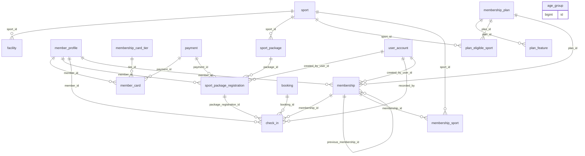

# 02 - Catalog and Membership (Flow 1)

Sports, facilities, card tiers and member cards, sport packages and registrations, check-in. The membership_* and plan_* tables belong to the old flow (deprecated).

Generated from the Flyway migrations V1-V20 on main (after PR #6). Source of truth: `backend/src/main/resources/db/migration`.

| Table | Status | Created in | Java entity | Columns |
|---|---|---|---|---|
| [`sport`](#sport) | In use | V5 | Sport | 10 |
| [`facility`](#facility) | In use | V5 | Facility | 9 |
| [`age_group`](#age_group) | In use | V5 | AgeGroup | 7 |
| [`membership_card_tier`](#membership_card_tier) | In use | V10 | MembershipCardTier | 10 |
| [`member_card`](#member_card) | In use | V10 | MemberCard | 11 |
| [`sport_package`](#sport_package) | In use | V10 | SportPackage | 13 |
| [`sport_package_registration`](#sport_package_registration) | In use | V10 | SportPackageRegistration | 20 |
| [`check_in`](#check_in) | In use | V5 | CheckIn | 10 |
| [`membership_plan`](#membership_plan) | In use (legacy, deprecated) | V5 | MembershipPlan | 16 |
| [`plan_feature`](#plan_feature) | In use (legacy, deprecated) | V5 | PlanFeature | 4 |
| [`plan_eligible_sport`](#plan_eligible_sport) | In use (legacy, deprecated) | V5 | MembershipPlan.eligibleSports (@JoinTable) | 2 |
| [`membership`](#membership) | In use (legacy, deprecated) | V5 | Membership | 19 |
| [`membership_sport`](#membership_sport) | In use (legacy, deprecated) | V5 | Membership.sports (@JoinTable) | 2 |

## Relationships

Arrows read "parent ||--o{ child : child column". Tables from other files appear when they are referenced.

## `sport`

- Status: **In use**
- Created in: V5
- Java entity: Sport

| # | Column | Type | Null | Default | Key | Since | Note |
|---|---|---|---|---|---|---|---|
| 1 | id | BIGINT | No | - | PK, IDENTITY | V5 | - |
| 2 | code | NVARCHAR(30) | No | - | UQ | V5 | - |
| 3 | name | NVARCHAR(50) | No | - | UQ | V5 | - |
| 4 | venue_type | NVARCHAR(20) | No | - | - | V5 | - |
| 5 | description | NVARCHAR(500) | Yes | - | - | V5 | - |
| 6 | image_url | NVARCHAR(500) | Yes | - | - | V5 | - |
| 7 | display_order | INT | No | 0 | - | V5 | - |
| 8 | is_active | BIT | No | 1 | - | V5 | - |
| 9 | created_at | DATETIME2(0) | No | SYSDATETIME() | - | V5 | - |
| 10 | updated_at | DATETIME2(0) | Yes | - | - | V5 | - |

Unique constraints:

- `uq_sport_code`: (code)
- `uq_sport_name`: (name)

Check constraints:

- `ck_sport_venue_type`: `(venue_type IN ('INDOOR', 'OUTDOOR', 'POOL'))`

## `facility`

- Status: **In use**
- Created in: V5
- Java entity: Facility

| # | Column | Type | Null | Default | Key | Since | Note |
|---|---|---|---|---|---|---|---|
| 1 | id | BIGINT | No | - | PK, IDENTITY | V5 | - |
| 2 | code | NVARCHAR(30) | No | - | UQ | V5 | - |
| 3 | name | NVARCHAR(100) | No | - | - | V5 | - |
| 4 | facility_type | NVARCHAR(20) | No | - | - | V5 | - |
| 5 | sport_id | BIGINT | Yes | - | FK -> sport.id | V5 | - |
| 6 | capacity | INT | Yes | - | - | V5 | - |
| 7 | is_active | BIT | No | 1 | - | V5 | - |
| 8 | created_at | DATETIME2(0) | No | SYSDATETIME() | - | V5 | - |
| 9 | updated_at | DATETIME2(0) | Yes | - | - | V5 | - |

Foreign keys:

- `fk_facility_sport`: (sport_id) -> sport(id)

Unique constraints:

- `uq_facility_code`: (code)

Check constraints:

- `ck_facility_type`: `(facility_type IN ('COURT', 'POOL', 'FIELD', 'HALL', 'STUDIO'))`
- `ck_facility_capacity`: `(capacity IS NULL OR capacity > 0)`

## `age_group`

- Status: **In use**
- Created in: V5
- Java entity: AgeGroup

| # | Column | Type | Null | Default | Key | Since | Note |
|---|---|---|---|---|---|---|---|
| 1 | id | BIGINT | No | - | PK, IDENTITY | V5 | - |
| 2 | code | NVARCHAR(30) | No | - | UQ | V5 | - |
| 3 | label | NVARCHAR(50) | No | - | - | V5 | - |
| 4 | min_age | INT | No | - | - | V5 | - |
| 5 | max_age | INT | Yes | - | - | V5 | - |
| 6 | display_order | INT | No | 0 | - | V5 | - |
| 7 | is_active | BIT | No | 1 | - | V5 | - |

Unique constraints:

- `uq_age_group_code`: (code)

Check constraints:

- `ck_age_group_min_age`: `(min_age >= 0)`
- `ck_age_group_max_age`: `(max_age IS NULL OR max_age >= min_age)`

## `membership_card_tier`

- Status: **In use**
- Created in: V10
- Java entity: MembershipCardTier

| # | Column | Type | Null | Default | Key | Since | Note |
|---|---|---|---|---|---|---|---|
| 1 | id | BIGINT | No | - | PK, IDENTITY | V10 | - |
| 2 | code | NVARCHAR(30) | No | - | UQ | V10 | - |
| 3 | name | NVARCHAR(50) | No | - | - | V10 | - |
| 4 | price | DECIMAL(14,2) | No | 0 | - | V10 | - |
| 5 | duration_months | INT | No | 0 | - | V10 | - |
| 6 | discount_percentage | INT | No | 0 | - | V10 | - |
| 7 | description | NVARCHAR(500) | Yes | - | - | V10 | - |
| 8 | is_active | BIT | No | 1 | - | V10 | - |
| 9 | created_at | DATETIME2(0) | No | SYSDATETIME() | - | V10 | - |
| 10 | updated_at | DATETIME2(0) | Yes | - | - | V10 | - |

Unique constraints:

- `uq_membership_card_tier_code`: (code)

Check constraints:

- `ck_membership_card_tier_price`: `(price >= 0)`
- `ck_membership_card_tier_duration`: `(duration_months >= 0)`
- `ck_membership_card_tier_discount`: `(discount_percentage >= 0 AND discount_percentage <= 100)`

## `member_card`

- Status: **In use**
- Created in: V10
- Java entity: MemberCard

| # | Column | Type | Null | Default | Key | Since | Note |
|---|---|---|---|---|---|---|---|
| 1 | id | BIGINT | No | - | PK, IDENTITY | V10 | - |
| 2 | card_code | NVARCHAR(30) | No | - | UQ | V10 | - |
| 3 | member_id | BIGINT | No | - | FK -> member_profile.user_id | V10 | - |
| 4 | tier_id | BIGINT | No | - | FK -> membership_card_tier.id | V10 | - |
| 5 | start_date | DATE | No | - | - | V10 | - |
| 6 | end_date | DATE | Yes | - | - | V10 | - |
| 7 | status | NVARCHAR(20) | No | 'ACTIVE' | - | V10 | - |
| 8 | price_paid | DECIMAL(14,2) | No | 0 | - | V10 | - |
| 9 | created_at | DATETIME2(0) | No | SYSDATETIME() | - | V10 | - |
| 10 | updated_at | DATETIME2(0) | Yes | - | - | V10 | - |
| 11 | payment_id | BIGINT | Yes | - | FK -> payment.id | V14 | Not mapped in the entity yet; Added in V14 |

Foreign keys:

- `fk_member_card_member`: (member_id) -> member_profile(user_id)
- `fk_member_card_tier`: (tier_id) -> membership_card_tier(id)
- `fk_member_card_payment`: (payment_id) -> payment(id)

Unique constraints:

- `uq_member_card_code`: (card_code)

Check constraints:

- `ck_member_card_price`: `(price_paid >= 0)`
- `ck_member_card_status`: `([status] IN ('PENDING_PAYMENT', 'ACTIVE', 'EXPIRED', 'CANCELLED', 'REPLACED'))` (since V20)

Indexes:

- `ix_member_card_lookup` on (member_id, status)

## `sport_package`

- Status: **In use**
- Created in: V10
- Java entity: SportPackage

| # | Column | Type | Null | Default | Key | Since | Note |
|---|---|---|---|---|---|---|---|
| 1 | id | BIGINT | No | - | PK, IDENTITY | V10 | - |
| 2 | code | NVARCHAR(50) | No | - | UQ | V10 | - |
| 3 | name | NVARCHAR(100) | No | - | - | V10 | - |
| 4 | sport_id | BIGINT | No | - | FK -> sport.id | V10 | - |
| 5 | training_format | NVARCHAR(20) | No | - | - | V10 | - |
| 6 | duration_days | INT | No | - | - | V10 | - |
| 7 | session_count | INT | No | - | - | V10 | - |
| 8 | price_amount | DECIMAL(14,2) | No | - | - | V10 | - |
| 9 | description | NVARCHAR(500) | Yes | - | - | V10 | - |
| 10 | is_active | BIT | No | 1 | - | V10 | - |
| 11 | created_at | DATETIME2(0) | No | SYSDATETIME() | - | V10 | - |
| 12 | updated_at | DATETIME2(0) | Yes | - | - | V10 | - |
| 13 | session_minutes | SMALLINT | No | 60 | - | V13 | Added in V13 |

Foreign keys:

- `fk_sport_package_sport`: (sport_id) -> sport(id)

Unique constraints:

- `uq_sport_package_code`: (code)

Check constraints:

- `ck_sport_package_format`: `(training_format IN ('SELF_TRAINING', 'COACH_LED'))`
- `ck_sport_package_duration`: `(duration_days > 0)`
- `ck_sport_package_sessions`: `(session_count > 0)`
- `ck_sport_package_price`: `(price_amount >= 0)`
- `ck_sport_package_session_minutes`: `([session_minutes] IN (60, 90))` (since V13)

## `sport_package_registration`

- Status: **In use**
- Created in: V10
- Java entity: SportPackageRegistration

| # | Column | Type | Null | Default | Key | Since | Note |
|---|---|---|---|---|---|---|---|
| 1 | id | BIGINT | No | - | PK, IDENTITY | V10 | - |
| 2 | registration_code | NVARCHAR(30) | No | - | UQ | V10 | - |
| 3 | member_id | BIGINT | No | - | FK -> member_profile.user_id | V10 | - |
| 4 | package_id | BIGINT | No | - | FK -> sport_package.id | V10 | - |
| 5 | channel | NVARCHAR(20) | No | 'ONLINE' | - | V10 | - |
| 6 | original_price | DECIMAL(14,2) | No | - | - | V10 | - |
| 7 | discount_percentage | INT | No | 0 | - | V10 | - |
| 8 | paid_amount | DECIMAL(14,2) | No | - | - | V10 | - |
| 9 | total_sessions | INT | No | - | - | V10 | - |
| 10 | remaining_sessions | INT | No | - | - | V10 | - |
| 11 | start_date | DATE | No | - | - | V10 | - |
| 12 | end_date | DATE | No | - | - | V10 | - |
| 13 | status | NVARCHAR(20) | No | 'PENDING_PAYMENT' | - | V10 | - |
| 14 | activated_at | DATETIME2(0) | Yes | - | - | V10 | - |
| 15 | cancelled_at | DATETIME2(0) | Yes | - | - | V10 | - |
| 16 | cancel_reason | NVARCHAR(255) | Yes | - | - | V10 | - |
| 17 | created_by_user_id | BIGINT | No | - | FK -> user_account.id | V10 | - |
| 18 | created_at | DATETIME2(0) | No | SYSDATETIME() | - | V10 | - |
| 19 | updated_at | DATETIME2(0) | Yes | - | - | V10 | - |
| 20 | payment_id | BIGINT | Yes | - | FK -> payment.id | V14 | Not mapped in the entity yet; Added in V14 |

Foreign keys:

- `fk_spr_member`: (member_id) -> member_profile(user_id)
- `fk_spr_package`: (package_id) -> sport_package(id)
- `fk_spr_created_by`: (created_by_user_id) -> user_account(id)
- `fk_package_reg_payment`: (payment_id) -> payment(id)

Unique constraints:

- `uq_sport_package_reg_code`: (registration_code)

Check constraints:

- `ck_spr_channel`: `(channel IN ('ONLINE', 'RECEPTION'))`
- `ck_spr_sessions`: `(remaining_sessions >= 0 AND remaining_sessions <= total_sessions)`
- `ck_spr_dates`: `(end_date >= start_date)`
- `ck_spr_status`: `([status] IN ('PENDING_PAYMENT', 'ACTIVE', 'EXPIRED', 'CANCELLED', 'REFUNDED'))` (since V11)

Indexes:

- `ix_spr_member_status` on (member_id, status, end_date)

## `check_in`

- Status: **In use**
- Created in: V5
- Java entity: CheckIn

| # | Column | Type | Null | Default | Key | Since | Note |
|---|---|---|---|---|---|---|---|
| 1 | id | BIGINT | No | - | PK, IDENTITY | V5 | - |
| 2 | member_id | BIGINT | No | - | FK -> member_profile.user_id | V5 | - |
| 3 | membership_id | BIGINT | Yes | - | FK -> membership.id | V5 | - |
| 4 | checked_in_at | DATETIME2(0) | No | SYSDATETIME() | - | V5 | - |
| 5 | result | NVARCHAR(20) | No | - | - | V5 | - |
| 6 | denial_reason | NVARCHAR(255) | Yes | - | - | V5 | - |
| 7 | recorded_by | BIGINT | No | - | FK -> user_account.id | V5 | - |
| 8 | note | NVARCHAR(255) | Yes | - | - | V5 | - |
| 9 | booking_id | BIGINT | Yes | - | FK -> booking.id | V10 | Added in V10 |
| 10 | package_registration_id | BIGINT | Yes | - | FK -> sport_package_registration.id | V10 | Added in V10 |

Foreign keys:

- `fk_check_in_member`: (member_id) -> member_profile(user_id)
- `fk_check_in_membership`: (membership_id) -> membership(id)
- `fk_check_in_recorded_by`: (recorded_by) -> user_account(id)
- `fk_check_in_booking`: (booking_id) -> booking(id)
- `fk_check_in_pkg`: (package_registration_id) -> sport_package_registration(id)

Check constraints:

- `ck_check_in_result`: `(result IN ('ALLOWED', 'DENIED'))`

Indexes:

- `ix_check_in_member` on (member_id, checked_in_at)
- `ix_check_in_time` on (checked_in_at)

## `membership_plan`

- Status: **In use (legacy, deprecated)**
- Created in: V5
- Java entity: MembershipPlan

| # | Column | Type | Null | Default | Key | Since | Note |
|---|---|---|---|---|---|---|---|
| 1 | id | BIGINT | No | - | PK, IDENTITY | V5 | - |
| 2 | code | NVARCHAR(30) | No | - | UQ | V5 | - |
| 3 | name | NVARCHAR(100) | No | - | - | V5 | - |
| 4 | tagline | NVARCHAR(100) | Yes | - | - | V5 | - |
| 5 | description | NVARCHAR(500) | Yes | - | - | V5 | - |
| 6 | price | DECIMAL(14,2) | No | - | - | V5 | - |
| 7 | duration_days | INT | No | - | - | V5 | - |
| 8 | max_sports | INT | No | - | - | V5 | - |
| 9 | is_featured | BIT | No | 0 | - | V5 | - |
| 10 | status | NVARCHAR(20) | No | 'DRAFT' | - | V5 | - |
| 11 | display_order | INT | No | 0 | - | V5 | - |
| 12 | created_at | DATETIME2(0) | No | SYSDATETIME() | - | V5 | - |
| 13 | updated_at | DATETIME2(0) | Yes | - | - | V5 | - |
| 14 | created_by | BIGINT | Yes | - | - | V5 | - |
| 15 | updated_by | BIGINT | Yes | - | - | V5 | - |
| 16 | version | INT | No | 0 | - | V5 | - |

Unique constraints:

- `uq_membership_plan_code`: (code)

Check constraints:

- `ck_membership_plan_price`: `(price >= 0)`
- `ck_membership_plan_duration`: `(duration_days > 0)`
- `ck_membership_plan_max_sports`: `(max_sports >= 1)`
- `ck_membership_plan_status`: `(status IN ('DRAFT', 'ACTIVE', 'ARCHIVED'))`

## `plan_feature`

- Status: **In use (legacy, deprecated)**
- Created in: V5
- Java entity: PlanFeature

| # | Column | Type | Null | Default | Key | Since | Note |
|---|---|---|---|---|---|---|---|
| 1 | id | BIGINT | No | - | PK, IDENTITY | V5 | - |
| 2 | plan_id | BIGINT | No | - | FK -> membership_plan.id | V5 | - |
| 3 | feature_text | NVARCHAR(150) | No | - | - | V5 | - |
| 4 | display_order | INT | No | 0 | - | V5 | - |

Foreign keys:

- `fk_pf_plan`: (plan_id) -> membership_plan(id) ON DELETE CASCADE

## `plan_eligible_sport`

- Status: **In use (legacy, deprecated)**
- Created in: V5
- Java entity: MembershipPlan.eligibleSports (@JoinTable)

| # | Column | Type | Null | Default | Key | Since | Note |
|---|---|---|---|---|---|---|---|
| 1 | plan_id | BIGINT | No | - | PK, FK -> membership_plan.id | V5 | - |
| 2 | sport_id | BIGINT | No | - | PK, FK -> sport.id | V5 | - |

Primary key: (plan_id, sport_id)

Foreign keys:

- `fk_pes_plan`: (plan_id) -> membership_plan(id) ON DELETE CASCADE
- `fk_pes_sport`: (sport_id) -> sport(id)

## `membership`

- Status: **In use (legacy, deprecated)**
- Created in: V5
- Java entity: Membership

| # | Column | Type | Null | Default | Key | Since | Note |
|---|---|---|---|---|---|---|---|
| 1 | id | BIGINT | No | - | PK, IDENTITY | V5 | - |
| 2 | registration_code | NVARCHAR(20) | No | - | UQ | V5 | - |
| 3 | member_id | BIGINT | No | - | FK -> member_profile.user_id | V5 | - |
| 4 | plan_id | BIGINT | No | - | FK -> membership_plan.id | V5 | - |
| 5 | registration_type | NVARCHAR(20) | No | - | - | V5 | - |
| 6 | previous_membership_id | BIGINT | Yes | - | FK -> membership.id | V5 | - |
| 7 | channel | NVARCHAR(20) | No | - | - | V5 | - |
| 8 | status | NVARCHAR(20) | No | 'PENDING_PAYMENT' | - | V5 | - |
| 9 | price_amount | DECIMAL(14,2) | No | - | - | V5 | - |
| 10 | duration_days | INT | No | - | - | V5 | - |
| 11 | start_date | DATE | Yes | - | - | V5 | - |
| 12 | end_date | DATE | Yes | - | - | V5 | - |
| 13 | activated_at | DATETIME2(0) | Yes | - | - | V5 | - |
| 14 | cancelled_at | DATETIME2(0) | Yes | - | - | V5 | - |
| 15 | cancel_reason | NVARCHAR(255) | Yes | - | - | V5 | - |
| 16 | created_by_user_id | BIGINT | No | - | FK -> user_account.id | V5 | - |
| 17 | created_at | DATETIME2(0) | No | SYSDATETIME() | - | V5 | - |
| 18 | updated_at | DATETIME2(0) | Yes | - | - | V5 | - |
| 19 | version | INT | No | 0 | - | V5 | - |

Foreign keys:

- `fk_membership_member`: (member_id) -> member_profile(user_id)
- `fk_membership_plan`: (plan_id) -> membership_plan(id)
- `fk_membership_previous`: (previous_membership_id) -> membership(id)
- `fk_membership_created_by`: (created_by_user_id) -> user_account(id)

Unique constraints:

- `uq_membership_registration_code`: (registration_code)

Check constraints:

- `ck_membership_registration_type`: `(registration_type IN ('NEW', 'RENEWAL'))`
- `ck_membership_channel`: `(channel IN ('ONLINE', 'RECEPTION'))`
- `ck_membership_status`: `(status IN ('PENDING_PAYMENT', 'SCHEDULED', 'ACTIVE', 'EXPIRED', 'CANCELLED'))`
- `ck_membership_price_amount`: `(price_amount >= 0)`
- `ck_membership_duration`: `(duration_days > 0)`
- `ck_membership_dates`: `(end_date IS NULL OR start_date IS NULL OR end_date >= start_date)`
- `ck_membership_active_dates`: `( status NOT IN ('SCHEDULED', 'ACTIVE', 'EXPIRED') OR (start_date IS NOT NULL AND end_date IS NOT NULL) )`

Indexes:

- `ux_membership_one_pending` UNIQUE on (member_id) WHERE status = 'PENDING_PAYMENT'
- `ix_membership_member_status` on (member_id, status, end_date)

## `membership_sport`

- Status: **In use (legacy, deprecated)**
- Created in: V5
- Java entity: Membership.sports (@JoinTable)

| # | Column | Type | Null | Default | Key | Since | Note |
|---|---|---|---|---|---|---|---|
| 1 | membership_id | BIGINT | No | - | PK, FK -> membership.id | V5 | - |
| 2 | sport_id | BIGINT | No | - | PK, FK -> sport.id | V5 | - |

Primary key: (membership_id, sport_id)

Foreign keys:

- `fk_ms_membership`: (membership_id) -> membership(id) ON DELETE CASCADE
- `fk_ms_sport`: (sport_id) -> sport(id)
