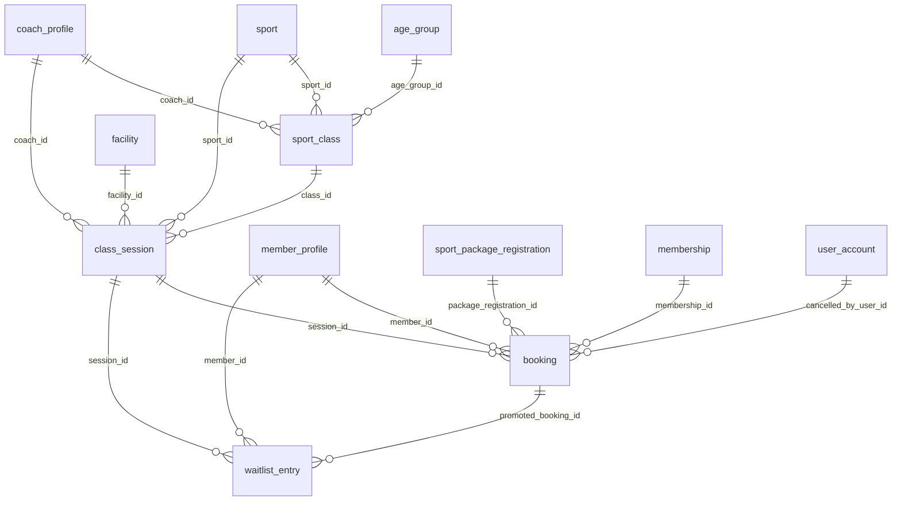

# 03 - Classes and Booking (Flow 2)

Classes, scheduled sessions, bookings and the waitlist.

Generated from the Flyway migrations V1-V20 on main (after PR #6). Source of truth: `backend/src/main/resources/db/migration`.

| Table | Status | Created in | Java entity | Columns |
|---|---|---|---|---|
| [`sport_class`](#sport_class) | In use | V10 | SportClass | 11 |
| [`class_session`](#class_session) | In use | V10 | ClassSession | 14 |
| [`booking`](#booking) | In use | V10 | Booking | 13 |
| [`waitlist_entry`](#waitlist_entry) | Not planned yet: Flow 2 (waitlist when a session is full) | V15 | - | 9 |

## Relationships

Arrows read "parent ||--o{ child : child column". Tables from other files appear when they are referenced.

## `sport_class`

- Status: **In use**
- Created in: V10
- Java entity: SportClass

| # | Column | Type | Null | Default | Key | Since | Note |
|---|---|---|---|---|---|---|---|
| 1 | id | BIGINT | No | - | PK, IDENTITY | V10 | - |
| 2 | code | NVARCHAR(30) | No | - | UQ | V10 | - |
| 3 | name | NVARCHAR(100) | No | - | - | V10 | - |
| 4 | sport_id | BIGINT | No | - | FK -> sport.id | V10 | - |
| 5 | age_group_id | BIGINT | Yes | - | FK -> age_group.id | V10 | - |
| 6 | level | NVARCHAR(20) | No | 'BEGINNER' | - | V10 | - |
| 7 | max_members | INT | No | 20 | - | V10 | - |
| 8 | is_active | BIT | No | 1 | - | V10 | - |
| 9 | created_at | DATETIME2(0) | No | SYSDATETIME() | - | V10 | - |
| 10 | updated_at | DATETIME2(0) | Yes | - | - | V10 | - |
| 11 | coach_id | BIGINT | Yes | - | FK -> coach_profile.user_id | V20 | Not mapped in the entity yet; Added in V20 |

Foreign keys:

- `fk_sc_sport`: (sport_id) -> sport(id)
- `fk_sc_age_group`: (age_group_id) -> age_group(id)
- `fk_sc_coach`: (coach_id) -> coach_profile(user_id)

Unique constraints:

- `uq_sport_class_code`: (code)

Indexes:

- `ix_sport_class_coach` on (coach_id) (since V20)

## `class_session`

- Status: **In use**
- Created in: V10
- Java entity: ClassSession

| # | Column | Type | Null | Default | Key | Since | Note |
|---|---|---|---|---|---|---|---|
| 1 | id | BIGINT | No | - | PK, IDENTITY | V10 | - |
| 2 | class_id | BIGINT | Yes | - | FK -> sport_class.id | V10 | - |
| 3 | sport_id | BIGINT | No | - | FK -> sport.id | V10 | - |
| 4 | session_date | DATE | No | - | - | V10 | - |
| 5 | start_time | TIME(0) | No | - | - | V10 | - |
| 6 | end_time | TIME(0) | No | - | - | V10 | - |
| 7 | facility_id | BIGINT | Yes | - | FK -> facility.id | V10 | - |
| 8 | coach_id | BIGINT | Yes | - | FK -> coach_profile.user_id | V10 | - |
| 9 | training_type | NVARCHAR(20) | No | 'COACH_LED' | - | V10 | - |
| 10 | capacity | INT | No | 20 | - | V10 | - |
| 11 | booked_count | INT | No | 0 | - | V10 | - |
| 12 | status | NVARCHAR(20) | No | 'PUBLISHED' | - | V10 | - |
| 13 | created_at | DATETIME2(0) | No | SYSDATETIME() | - | V10 | - |
| 14 | updated_at | DATETIME2(0) | Yes | - | - | V10 | - |

Foreign keys:

- `fk_cs_class`: (class_id) -> sport_class(id)
- `fk_cs_sport`: (sport_id) -> sport(id)
- `fk_cs_facility`: (facility_id) -> facility(id)
- `fk_cs_coach`: (coach_id) -> coach_profile(user_id)

Check constraints:

- `ck_cs_training_type`: `(training_type IN ('COACH_LED', 'SELF_TRAINING'))`
- `ck_cs_status`: `(status IN ('DRAFT', 'PUBLISHED', 'CANCELLED', 'COMPLETED'))`

Indexes:

- `ix_class_session_date_status` on (session_date, status)

## `booking`

- Status: **In use**
- Created in: V10
- Java entity: Booking

| # | Column | Type | Null | Default | Key | Since | Note |
|---|---|---|---|---|---|---|---|
| 1 | id | BIGINT | No | - | PK, IDENTITY | V10 | - |
| 2 | booking_code | NVARCHAR(30) | No | - | UQ | V10 | - |
| 3 | session_id | BIGINT | No | - | FK -> class_session.id | V10 | - |
| 4 | member_id | BIGINT | No | - | FK -> member_profile.user_id | V10 | - |
| 5 | package_registration_id | BIGINT | Yes | - | FK -> sport_package_registration.id | V10 | - |
| 6 | membership_id | BIGINT | Yes | - | FK -> membership.id | V10 | - |
| 7 | status | NVARCHAR(20) | No | 'CONFIRMED' | - | V10 | - |
| 8 | booked_at | DATETIME2(0) | No | SYSDATETIME() | - | V10 | - |
| 9 | cancelled_at | DATETIME2(0) | Yes | - | - | V10 | - |
| 10 | cancel_reason | NVARCHAR(255) | Yes | - | - | V10 | - |
| 11 | created_at | DATETIME2(0) | No | SYSDATETIME() | - | V10 | - |
| 12 | updated_at | DATETIME2(0) | Yes | - | - | V10 | - |
| 13 | cancelled_by_user_id | BIGINT | Yes | - | FK -> user_account.id | V20 | Not mapped in the entity yet; Added in V20 |

Foreign keys:

- `fk_bk_session`: (session_id) -> class_session(id)
- `fk_bk_member`: (member_id) -> member_profile(user_id)
- `fk_bk_pkg`: (package_registration_id) -> sport_package_registration(id)
- `fk_bk_membership`: (membership_id) -> membership(id)
- `fk_bk_cancelled_by`: (cancelled_by_user_id) -> user_account(id)

Unique constraints:

- `uq_booking_code`: (booking_code)

Check constraints:

- `ck_bk_status`: `(status IN ('CONFIRMED', 'CANCELLED'))`

Indexes:

- `ix_booking_member_session` on (member_id, session_id, status)
- `ux_booking_active` UNIQUE on (member_id, session_id) WHERE status = 'CONFIRMED' (since V20)

## `waitlist_entry`

- Status: **Not planned yet: Flow 2 (waitlist when a session is full)**
- Created in: V15
- Java entity: -

| # | Column | Type | Null | Default | Key | Since | Note |
|---|---|---|---|---|---|---|---|
| 1 | id | BIGINT | No | - | PK, IDENTITY | V15 | - |
| 2 | session_id | BIGINT | No | - | FK -> class_session.id | V15 | - |
| 3 | member_id | BIGINT | No | - | FK -> member_profile.user_id | V15 | - |
| 4 | status | VARCHAR(20) | No | 'WAITING' | - | V15 | - |
| 5 | joined_at | DATETIME2(0) | No | SYSDATETIME() | - | V15 | - |
| 6 | offered_at | DATETIME2(0) | Yes | - | - | V15 | - |
| 7 | offer_expires_at | DATETIME2(0) | Yes | - | - | V15 | - |
| 8 | promoted_booking_id | BIGINT | Yes | - | FK -> booking.id | V15 | - |
| 9 | cancelled_at | DATETIME2(0) | Yes | - | - | V15 | - |

Foreign keys:

- `fk_waitlist_session`: (session_id) -> class_session(id)
- `fk_waitlist_member`: (member_id) -> member_profile(user_id)
- `fk_waitlist_promoted_booking`: (promoted_booking_id) -> booking(id)

Check constraints:

- `ck_waitlist_status`: `([status] IN ('WAITING', 'OFFERED', 'PROMOTED', 'EXPIRED', 'CANCELLED'))`

Indexes:

- `ix_waitlist_session_status_joined` on (session_id, status, joined_at)
- `ix_waitlist_member_status` on (member_id, status)
