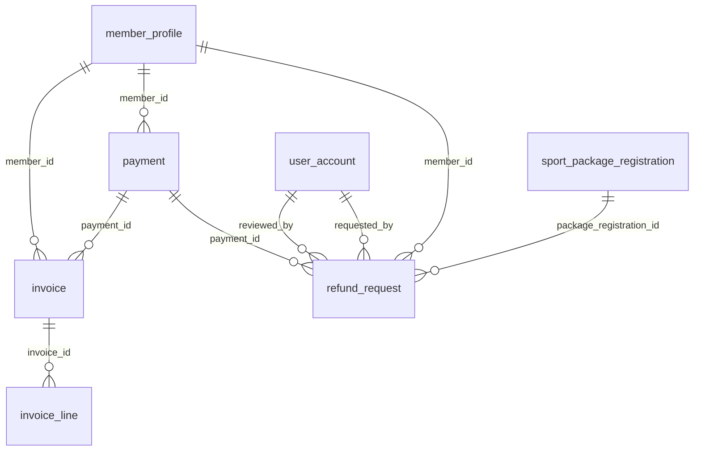

# 04 - Payments, Invoices and Refunds (Flow 3)

Payments, invoices with their lines, refund requests.

Generated from the Flyway migrations V1-V20 on main (after PR #6). Source of truth: `backend/src/main/resources/db/migration`.

| Table | Status | Created in | Java entity | Columns |
|---|---|---|---|---|
| [`payment`](#payment) | Planned for Flow 1-3 (BE-16) | V14 | - | 12 |
| [`invoice`](#invoice) | Planned for Flow 1-3 (BE-16) | V14 | - | 12 |
| [`invoice_line`](#invoice_line) | Planned for Flow 1-3 (BE-16) | V14 | - | 9 |
| [`refund_request`](#refund_request) | In use | V10 | RefundRequest | 15 |

## Relationships

Arrows read "parent ||--o{ child : child column". Tables from other files appear when they are referenced.

## `payment`

- Status: **Planned for Flow 1-3 (BE-16)**
- Created in: V14
- Java entity: -

| # | Column | Type | Null | Default | Key | Since | Note |
|---|---|---|---|---|---|---|---|
| 1 | id | BIGINT | No | - | PK, IDENTITY | V14 | - |
| 2 | payment_code | VARCHAR(30) | No | - | UQ | V14 | - |
| 3 | member_id | BIGINT | No | - | FK -> member_profile.user_id | V14 | - |
| 4 | amount | DECIMAL(12,2) | No | - | - | V14 | - |
| 5 | payment_method | VARCHAR(30) | No | - | - | V14 | - |
| 6 | payment_status | VARCHAR(20) | No | - | - | V14 | - |
| 7 | reference_code | VARCHAR(100) | Yes | - | - | V14 | - |
| 8 | notes | NVARCHAR(500) | Yes | - | - | V14 | - |
| 9 | payment_time | DATETIME2(0) | No | SYSDATETIME() | - | V14 | - |
| 10 | version | INT | No | 0 | - | V14 | - |
| 11 | created_at | DATETIME2(0) | No | SYSDATETIME() | - | V14 | - |
| 12 | updated_at | DATETIME2(0) | No | SYSDATETIME() | - | V14 | - |

Foreign keys:

- `fk_payment_member`: (member_id) -> member_profile(user_id)

Unique constraints:

- `uq_payment_code`: (payment_code)

Check constraints:

- `ck_payment_amount`: `([amount] > 0)`
- `ck_payment_method`: `([payment_method] IN ('CASH', 'CREDIT_CARD', 'BANK_TRANSFER', 'MOMO', 'VNPAY', 'ZALOPAY'))`
- `ck_payment_status`: `([payment_status] IN ('PENDING', 'SUCCESS', 'FAILED', 'REFUNDED'))`

Indexes:

- `ix_payment_member_id` on (member_id)
- `ix_payment_payment_time` on (payment_time)
- `ix_payment_status` on (payment_status)

## `invoice`

- Status: **Planned for Flow 1-3 (BE-16)**
- Created in: V14
- Java entity: -

| # | Column | Type | Null | Default | Key | Since | Note |
|---|---|---|---|---|---|---|---|
| 1 | id | BIGINT | No | - | PK, IDENTITY | V14 | - |
| 2 | invoice_number | VARCHAR(30) | No | - | UQ | V14 | - |
| 3 | payment_id | BIGINT | No | - | FK -> payment.id | V14 | - |
| 4 | member_id | BIGINT | No | - | FK -> member_profile.user_id | V14 | - |
| 5 | subtotal_amount | DECIMAL(12,2) | No | - | - | V14 | - |
| 6 | discount_amount | DECIMAL(12,2) | No | 0 | - | V14 | - |
| 7 | tax_amount | DECIMAL(12,2) | No | 0 | - | V14 | - |
| 8 | total_amount | DECIMAL(12,2) | No | - | - | V14 | - |
| 9 | status | VARCHAR(20) | No | - | - | V14 | - |
| 10 | issue_date | DATETIME2(0) | No | SYSDATETIME() | - | V14 | - |
| 11 | created_at | DATETIME2(0) | No | SYSDATETIME() | - | V14 | - |
| 12 | updated_at | DATETIME2(0) | No | SYSDATETIME() | - | V14 | - |

Foreign keys:

- `fk_invoice_payment`: (payment_id) -> payment(id)
- `fk_invoice_member`: (member_id) -> member_profile(user_id)

Unique constraints:

- `uq_invoice_number`: (invoice_number)

Check constraints:

- `ck_invoice_amounts`: `([total_amount] >= 0 AND [subtotal_amount] >= 0)`
- `ck_invoice_status`: `([status] IN ('ISSUED', 'PAID', 'CANCELLED', 'REFUNDED'))`

Indexes:

- `ix_invoice_payment_id` on (payment_id)
- `ix_invoice_member_id` on (member_id)
- `ix_invoice_issue_date` on (issue_date)

## `invoice_line`

- Status: **Planned for Flow 1-3 (BE-16)**
- Created in: V14
- Java entity: -

| # | Column | Type | Null | Default | Key | Since | Note |
|---|---|---|---|---|---|---|---|
| 1 | id | BIGINT | No | - | PK, IDENTITY | V14 | - |
| 2 | invoice_id | BIGINT | No | - | FK -> invoice.id | V14 | - |
| 3 | item_type | VARCHAR(30) | No | - | - | V14 | - |
| 4 | item_reference_id | BIGINT | No | - | - | V14 | - |
| 5 | description | NVARCHAR(255) | No | - | - | V14 | - |
| 6 | quantity | INT | No | 1 | - | V14 | - |
| 7 | unit_price | DECIMAL(12,2) | No | - | - | V14 | - |
| 8 | line_total | DECIMAL(12,2) | No | - | - | V14 | - |
| 9 | created_at | DATETIME2(0) | No | SYSDATETIME() | - | V14 | - |

Foreign keys:

- `fk_invoice_line_invoice`: (invoice_id) -> invoice(id) ON DELETE CASCADE

Check constraints:

- `ck_invoice_line_quantity`: `([quantity] > 0)`
- `ck_invoice_line_item_type`: `([item_type] IN ('SPORT_PACKAGE', 'MEMBERSHIP_CARD', 'CLASS_DROP_IN', 'PENALTY_FEE'))`

Indexes:

- `ix_invoice_line_invoice_id` on (invoice_id)

## `refund_request`

- Status: **In use**
- Created in: V10
- Java entity: RefundRequest

| # | Column | Type | Null | Default | Key | Since | Note |
|---|---|---|---|---|---|---|---|
| 1 | id | BIGINT | No | - | PK, IDENTITY | V10 | - |
| 2 | refund_code | NVARCHAR(30) | No | - | UQ | V10 | - |
| 3 | package_registration_id | BIGINT | No | - | FK -> sport_package_registration.id | V10 | - |
| 4 | member_id | BIGINT | No | - | FK -> member_profile.user_id | V10 | - |
| 5 | amount_requested | DECIMAL(14,2) | No | - | - | V10 | - |
| 6 | amount_approved | DECIMAL(14,2) | Yes | - | - | V10 | - |
| 7 | reason | NVARCHAR(500) | No | - | - | V10 | - |
| 8 | status | NVARCHAR(20) | No | 'PENDING' | - | V10 | - |
| 9 | requested_by | BIGINT | No | - | FK -> user_account.id | V10 | - |
| 10 | reviewed_by | BIGINT | Yes | - | FK -> user_account.id | V10 | - |
| 11 | reviewed_at | DATETIME2(0) | Yes | - | - | V10 | - |
| 12 | manager_note | NVARCHAR(500) | Yes | - | - | V10 | - |
| 13 | created_at | DATETIME2(0) | No | SYSDATETIME() | - | V10 | - |
| 14 | updated_at | DATETIME2(0) | Yes | - | - | V10 | - |
| 15 | payment_id | BIGINT | Yes | - | FK -> payment.id | V14 | Not mapped in the entity yet; Added in V14 |

Foreign keys:

- `fk_refund_pkg`: (package_registration_id) -> sport_package_registration(id)
- `fk_refund_member`: (member_id) -> member_profile(user_id)
- `fk_refund_req_by`: (requested_by) -> user_account(id)
- `fk_refund_rev_by`: (reviewed_by) -> user_account(id)
- `fk_refund_request_payment`: (payment_id) -> payment(id)

Unique constraints:

- `uq_refund_code`: (refund_code)

Check constraints:

- `ck_refund_status`: `(status IN ('PENDING', 'APPROVED', 'REJECTED', 'COMPLETED'))`
- `ck_refund_amount_req`: `(amount_requested > 0)`
- `ck_refund_amount_app`: `(amount_approved IS NULL OR amount_approved >= 0)`

Indexes:

- `ix_refund_request_status` on (status)
