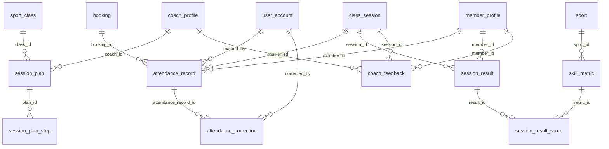

# 05 - Training and Attendance (Flow 4)

Session plans, attendance, skill results and coach feedback.

Generated from the Flyway migrations V1-V20 on main (after PR #6). Source of truth: `backend/src/main/resources/db/migration`.

| Table | Status | Created in | Java entity | Columns |
|---|---|---|---|---|
| [`session_plan`](#session_plan) | Later (Flow 4) | V16 | - | 8 |
| [`session_plan_step`](#session_plan_step) | Later (Flow 4) | V16 | - | 6 |
| [`attendance_record`](#attendance_record) | Later (Flow 4) | V16 | - | 8 |
| [`attendance_correction`](#attendance_correction) | Later (Flow 4) | V16 | - | 7 |
| [`skill_metric`](#skill_metric) | Later (Flow 4) | V16 | - | 5 |
| [`session_result`](#session_result) | Later (Flow 4) | V16 | - | 5 |
| [`session_result_score`](#session_result_score) | Later (Flow 4) | V16 | - | 4 |
| [`coach_feedback`](#coach_feedback) | Later (Flow 4) | V16 | - | 9 |

## Relationships

Arrows read "parent ||--o{ child : child column". Tables from other files appear when they are referenced.

## `session_plan`

- Status: **Later (Flow 4)**
- Created in: V16
- Java entity: -

| # | Column | Type | Null | Default | Key | Since | Note |
|---|---|---|---|---|---|---|---|
| 1 | id | BIGINT | No | - | PK, IDENTITY | V16 | - |
| 2 | class_id | BIGINT | No | - | FK -> sport_class.id | V16 | - |
| 3 | coach_id | BIGINT | No | - | FK -> coach_profile.user_id | V16 | - |
| 4 | title | NVARCHAR(150) | No | - | - | V16 | - |
| 5 | description | NVARCHAR(1000) | Yes | - | - | V16 | - |
| 6 | is_template | BIT | No | 0 | - | V16 | - |
| 7 | created_at | DATETIME2(0) | No | SYSDATETIME() | - | V16 | - |
| 8 | updated_at | DATETIME2(0) | No | SYSDATETIME() | - | V16 | - |

Foreign keys:

- `fk_session_plan_class`: (class_id) -> sport_class(id)
- `fk_session_plan_coach`: (coach_id) -> coach_profile(user_id)

Indexes:

- `ix_session_plan_class` on (class_id)

## `session_plan_step`

- Status: **Later (Flow 4)**
- Created in: V16
- Java entity: -

| # | Column | Type | Null | Default | Key | Since | Note |
|---|---|---|---|---|---|---|---|
| 1 | id | BIGINT | No | - | PK, IDENTITY | V16 | - |
| 2 | plan_id | BIGINT | No | - | FK -> session_plan.id | V16 | - |
| 3 | step_order | INT | No | - | - | V16 | - |
| 4 | title | NVARCHAR(150) | No | - | - | V16 | - |
| 5 | duration_minutes | INT | No | - | - | V16 | - |
| 6 | instructions | NVARCHAR(1000) | Yes | - | - | V16 | - |

Foreign keys:

- `fk_session_plan_step_plan`: (plan_id) -> session_plan(id) ON DELETE CASCADE

Check constraints:

- `ck_session_plan_step_duration`: `([duration_minutes] > 0)`

Indexes:

- `ix_session_plan_step_plan` on (plan_id, step_order)

## `attendance_record`

- Status: **Later (Flow 4)**
- Created in: V16
- Java entity: -

| # | Column | Type | Null | Default | Key | Since | Note |
|---|---|---|---|---|---|---|---|
| 1 | id | BIGINT | No | - | PK, IDENTITY | V16 | - |
| 2 | session_id | BIGINT | No | - | FK -> class_session.id | V16 | - |
| 3 | member_id | BIGINT | No | - | FK -> member_profile.user_id | V16 | - |
| 4 | booking_id | BIGINT | Yes | - | FK -> booking.id | V16 | - |
| 5 | status | VARCHAR(20) | No | - | - | V16 | - |
| 6 | marked_at | DATETIME2(0) | No | SYSDATETIME() | - | V16 | - |
| 7 | marked_by | BIGINT | No | - | FK -> user_account.id | V16 | - |
| 8 | notes | NVARCHAR(500) | Yes | - | - | V16 | - |

Foreign keys:

- `fk_attendance_session`: (session_id) -> class_session(id)
- `fk_attendance_member`: (member_id) -> member_profile(user_id)
- `fk_attendance_booking`: (booking_id) -> booking(id)
- `fk_attendance_marked_by`: (marked_by) -> user_account(id)

Unique constraints:

- `uq_attendance_session_member`: (session_id, member_id)

Check constraints:

- `ck_attendance_status`: `([status] IN ('PRESENT', 'ABSENT', 'LATE', 'EXCUSED'))`

Indexes:

- `ix_attendance_session` on (session_id)
- `ix_attendance_member` on (member_id)

## `attendance_correction`

- Status: **Later (Flow 4)**
- Created in: V16
- Java entity: -

| # | Column | Type | Null | Default | Key | Since | Note |
|---|---|---|---|---|---|---|---|
| 1 | id | BIGINT | No | - | PK, IDENTITY | V16 | - |
| 2 | attendance_record_id | BIGINT | No | - | FK -> attendance_record.id | V16 | - |
| 3 | previous_status | VARCHAR(20) | No | - | - | V16 | - |
| 4 | new_status | VARCHAR(20) | No | - | - | V16 | - |
| 5 | reason | NVARCHAR(500) | No | - | - | V16 | - |
| 6 | corrected_by | BIGINT | No | - | FK -> user_account.id | V16 | - |
| 7 | created_at | DATETIME2(0) | No | SYSDATETIME() | - | V16 | - |

Foreign keys:

- `fk_attendance_corr_record`: (attendance_record_id) -> attendance_record(id)
- `fk_attendance_corr_user`: (corrected_by) -> user_account(id)

## `skill_metric`

- Status: **Later (Flow 4)**
- Created in: V16
- Java entity: -

| # | Column | Type | Null | Default | Key | Since | Note |
|---|---|---|---|---|---|---|---|
| 1 | id | BIGINT | No | - | PK, IDENTITY | V16 | - |
| 2 | sport_id | BIGINT | No | - | FK -> sport.id | V16 | - |
| 3 | name | NVARCHAR(100) | No | - | - | V16 | - |
| 4 | description | NVARCHAR(500) | Yes | - | - | V16 | - |
| 5 | max_score | INT | No | 10 | - | V16 | - |

Foreign keys:

- `fk_skill_metric_sport`: (sport_id) -> sport(id)

## `session_result`

- Status: **Later (Flow 4)**
- Created in: V16
- Java entity: -

| # | Column | Type | Null | Default | Key | Since | Note |
|---|---|---|---|---|---|---|---|
| 1 | id | BIGINT | No | - | PK, IDENTITY | V16 | - |
| 2 | session_id | BIGINT | No | - | FK -> class_session.id | V16 | - |
| 3 | member_id | BIGINT | No | - | FK -> member_profile.user_id | V16 | - |
| 4 | notes | NVARCHAR(1000) | Yes | - | - | V16 | - |
| 5 | created_at | DATETIME2(0) | No | SYSDATETIME() | - | V16 | - |

Foreign keys:

- `fk_session_result_session`: (session_id) -> class_session(id)
- `fk_session_result_member`: (member_id) -> member_profile(user_id)

Unique constraints:

- `uq_session_result_session_member`: (session_id, member_id)

## `session_result_score`

- Status: **Later (Flow 4)**
- Created in: V16
- Java entity: -

| # | Column | Type | Null | Default | Key | Since | Note |
|---|---|---|---|---|---|---|---|
| 1 | id | BIGINT | No | - | PK, IDENTITY | V16 | - |
| 2 | result_id | BIGINT | No | - | FK -> session_result.id | V16 | - |
| 3 | metric_id | BIGINT | No | - | FK -> skill_metric.id | V16 | - |
| 4 | score | DECIMAL(5,2) | No | - | - | V16 | - |

Foreign keys:

- `fk_session_score_result`: (result_id) -> session_result(id) ON DELETE CASCADE
- `fk_session_score_metric`: (metric_id) -> skill_metric(id)

## `coach_feedback`

- Status: **Later (Flow 4)**
- Created in: V16
- Java entity: -

| # | Column | Type | Null | Default | Key | Since | Note |
|---|---|---|---|---|---|---|---|
| 1 | id | BIGINT | No | - | PK, IDENTITY | V16 | - |
| 2 | session_id | BIGINT | No | - | FK -> class_session.id | V16 | - |
| 3 | coach_id | BIGINT | No | - | FK -> coach_profile.user_id | V16 | - |
| 4 | member_id | BIGINT | No | - | FK -> member_profile.user_id | V16 | - |
| 5 | rating | INT | No | - | - | V16 | - |
| 6 | comments | NVARCHAR(1000) | No | - | - | V16 | - |
| 7 | strengths | NVARCHAR(500) | Yes | - | - | V16 | - |
| 8 | areas_for_improvement | NVARCHAR(500) | Yes | - | - | V16 | - |
| 9 | created_at | DATETIME2(0) | No | SYSDATETIME() | - | V16 | - |

Foreign keys:

- `fk_coach_feedback_session`: (session_id) -> class_session(id)
- `fk_coach_feedback_coach`: (coach_id) -> coach_profile(user_id)
- `fk_coach_feedback_member`: (member_id) -> member_profile(user_id)

Check constraints:

- `ck_coach_feedback_rating`: `([rating] BETWEEN 1 AND 5)`

Indexes:

- `ix_coach_feedback_member` on (member_id)
- `ix_coach_feedback_session` on (session_id)
