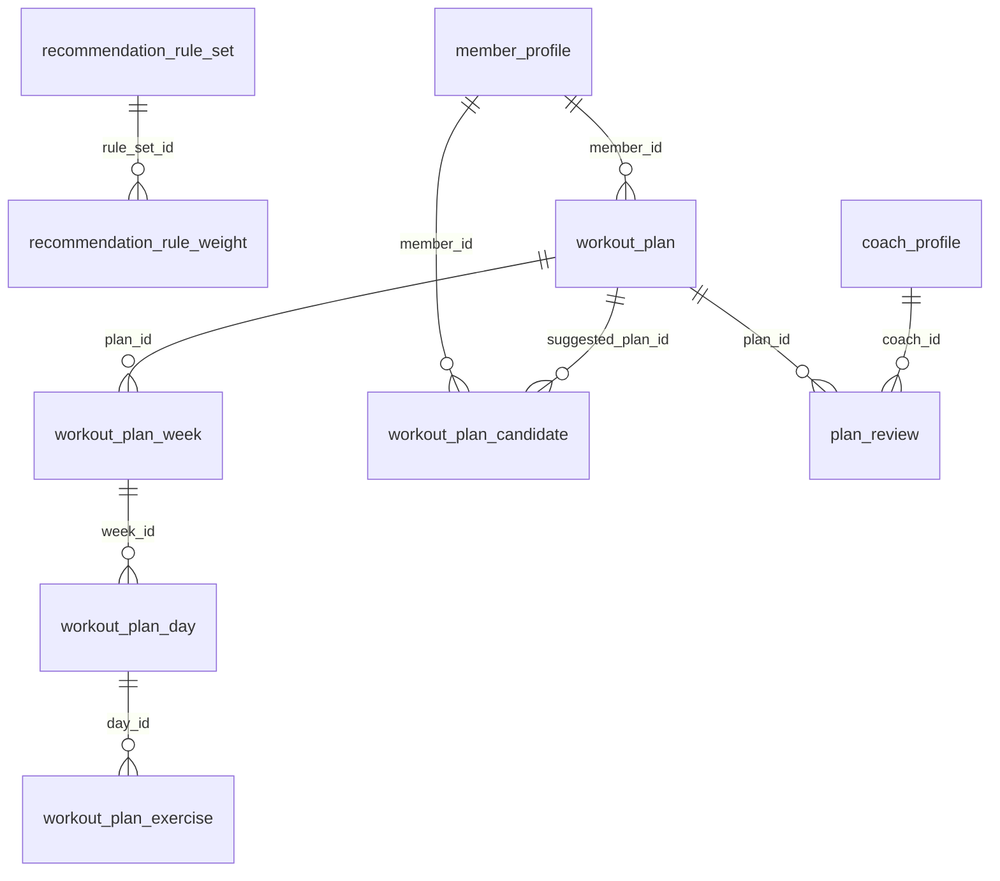

# 06 - AI Workout Recommendation (Flow 5)

Rule sets and generated workout plans reviewed by coaches.

Generated from the Flyway migrations V1-V20 on main (after PR #6). Source of truth: `backend/src/main/resources/db/migration`.

| Table | Status | Created in | Java entity | Columns |
|---|---|---|---|---|
| [`recommendation_rule_set`](#recommendation_rule_set) | Later (Flow 5) | V18 | - | 5 |
| [`recommendation_rule_weight`](#recommendation_rule_weight) | Later (Flow 5) | V18 | - | 4 |
| [`workout_plan`](#workout_plan) | Later (Flow 5) | V18 | - | 10 |
| [`workout_plan_week`](#workout_plan_week) | Later (Flow 5) | V18 | - | 4 |
| [`workout_plan_day`](#workout_plan_day) | Later (Flow 5) | V18 | - | 4 |
| [`workout_plan_exercise`](#workout_plan_exercise) | Later (Flow 5) | V18 | - | 8 |
| [`workout_plan_candidate`](#workout_plan_candidate) | Later (Flow 5) | V18 | - | 7 |
| [`plan_review`](#plan_review) | Later (Flow 5) | V18 | - | 6 |

## Relationships

Arrows read "parent ||--o{ child : child column". Tables from other files appear when they are referenced.

## `recommendation_rule_set`

- Status: **Later (Flow 5)**
- Created in: V18
- Java entity: -

| # | Column | Type | Null | Default | Key | Since | Note |
|---|---|---|---|---|---|---|---|
| 1 | id | BIGINT | No | - | PK, IDENTITY | V18 | - |
| 2 | name | NVARCHAR(100) | No | - | - | V18 | - |
| 3 | description | NVARCHAR(500) | Yes | - | - | V18 | - |
| 4 | is_active | BIT | No | 1 | - | V18 | - |
| 5 | created_at | DATETIME2(0) | No | SYSDATETIME() | - | V18 | - |

## `recommendation_rule_weight`

- Status: **Later (Flow 5)**
- Created in: V18
- Java entity: -

| # | Column | Type | Null | Default | Key | Since | Note |
|---|---|---|---|---|---|---|---|
| 1 | id | BIGINT | No | - | PK, IDENTITY | V18 | - |
| 2 | rule_set_id | BIGINT | No | - | FK -> recommendation_rule_set.id | V18 | - |
| 3 | parameter_name | VARCHAR(100) | No | - | - | V18 | - |
| 4 | weight | DECIMAL(5,2) | No | - | - | V18 | - |

Foreign keys:

- `fk_rec_rule_weight_set`: (rule_set_id) -> recommendation_rule_set(id) ON DELETE CASCADE

## `workout_plan`

- Status: **Later (Flow 5)**
- Created in: V18
- Java entity: -

| # | Column | Type | Null | Default | Key | Since | Note |
|---|---|---|---|---|---|---|---|
| 1 | id | BIGINT | No | - | PK, IDENTITY | V18 | - |
| 2 | plan_code | VARCHAR(30) | No | - | UQ | V18 | - |
| 3 | member_id | BIGINT | No | - | FK -> member_profile.user_id | V18 | - |
| 4 | name | NVARCHAR(150) | No | - | - | V18 | - |
| 5 | goal | VARCHAR(50) | No | - | - | V18 | - |
| 6 | difficulty_level | VARCHAR(30) | No | - | - | V18 | - |
| 7 | duration_weeks | INT | No | - | - | V18 | - |
| 8 | status | VARCHAR(20) | No | 'DRAFT' | - | V18 | - |
| 9 | created_at | DATETIME2(0) | No | SYSDATETIME() | - | V18 | - |
| 10 | updated_at | DATETIME2(0) | No | SYSDATETIME() | - | V18 | - |

Foreign keys:

- `fk_workout_plan_member`: (member_id) -> member_profile(user_id)

Unique constraints:

- `uq_workout_plan_code`: (plan_code)

Check constraints:

- `ck_workout_plan_weeks`: `([duration_weeks] > 0)`

Indexes:

- `ix_workout_plan_member` on (member_id)

## `workout_plan_week`

- Status: **Later (Flow 5)**
- Created in: V18
- Java entity: -

| # | Column | Type | Null | Default | Key | Since | Note |
|---|---|---|---|---|---|---|---|
| 1 | id | BIGINT | No | - | PK, IDENTITY | V18 | - |
| 2 | plan_id | BIGINT | No | - | FK -> workout_plan.id | V18 | - |
| 3 | week_number | INT | No | - | - | V18 | - |
| 4 | focus | NVARCHAR(150) | Yes | - | - | V18 | - |

Foreign keys:

- `fk_workout_week_plan`: (plan_id) -> workout_plan(id) ON DELETE CASCADE

## `workout_plan_day`

- Status: **Later (Flow 5)**
- Created in: V18
- Java entity: -

| # | Column | Type | Null | Default | Key | Since | Note |
|---|---|---|---|---|---|---|---|
| 1 | id | BIGINT | No | - | PK, IDENTITY | V18 | - |
| 2 | week_id | BIGINT | No | - | FK -> workout_plan_week.id | V18 | - |
| 3 | day_number | INT | No | - | - | V18 | - |
| 4 | focus | NVARCHAR(150) | Yes | - | - | V18 | - |

Foreign keys:

- `fk_workout_day_week`: (week_id) -> workout_plan_week(id) ON DELETE CASCADE

## `workout_plan_exercise`

- Status: **Later (Flow 5)**
- Created in: V18
- Java entity: -

| # | Column | Type | Null | Default | Key | Since | Note |
|---|---|---|---|---|---|---|---|
| 1 | id | BIGINT | No | - | PK, IDENTITY | V18 | - |
| 2 | day_id | BIGINT | No | - | FK -> workout_plan_day.id | V18 | - |
| 3 | name | NVARCHAR(150) | No | - | - | V18 | - |
| 4 | sets | INT | No | - | - | V18 | - |
| 5 | reps | INT | No | - | - | V18 | - |
| 6 | rest_seconds | INT | No | 60 | - | V18 | - |
| 7 | video_url | VARCHAR(500) | Yes | - | - | V18 | - |
| 8 | is_completed | BIT | No | 0 | - | V18 | - |

Foreign keys:

- `fk_workout_exercise_day`: (day_id) -> workout_plan_day(id) ON DELETE CASCADE

## `workout_plan_candidate`

- Status: **Later (Flow 5)**
- Created in: V18
- Java entity: -

| # | Column | Type | Null | Default | Key | Since | Note |
|---|---|---|---|---|---|---|---|
| 1 | id | BIGINT | No | - | PK, IDENTITY | V18 | - |
| 2 | member_id | BIGINT | No | - | FK -> member_profile.user_id | V18 | - |
| 3 | goal | VARCHAR(50) | No | - | - | V18 | - |
| 4 | fitness_level | VARCHAR(30) | No | - | - | V18 | - |
| 5 | score | DECIMAL(5,2) | No | - | - | V18 | - |
| 6 | suggested_plan_id | BIGINT | Yes | - | FK -> workout_plan.id | V18 | - |
| 7 | created_at | DATETIME2(0) | No | SYSDATETIME() | - | V18 | - |

Foreign keys:

- `fk_workout_candidate_member`: (member_id) -> member_profile(user_id)
- `fk_workout_candidate_plan`: (suggested_plan_id) -> workout_plan(id)

## `plan_review`

- Status: **Later (Flow 5)**
- Created in: V18
- Java entity: -

| # | Column | Type | Null | Default | Key | Since | Note |
|---|---|---|---|---|---|---|---|
| 1 | id | BIGINT | No | - | PK, IDENTITY | V18 | - |
| 2 | plan_id | BIGINT | No | - | FK -> workout_plan.id | V18 | - |
| 3 | coach_id | BIGINT | No | - | FK -> coach_profile.user_id | V18 | - |
| 4 | status | VARCHAR(20) | No | 'PENDING' | - | V18 | - |
| 5 | feedback | NVARCHAR(2000) | Yes | - | - | V18 | - |
| 6 | reviewed_at | DATETIME2(0) | Yes | - | - | V18 | - |

Foreign keys:

- `fk_plan_review_plan`: (plan_id) -> workout_plan(id)
- `fk_plan_review_coach`: (coach_id) -> coach_profile(user_id)

Check constraints:

- `ck_plan_review_status`: `([status] IN ('PENDING', 'APPROVED', 'MODIFIED', 'REJECTED'))`

Indexes:

- `ix_plan_review_coach` on (coach_id, status)
