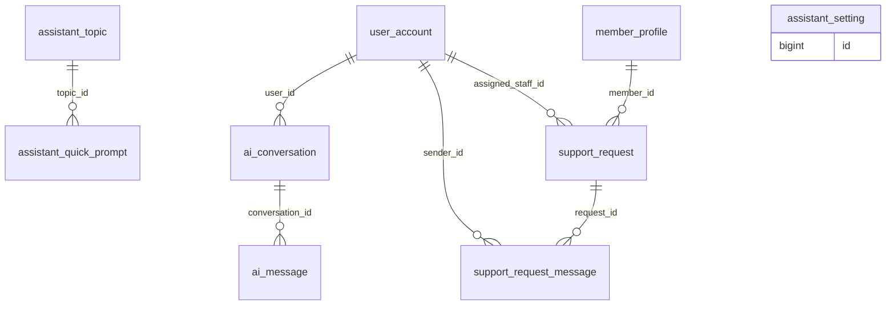

# 07 - AI Assistant and Support (Flow 6, F1-16)

Assistant settings, topics, conversations and support requests.

Generated from the Flyway migrations V1-V20 on main (after PR #6). Source of truth: `backend/src/main/resources/db/migration`.

| Table | Status | Created in | Java entity | Columns |
|---|---|---|---|---|
| [`assistant_setting`](#assistant_setting) | Later (Flow 6) | V17 | - | 4 |
| [`assistant_topic`](#assistant_topic) | Later (Flow 6) | V17 | - | 5 |
| [`assistant_quick_prompt`](#assistant_quick_prompt) | Later (Flow 6) | V17 | - | 4 |
| [`ai_conversation`](#ai_conversation) | Later (Flow 6) | V17 | - | 6 |
| [`ai_message`](#ai_message) | Later (Flow 6) | V17 | - | 5 |
| [`support_request`](#support_request) | Not planned yet: Flow 1 (F1-16 Support Requests) | V17 | - | 12 |
| [`support_request_message`](#support_request_message) | Not planned yet: Flow 1 (F1-16 Support Requests) | V17 | - | 5 |

## Relationships

Arrows read "parent ||--o{ child : child column". Tables from other files appear when they are referenced.

## `assistant_setting`

- Status: **Later (Flow 6)**
- Created in: V17
- Java entity: -

| # | Column | Type | Null | Default | Key | Since | Note |
|---|---|---|---|---|---|---|---|
| 1 | id | BIGINT | No | - | PK, IDENTITY | V17 | - |
| 2 | setting_key | VARCHAR(100) | No | - | UQ | V17 | - |
| 3 | setting_value | NVARCHAR(MAX) | No | - | - | V17 | - |
| 4 | description | NVARCHAR(500) | Yes | - | - | V17 | - |

Unique constraints:

- `uq_assistant_setting_key`: (setting_key)

## `assistant_topic`

- Status: **Later (Flow 6)**
- Created in: V17
- Java entity: -

| # | Column | Type | Null | Default | Key | Since | Note |
|---|---|---|---|---|---|---|---|
| 1 | id | BIGINT | No | - | PK, IDENTITY | V17 | - |
| 2 | title | NVARCHAR(150) | No | - | - | V17 | - |
| 3 | category | VARCHAR(50) | No | - | - | V17 | - |
| 4 | content | NVARCHAR(2000) | No | - | - | V17 | - |
| 5 | is_active | BIT | No | 1 | - | V17 | - |

## `assistant_quick_prompt`

- Status: **Later (Flow 6)**
- Created in: V17
- Java entity: -

| # | Column | Type | Null | Default | Key | Since | Note |
|---|---|---|---|---|---|---|---|
| 1 | id | BIGINT | No | - | PK, IDENTITY | V17 | - |
| 2 | topic_id | BIGINT | Yes | - | FK -> assistant_topic.id | V17 | - |
| 3 | prompt_text | NVARCHAR(255) | No | - | - | V17 | - |
| 4 | display_order | INT | No | 0 | - | V17 | - |

Foreign keys:

- `fk_quick_prompt_topic`: (topic_id) -> assistant_topic(id) ON DELETE SET NULL

## `ai_conversation`

- Status: **Later (Flow 6)**
- Created in: V17
- Java entity: -

| # | Column | Type | Null | Default | Key | Since | Note |
|---|---|---|---|---|---|---|---|
| 1 | id | BIGINT | No | - | PK, IDENTITY | V17 | - |
| 2 | user_id | BIGINT | No | - | FK -> user_account.id | V17 | - |
| 3 | title | NVARCHAR(200) | Yes | - | - | V17 | - |
| 4 | rating | INT | Yes | - | - | V17 | - |
| 5 | feedback_notes | NVARCHAR(500) | Yes | - | - | V17 | - |
| 6 | created_at | DATETIME2(0) | No | SYSDATETIME() | - | V17 | - |

Foreign keys:

- `fk_ai_conv_user`: (user_id) -> user_account(id)

Check constraints:

- `ck_ai_conv_rating`: `([rating] IS NULL OR [rating] BETWEEN 1 AND 5)`

Indexes:

- `ix_ai_conv_user` on (user_id)

## `ai_message`

- Status: **Later (Flow 6)**
- Created in: V17
- Java entity: -

| # | Column | Type | Null | Default | Key | Since | Note |
|---|---|---|---|---|---|---|---|
| 1 | id | BIGINT | No | - | PK, IDENTITY | V17 | - |
| 2 | conversation_id | BIGINT | No | - | FK -> ai_conversation.id | V17 | - |
| 3 | sender_type | VARCHAR(20) | No | - | - | V17 | - |
| 4 | content | NVARCHAR(MAX) | No | - | - | V17 | - |
| 5 | sent_at | DATETIME2(0) | No | SYSDATETIME() | - | V17 | - |

Foreign keys:

- `fk_ai_msg_conversation`: (conversation_id) -> ai_conversation(id) ON DELETE CASCADE

Check constraints:

- `ck_ai_msg_sender`: `([sender_type] IN ('USER', 'ASSISTANT', 'SYSTEM'))`

Indexes:

- `ix_ai_msg_conversation` on (conversation_id, sent_at)

## `support_request`

- Status: **Not planned yet: Flow 1 (F1-16 Support Requests)**
- Created in: V17
- Java entity: -

| # | Column | Type | Null | Default | Key | Since | Note |
|---|---|---|---|---|---|---|---|
| 1 | id | BIGINT | No | - | PK, IDENTITY | V17 | - |
| 2 | request_code | VARCHAR(30) | No | - | UQ | V17 | - |
| 3 | member_id | BIGINT | No | - | FK -> member_profile.user_id | V17 | - |
| 4 | subject | NVARCHAR(200) | No | - | - | V17 | - |
| 5 | category | VARCHAR(50) | No | - | - | V17 | - |
| 6 | description | NVARCHAR(2000) | No | - | - | V17 | - |
| 7 | priority | VARCHAR(20) | No | 'MEDIUM' | - | V17 | - |
| 8 | status | VARCHAR(20) | No | 'OPEN' | - | V17 | - |
| 9 | assigned_staff_id | BIGINT | Yes | - | FK -> user_account.id | V17 | - |
| 10 | resolution_notes | NVARCHAR(2000) | Yes | - | - | V17 | - |
| 11 | created_at | DATETIME2(0) | No | SYSDATETIME() | - | V17 | - |
| 12 | updated_at | DATETIME2(0) | No | SYSDATETIME() | - | V17 | - |

Foreign keys:

- `fk_support_req_member`: (member_id) -> member_profile(user_id)
- `fk_support_req_staff`: (assigned_staff_id) -> user_account(id)

Unique constraints:

- `uq_support_request_code`: (request_code)

Check constraints:

- `ck_support_req_priority`: `([priority] IN ('LOW', 'MEDIUM', 'HIGH', 'URGENT'))`
- `ck_support_req_status`: `([status] IN ('OPEN', 'IN_PROGRESS', 'RESOLVED', 'CLOSED'))`

Indexes:

- `ix_support_req_member` on (member_id)
- `ix_support_req_status` on (status)

## `support_request_message`

- Status: **Not planned yet: Flow 1 (F1-16 Support Requests)**
- Created in: V17
- Java entity: -

| # | Column | Type | Null | Default | Key | Since | Note |
|---|---|---|---|---|---|---|---|
| 1 | id | BIGINT | No | - | PK, IDENTITY | V17 | - |
| 2 | request_id | BIGINT | No | - | FK -> support_request.id | V17 | - |
| 3 | sender_id | BIGINT | No | - | FK -> user_account.id | V17 | - |
| 4 | message_body | NVARCHAR(2000) | No | - | - | V17 | - |
| 5 | created_at | DATETIME2(0) | No | SYSDATETIME() | - | V17 | - |

Foreign keys:

- `fk_support_msg_request`: (request_id) -> support_request(id) ON DELETE CASCADE
- `fk_support_msg_sender`: (sender_id) -> user_account(id)

Indexes:

- `ix_support_msg_request` on (request_id, created_at)
