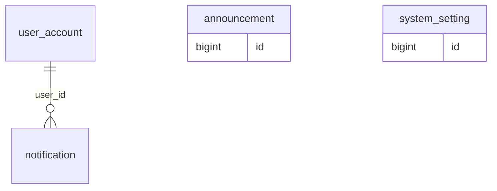

# 08 - Notifications and System

In-app notifications, announcements and system settings.

Generated from the Flyway migrations V1-V20 on main (after PR #6). Source of truth: `backend/src/main/resources/db/migration`.

| Table | Status | Created in | Java entity | Columns |
|---|---|---|---|---|
| [`notification`](#notification) | Not planned yet: Flow 1-3 (booking and payment notifications) | V19 | - | 7 |
| [`announcement`](#announcement) | Later (notifications) | V19 | - | 6 |
| [`system_setting`](#system_setting) | Not planned yet: Flow 3 (bank transfer settings) | V19 | - | 4 |

## Relationships

Arrows read "parent ||--o{ child : child column". Tables from other files appear when they are referenced.

## `notification`

- Status: **Not planned yet: Flow 1-3 (booking and payment notifications)**
- Created in: V19
- Java entity: -

| # | Column | Type | Null | Default | Key | Since | Note |
|---|---|---|---|---|---|---|---|
| 1 | id | BIGINT | No | - | PK, IDENTITY | V19 | - |
| 2 | user_id | BIGINT | No | - | FK -> user_account.id | V19 | - |
| 3 | title | NVARCHAR(200) | No | - | - | V19 | - |
| 4 | content | NVARCHAR(1000) | No | - | - | V19 | - |
| 5 | type | VARCHAR(50) | No | - | - | V19 | - |
| 6 | is_read | BIT | No | 0 | - | V19 | - |
| 7 | created_at | DATETIME2(0) | No | SYSDATETIME() | - | V19 | - |

Foreign keys:

- `fk_notification_user`: (user_id) -> user_account(id)

Indexes:

- `ix_notification_user_unread` on (user_id, is_read)

## `announcement`

- Status: **Later (notifications)**
- Created in: V19
- Java entity: -

| # | Column | Type | Null | Default | Key | Since | Note |
|---|---|---|---|---|---|---|---|
| 1 | id | BIGINT | No | - | PK, IDENTITY | V19 | - |
| 2 | title | NVARCHAR(200) | No | - | - | V19 | - |
| 3 | content | NVARCHAR(2000) | No | - | - | V19 | - |
| 4 | target_role | VARCHAR(30) | Yes | - | - | V19 | - |
| 5 | is_published | BIT | No | 1 | - | V19 | - |
| 6 | published_at | DATETIME2(0) | No | SYSDATETIME() | - | V19 | - |

## `system_setting`

- Status: **Not planned yet: Flow 3 (bank transfer settings)**
- Created in: V19
- Java entity: -

| # | Column | Type | Null | Default | Key | Since | Note |
|---|---|---|---|---|---|---|---|
| 1 | id | BIGINT | No | - | PK, IDENTITY | V19 | - |
| 2 | setting_key | VARCHAR(100) | No | - | UQ | V19 | - |
| 3 | setting_value | NVARCHAR(MAX) | No | - | - | V19 | - |
| 4 | description | NVARCHAR(500) | Yes | - | - | V19 | - |

Unique constraints:

- `uq_system_setting_key`: (setting_key)
